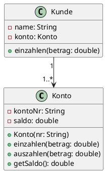

# Fachmodul: UML Klassendiagramm

**Kurs-ID:** 1955
**Kategorie:** Kursbibliothek / Fachmodule / Informatik / UML
**Quelle:** https://moodle.oszimt.de/course/view.php?id=1955

---

## Inhaltsverzeichnis

1. [Lernziele](#1-lernziele)
2. [Klasse – Konzept und Notation](#2-klasse--konzept-und-notation)
3. [Sichtbarkeiten und Modifier](#3-sichtbarkeiten-und-modifier)
4. [Beziehungen zwischen Klassen](#4-beziehungen-zwischen-klassen)
5. [Vererbung](#5-vererbung)
6. [Schnittstellen (Interfaces)](#6-schnittstellen-interfaces)
7. [Polymorphie](#7-polymorphie)
8. [Schichtenarchitektur](#8-schichtenarchitektur)
9. [Design Pattern MVC und MVVM](#9-design-pattern-mvc-und-mvvm)
10. [Clean Code – Kurzer Überblick](#10-clean-code--kurzer-überblick)
11. [Tools für UML-Klassendiagramme](#11-tools-für-uml-klassendiagramme)
12. [Übungen](#12-übungen)
13. [Quellen](#13-quellen)
14. [Zusammenfassung](#14-zusammenfassung)

---

## 1. Lernziele

Nach Bearbeitung dieses Fachmoduls können Sie:

- UML-Klassendiagramme lesen und erstellen,
- Klassen mit Attributen und Methoden modellieren,
- Sichtbarkeiten korrekt einsetzen,
- Assoziation, Aggregation, Komposition, Vererbung modellieren,
- Interfaces und Polymorphie darstellen,
- Schichtenarchitektur (Layer Architecture) zeichnen,
- MVC und MVVM erläutern.

---

## 2. Klasse – Konzept und Notation

Eine **Klasse** beschreibt die Struktur und das Verhalten gleichartiger Objekte.

### 2.1 UML-Notation

```
┌─────────────────────┐
│      Klassenname     │
├─────────────────────┤
│ - attr1: Typ        │
│ - attr2: Typ = default │
├─────────────────────┤
│ + methode1(): Rückgabewert │
│ - methode2(p: int): void    │
└─────────────────────┘
```

### 2.2 Drei-Bereiche-Box

Eine Klasse hat typischerweise drei Bereiche:

1. **Klassenname**
2. **Attribute** (Felder)
3. **Methoden** (Operationen)

### 2.3 Statische Member

Statische Member werden **unterstrichen**:

```
┌─────────────────────┐
│      MathHelper     │
├─────────────────────┤
│ - PI: double        │
├─────────────────────┤
│ + max(a: int, b: int): int │
└─────────────────────┘
```

---

## 3. Sichtbarkeiten und Modifier

| UML | Java | Bedeutung |
|---|---|---|
| `+` | `public` | überall sichtbar |
| `-` | `private` | nur in der Klasse |
| `#` | `protected` | Klasse + Subklassen + Package |
| `~` | (kein Modifier) | package-private |

### 3.1 Beispiel

```
┌─────────────────────┐
│      Konto          │
├─────────────────────┤
│ - kontoNr: String   │
│ - saldo: double     │
│ - MAX_DISPO: double │
├─────────────────────┤
│ + Konto(nr: String) │
│ + einzahlen(betrag: double) │
│ + auszahlen(betrag: double) │
│ + getSaldo(): double │
└─────────────────────┘
```

---

## 4. Beziehungen zwischen Klassen

(Siehe Fachmodul 1954 OOP-Klasse für Details.)

### 4.1 Überblick

| Beziehung | UML | Bedeutung |
|---|---|---|
| **Assoziation** | durchgezogene Linie | "kennt-beziehung" |
| **Aggregation** | Linie mit ◇ (leer) | "hat-beziehung" (Teil eigenständig) |
| **Komposition** | Linie mit ◆ (gefüllt) | "besteht-aus" (Teil stirbt mit Ganzem) |
| **Vererbung** | Linie mit ▷ (offener Pfeil) | Generalisierung/Spezialisierung |
| **Realisierung** | gestrichelt mit ▷ | Interface-Implementierung |
| **Dependency** | gestrichelter Pfeil | lose Abhängigkeit |

### 4.2 Multiplizitäten

| Notation | Bedeutung |
|---|---|
| `1` | genau eins |
| `0..1` | null oder eins |
| `*` oder `0..*` | beliebig viele |
| `1..*` | mindestens eins |
| `n` | genau n |

### 4.3 Beispiel: Bibliothek

```
┌─────────────┐ 0..*   1..* ┌──────────────┐
│   Bibliothek │◇────────◇│     Buch       │
├─────────────┤ besitzt  ├──────────────┤
│ - name      │          │ - titel       │
│ - buecher   │          │ - isbn        │
├─────────────┤          ├──────────────┤
│ + ausleihen()│         │ + getTitel()  │
└─────────────┘          └──────────────┘
```

### 4.4 Aggregation vs. Komposition

**Aggregation (leere Raute):** Teil kann eigenständig existieren.

```
┌─────────────┐
│   Verein   │
├─────────────┤
│ - name      │◇────┌──────────┐
└─────────────┘     │ Mitglied │
                    └──────────┘
```

**Komposition (gefüllte Raute):** Teil stirbt mit dem Ganzen.

```
┌─────────────┐
│     Haus    │
├─────────────┤
│ - adresse   │◆────┌──────────┐
└─────────────┘     │  Tür      │
                    └──────────┘
```

---

## 5. Vererbung

### 5.1 Notation

```
┌─────────────────────┐
│      Tier            │
├─────────────────────┤
│ - name: String      │
├─────────────────────┤
│ + atmen()           │
└─────────────────────┘
         △
         │ (Vererbung)
         │
┌─────────────────────┐
│      Hund            │
├─────────────────────┤
│ - rasse: String     │
├─────────────────────┤
│ + bellen()          │
└─────────────────────┘
```

### 5.2 Beispiel mit Subklasse

`Hund` erbt von `Tier`:

- Attribute `name`
- Methode `atmen()`
- Hat zusätzlich `rasse` und `bellen()`

### 5.3 Vererbungshierarchien

```
Tier ─── Hund ─── Dackel
       └── Katze
       └── Pferd
```

---

## 6. Schnittstellen (Interfaces)

### 6.1 Notation in UML

```
┌─────────────────────┐
│ <<interface>>        │
│     Druckbar         │
├─────────────────────┤
│ + drucken(): void   │
└─────────────────────┘
         △
         │ (Realisierung, gestrichelt)
         │
┌─────────────────────┐
│      PDF-Drucker      │
├─────────────────────┤
│ + drucken(): void   │
└─────────────────────┘
```

### 6.2 Verwendung

Eine Klasse **realisiert** ein Interface und muss alle Methoden implementieren.

```java
class PDFDrucker implements Druckbar {
    public void drucken() { /* ... */ }
}
```

---

## 7. Polymorphie

### 7.1 Konzept

Verschiedene Objekte können über einen gemeinsamen Obertyp verwendet werden und auf denselben Methodenaufruf unterschiedlich reagieren.

### 7.2 UML-Beispiel

```
┌─────────────────────┐
│ <<abstract>>         │
│      Fahrzeug        │
├─────────────────────┤
│ # baujahr: int      │
├─────────────────────┤
│ + berechneMaut(): double │
└─────────────────────┘
         △
         │
   ┌─────┴─────┐
   │           │
┌──▼────┐ ┌──▼────┐
│  PKW  │ │  LKW  │
├───────┤ ├───────┤
│       │ │ - achsen│
├───────┤ ├───────┤
│berechneMaut │ berechneMaut│
│() = 0   │ () = achsen*2 │
└───────┘ └───────┘
```

### 7.3 Dynamischer Typ

```java
Fahrzeug fahrzeug = new LKW(4);
double maut = fahrzeug.berechneMaut();  // LKW-Implementierung
```

---

## 8. Schichtenarchitektur

**Schichtenarchitektur** (Layered Architecture) trennt Anwendungen in klare Schichten:

```
┌──────────────────────────────────┐
│   Präsentationsschicht (UI)     │
├──────────────────────────────────┤
│   Anwendungsschicht (Logik)      │
├──────────────────────────────────┤
│   Datenzugriffsschicht (DAO)     │
├──────────────────────────────────┤
│   Datenhaltungsschicht (DB)      │
└──────────────────────────────────┘
```

### 8.1 Beispiel

```
┌─────────────┐
│ View        │   Präsentation
├─────────────┤
│ Controller  │   Logik
├─────────────┤
│ Service     │   Fachlogik
├─────────────┤
│ Repository  │   Datenzugriff
├─────────────┤
│ Database    │   Persistenz
└─────────────┘
```

### 8.2 Vorteile

- **Trennung der Verantwortlichkeiten**
- **Testbarkeit** (jede Schicht isoliert testbar)
- **Austauschbarkeit** (z. B. UI-Framework)
- **Wartbarkeit**

---

## 9. Design Pattern MVC und MVVM

### 9.1 MVC (Model-View-Controller)

```
┌──────────┐    ┌──────────────┐    ┌────────────┐
│   View   │◄──►│  Controller  │◄──►│   Model    │
│          │    │              │    │            │
└──────────┘    └──────────────┘    └────────────┘
```

- **Model**: Daten und Fachlogik
- **View**: Darstellung (UI)
- **Controller**: Vermittler zwischen Model und View

### 9.2 MVVM (Model-View-ViewModel)

```
┌──────────┐    ┌──────────────┐    ┌────────────┐
│   View   │◄──►│  ViewModel   │◄──►│   Model    │
│          │    │              │    │            │
└──────────┘    └──────────────┘    └────────────┘
```

- **Model**: Daten und Fachlogik
- **View**: UI (deklarativ, oft XAML/HTML)
- **ViewModel**: Observable für Datenbinding

### 9.3 Unterschied

| Aspekt | MVC | MVVM |
|---|---|---|
| Vermittler | Controller | ViewModel |
| Datenbinding | manuell | automatisch |
| Testbarkeit | gut | sehr gut |
| Frameworks | Spring MVC, Rails | Vue, Angular, WPF |

---

## 10. Clean Code – Kurzer Überblick

(Siehe Fachmodul 4654 Clean Code für Details.)

**Clean Code** (Robert C. Martin) — Prinzipien für wartbaren Code:

- Aussagekräftige Namen
- Funktionen: klein, eine Aufgabe
- Kommentare: warum, nicht was
- Formatierung: konsistent
- Error Handling: Exceptions
- Klassen: klein, single responsibility
- Tests: automatisieren

**SOLID-Prinzipien:**

- **S**ingle Responsibility Principle
- **O**pen-Closed Principle
- **L**iskov Substitution Principle
- **I**nterface Segregation Principle
- **D**ependency Inversion Principle

---

## 11. Tools für UML-Klassendiagramme

| Tool | Vorteil | Nachteil |
|---|---|---|
| **draw.io** | kostenlos, Browser | Lernkurve für ER-Symbole |
| **Lucidchart** | kollaborativ, Vorlagen | kostenpflichtig |
| **PlantUML** | Code-basiert, Git-fähig | textuelle Notation |
| **Visual Paradigm** | professionell | kostenpflichtig |
| **StarUML** | kostenlos, MDSD | wenig kommerzielle Nutzung |
| **Enterprise Architect** | mächtig, professionell | teuer |

### 11.1 PlantUML-Code



---

## 12. Übungen

### Übung 1 — Bibliothek

Modellieren Sie Bibliothek, Buch und Mitglied mit UML.

### Übung 2 — Vererbung

Modellieren Sie Tier → Hund, Katze, Pferd.

### Übung 3 — Schichtenarchitektur

Zeichnen Sie eine 4-Schichten-Architektur mit Klassen für jede Schicht.

### Übung 4 — MVC

Zeichnen Sie ein MVC-Diagramm für eine Webshop-Anwendung.

---

## 13. Quellen

- OMG UML 2.5.1 Specification: <https://www.omg.org/spec/UML/2.5.1/>
- UML Class Diagrams: <https://www.uml-diagrams.org/class-diagrams.html>
- R. C. Martin: *Clean Code*
- M. Fowler: *Patterns of Enterprise Application Architecture*
- PlantUML Class Diagram: <https://plantuml.com/class-diagram>

---

## 14. Zusammenfassung

**UML-Klassendiagramme** sind das wichtigste Diagramm der objektorientierten Modellierung.

**Schlüsselkonzepte:**

- **Klasse**: Bauplan mit Attributen und Methoden
- **Sichtbarkeiten**: `+`, `-`, `#`, `~`
- **Beziehungen**: Assoziation, Aggregation, Komposition, Vererbung, Realisierung
- **Multiplizitäten**: `1`, `0..1`, `*`, `1..*`
- **Polymorphie**: ein Aufruf, viele Implementierungen
- **Architektur**: Schichten, MVC, MVVM

### Selbsttest-Checkliste

- [ ] Ich modelliere Klassen mit Attributen und Methoden.
- [ ] Ich nutze Sichtbarkeiten korrekt.
- [ ] Ich unterscheide Assoziation, Aggregation, Komposition.
- [ ] Ich modelliere Vererbung und Interfaces.
- [ ] Ich zeichne Schichtenarchitektur und MVC.

---

*Quelle: https://moodle.oszimt.de/course/view.php?id=1955 — Recherche 2026*
