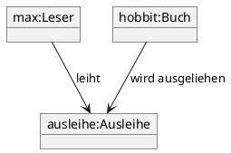

# Fachmodul: UML Objektdiagramm

**Kurs-ID:** 1956
**Kategorie:** Kursbibliothek / Fachmodule / Informatik / UML
**Quelle:** https://moodle.oszimt.de/course/view.php?id=1956

---

## Inhaltsverzeichnis

1. [Lernziele](#1-lernziele)
2. [Objektbegriff und Identität](#2-objektbegriff-und-identität)
3. [Datenkapselung (Encapsulation)](#3-datenkapselung-encapsulation)
4. [UML-Notation für Objekte](#4-uml-notation-für-objekte)
5. [Objektdiagramm vs. Klassendiagramm](#5-objektdiagramm-vs-klassendiagramm)
6. [Beziehungen zwischen Objekten](#6-beziehungen-zwischen-objekten)
7. [Praxisbeispiele](#7-praxisbeispiele)
8. [Erstellung von Objektdiagrammen](#8-erstellung-von-objektdiagrammen)
9. [Werkzeuge](#9-werkzeuge)
10. [Übungen](#10-übungen)
11. [Quellen](#11-quellen)
12. [Zusammenfassung](#12-zusammenfassung)

---

## 1. Lernziele

Nach Bearbeitung dieses Fachmoduls können Sie:

- den Unterschied zwischen Klasse und Objekt sicher erklären,
- Objektdiagramme in UML erstellen und lesen,
- Datenkapselung an UML-Notation anwenden,
- Beziehungen zwischen Objekten darstellen,
- typische LF-Aufgaben (Musiker, Zwerge, BirthdayManager) modellieren.

---

## 2. Objektbegriff und Identität

### 2.1 Was ist ein Objekt?

Ein **Objekt** ist eine konkrete Instanz einer Klasse mit eigenem Zustand und Verhalten.

**Drei Merkmale:**

- **Identität**: Jedes Objekt ist eindeutig unterscheidbar
- **Zustand**: aktuelle Werte seiner Attribute
- **Verhalten**: angebotene Operationen (Methoden)

### 2.2 Identität vs. Gleichheit

- Zwei Hunde können denselben Namen und dasselbe Alter haben — sie bleiben verschiedene Objekte
- Erst wenn Werte gleich sind, sind die Werte gleich; die Objekte sind es nicht (außer `equals` ist implementiert)

```java
Hund a = new Hund();
Hund b = new Hund();
// a != b (verschiedene Identitäten), aber a.equals(b) könnte true sein
```

---

## 3. Datenkapselung (Encapsulation)

(Siehe auch Fachmodul 1954 OOP-Klasse.)

**Datenkapselung** bedeutet: Attribute sind `private`, Zugriff nur über Methoden.

In UML-Objektdiagrammen wird dies dargestellt durch:

- Attribute mit Sichtbarkeit (`+`, `-`, `#`, `~`)
- Methoden, die Zugriff bieten

Beispiel: Objekt `mitarbeiter1:Mitarbeiter`

```
┌─────────────────────┐
│ mitarbeiter1:Mitarbeiter │
├─────────────────────┤
│ - name: String = "Anna"   │
│ - gehalt: double = 5500.0 │
├─────────────────────┤
│ + getName(): String      │
│ + getGehalt(): double    │
│ + setGehalt(double)      │
└─────────────────────┘
```

Unterstrichen: Objektname, Klassenname nach Doppelpunkt.

---

## 4. UML-Notation für Objekte

### 4.1 Notation

```
objektname :Klassenname
```

Beispiel: `anna:Mitarbeiter`

### 4.2 Notation mit Attributen

```
┌─────────────────────┐
│ anna:Mitarbeiter    │
├─────────────────────┤
│ name = "Anna"       │
│ gehalt = 5500       │
└─────────────────────┘
```

### 4.3 Notation mit Methoden

Methoden werden in Objektdiagrammen **selten** gezeigt, weil sie zum Verhalten der Klasse gehören, nicht zum Zustand des Objekts. Wenn doch:

```
┌─────────────────────┐
│ anna:Mitarbeiter    │
├─────────────────────┤
│ name = "Anna"       │
├─────────────────────┤
│ getName(): String   │
└─────────────────────┘
```

### 4.4 Nur Objektname

```
┌─────────────────┐
│  :Mitarbeiter   │
└─────────────────┘
```

Anonym — wichtig, wenn das konkrete Objekt egal ist.

### 4.5 Drei-Bereiche-Box (Empfohlen)

```
┌─────────────────────┐
│ objektname:Klasse   │
├─────────────────────┤
│ attribut = wert      │
│ attribut = wert      │
└─────────────────────┘
```

Oder mit Methoden:

```
┌─────────────────────┐
│ objektname:Klasse   │
├─────────────────────┤
│ attribut = wert      │
├─────────────────────┤
│ methode(): Typ      │
└─────────────────────┘
```

---

## 5. Objektdiagramm vs. Klassendiagramm

| Aspekt | Objektdiagramm | Klassendiagramm |
|---|---|---|
| Zeigt | Konkrete Instanzen | Schema |
| Name unterstrichen | ja | nein |
| Attribute | mit konkreten Werten | nur Typen |
| Methoden | meist weggelassen | mit Parametern |
| Verwendung | Snapshot zur Laufzeit | Blaupause |

---

## 6. Beziehungen zwischen Objekten

### 6.1 Assoziation (Link)

```
[Hund belli] ─────── <besitzt> ─────── [Person anna]
```

In UML: durchgezogene Linie zwischen Objekten.

### 6.2 Multiplizität

```
[Hund belli] ─── 1 ──── <besitzt> ──── 1 ──── [Person anna]
```

### 6.3 Aggregation (leere Raute)

```
[Schule] ◇──── <besteht aus> ──── [Klasse 5a]
```

### 6.4 Komposition (gefüllte Raute)

```
[Auto] ◆──── <besteht aus> ──── [Motor V6]
```

---

## 7. Praxisbeispiele

### 7.1 Beispiel 1: Musiker

```uml
┌──────────────┐
│ hans:Musiker │
├──────────────┤
│ name = "Hans"│
│ instrument = "Gitarre" │
└──────────────┘
       │
       │ spielt
       ▼
┌──────────────┐
│ gitarre:Gitarre │
├──────────────┤
│ marke = "Fender"│
│ baujahr = 2018│
└──────────────┘
```

### 7.2 Beispiel 2: Zwerge

```uml
┌──────────────┐    ┌──────────────┐
│ thorin:Zwerg │    │ glamring:Zwerg│
├──────────────┤    ├──────────────┤
│ name = "Thorin"│   │ name = "Glamring"│
│ hp = 100     │    │ hp = 80      │
└──────────────┘    └──────────────┘
        ▲                ▲
        │                │
        │ Schwert        │ Axt
        │                │
┌──────────────┐    ┌──────────────┐
│ zmorgen:Waffe│    │ zmorgen:Waffe│
├──────────────┤    ├──────────────┤
│ name="Morgenklinge"││ name="Glamrings Axt"│
└──────────────┘    └──────────────┘
```

### 7.3 Beispiel 3: BirthdayManager

```uml
┌──────────────────┐
│ manager:BirthdayManager │
├──────────────────┤
│ name = "Anna"  │
│ birthdate = "1990-05-15" │
└──────────────────┘
         │
         │ verwaltet
         ▼
┌──────────────────┐
│ p1:Person        │
├──────────────────┤
│ name = "Bernd"  │
│ birthday = "1985-03-20" │
└──────────────────┘
```

---

## 8. Erstellung von Objektdiagrammen

### 8.1 Vorgehen

1. **Klassendiagramm** als Grundlage haben
2. **Szenario** wählen ("Im konkreten Moment ...")
3. **Objekte** identifizieren und benennen
4. **Attributwerte** festlegen
5. **Links** zwischen Objekten einzeichnen
6. **Multiplizitäten** und Rollennamen angeben

### 8.2 Beispiel-Szenario

> "Am 15.03.2024 um 10:00 Uhr leiht Max Mustermann das Buch 'Der Hobbit' aus."

```uml
┌──────────────────────┐    ┌──────────────────────┐
│ max:Leser             │    │ hobbit:Buch          │
├──────────────────────┤    ├──────────────────────┤
│ leserID = 1001        │    │ ISBN = "978-3-16-148" │
│ name = "Max M."       │    │ titel = "Der Hobbit" │
└──────────────────────┘    └──────────────────────┘
        │ leiht
        ▼
┌──────────────────────┐
│ ausleihe:Ausleihe     │
├──────────────────────┤
│ ausleihID = 4711      │
│ datum = "2024-03-15" │
│ faellig = "2024-04-15" │
└──────────────────────┘
```

---

## 9. Werkzeuge

- **draw.io**: kostenlos, Browser
- **Lucidchart**: kollaborativ
- **PlantUML**: Code-basiert



---

## 10. Übungen

### Übung 1 — Musiker

Zeichnen Sie ein Objektdiagramm für: "Hans spielt Gitarre, Bernd spielt Klavier, beide spielen in der Band 'Die Tonleiter'."

### Übung 2 — Zwerge

Zeichnen Sie die Waffen und Inventar von Thorin und Glamring.

### Übung 3 — BirthdayManager

Modellieren Sie drei Personen mit ihren Geburtstagen und einen Manager.

### Übung 4 — Eigene Realwelt

Wählen Sie selbst ein Szenario (z. B. Bibliothek, Restaurant, Schule) und zeichnen Sie ein Objektdiagramm mit mindestens 5 Objekten.

---

## 11. Quellen

- OMG UML 2.5.1 Specification: <https://www.omg.org/spec/UML/2.5.1/>
- UML Reference: <https://www.uml-diagrams.org/object-diagram.html>
- Lucidchart UML: <https://www.lucidchart.com/pages/de/uml-diagram>
- draw.io UML: <https://www.drawio.com/>
- PlantUML Object Diagram: <https://plantuml.com/object-diagram>

---

## 12. Zusammenfassung

Ein **UML-Objektdiagramm** zeigt konkrete Instanzen mit ihren aktuellen Attributwerten zu einem bestimmten Zeitpunkt.

**Schlüsselkonzepte:**

- **Notation**: `objektname:Klassenname` (unterstrichen)
- **Attribute**: mit konkreten Werten
- **Methoden**: meist weggelassen
- **Beziehungen**: Assoziation, Aggregation, Komposition
- **Werkzeuge**: draw.io, Lucidchart, PlantUML

### Selbsttest-Checkliste

- [ ] Ich erkläre den Unterschied zwischen Klasse und Objekt.
- [ ] Ich notiere Objektdiagramme korrekt.
- [ ] Ich modelliere Beziehungen mit Multiplizitäten.
- [ ] Ich nutze Tools zur Diagrammerstellung.

---

*Quelle: https://moodle.oszimt.de/course/view.php?id=1956 — Recherche 2026*
