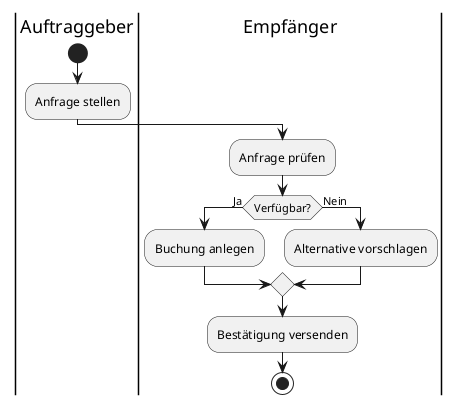

# Fachmodul: UML Aktivitätsdiagramm

**Kurs-ID:** 1960
**Kategorie:** Kursbibliothek / Fachmodule / Informatik / UML
**Quelle:** https://moodle.oszimt.de/course/view.php?id=1960

---

## Inhaltsverzeichnis

1. [Lernziele](#1-lernziele)
2. [Was ist ein UML-Aktivitätsdiagramm?](#2-was-ist-ein-uml-aktivitätsdiagramm)
3. [Notationselemente](#3-notationselemente)
4. [Kontrollfluss](#4-kontrollfluss)
5. [Entscheidungen und Verzweigungen](#5-entscheidungen-und-verzweigungen)
6. [Parallele Aktivitäten (Fork/Join)](#6-parallele-aktivitäten-forkjoin)
7. [Schwimmbahnen (Swimlanes)](#7-schwimmbahnen-swimlanes)
8. [Aktivitätsdiagramme für typische LF-Aufgaben](#8-aktivitätsdiagramme-für-typische-lf-aufgaben)
9. [Tools für Aktivitätsdiagramme](#9-tools-für-aktivitätsdiagramme)
10. [Übungen](#10-übungen)
11. [Quellen](#11-quellen)
12. [Zusammenfassung](#12-zusammenfassung)

---

## 1. Lernziele

Nach Bearbeitung dieses Fachmoduls können Sie:

- UML-Aktivitätsdiagramme lesen und erstellen,
- die wichtigsten Notationselemente sicher anwenden,
- Entscheidungen, Parallelität und Swimlanes modellieren,
- typische LF-Aufgaben (Buchung eines Fahrzeugs, Restaurantbesuch, Rederei) lösen.

---

## 2. Was ist ein UML-Aktivitätsdiagramm?

Ein **Aktivitätsdiagramm** (Activity Diagram) ist ein Verhaltensdiagramm in UML. Es modelliert:

- **Geschäftsprozesse** und Workflows
- **Abläufe** in Use Cases
- **Algorithmen** und Datenflüsse
- **Parallele Aktivitäten**

Es ist eng verwandt mit Flussdiagrammen, aber UML-spezifisch erweitert um Swimlanes, Fork/Join und mehr.

---

## 3. Notationselemente

### 3.1 Übersicht

| Element | Symbol | Bedeutung |
|---|---|---|
| Startknoten | gefüllter Kreis | Aktivität beginnt |
| Endknoten | Bullauge | Aktivität endet |
| Aktion | Rechteck (abgerundet) | einzelner Schritt |
| Entscheidung | Raute | Verzweigung (if/else) |
| Zusammenführung | Raute | Wiedervereinigung |
| Gabelung (Fork) | dicker Strich | parallele Abläufe starten |
| Vereinigung (Join) | dicker Strich | parallele Abläufe enden |
| Swimlane | Band | Verantwortlichkeit |
| Objektknoten | Rechteck | beteiligte Daten |
| Notiz | Dog-Ear-Notiz | Anmerkungen |
| Signal | Pentagramm-Form | asynchrone Nachricht |

### 3.2 Start- und Endknoten

```
●  Activity start
   ◯  Activity ends
```

### 3.3 Aktion

```
[Schritt ausführen]
```

### 3.4 Objektknoten (Daten)

```
┌──────────────┐
│ Bestellung  │
└──────────────┘
```

### 3.5 Notiz (Note)

```
╔══════════════╗
║  Hinweis     ║
╚══════════════╝
```

---

## 4. Kontrollfluss

Der **Kontrollfluss** wird durch Pfeile zwischen den Elementen dargestellt.

```
● ──→ [Anfrage prüfen] ──→ [Genehmigen] ──→ ◯
```

**Regel:** Pfeile ohne Beschriftung sind ein einfacher Sequenzfluss.

---

## 5. Entscheidungen und Verzweigungen

### 5.1 Verzweigung (Decision)

```
[Anfrage prüfen] ──→ ◇
                     │
                  [ja]│  [nein]
                     ↓    ↓
                  [Genehmigen]  [Ablehnen]
                     │          │
                     ◇          │
                     ↓          ↓
                  ◯
```

### 5.2 Bedingungen

- Die **Beschriftung am Pfeil** beschreibt die Bedingung (z. B. `[ja]`, `[nein]`, `[x > 0]`)
- **In Klammern** für Guard-Bedingungen
- Ohne Beschriftung = unkonditionaler Pfad

### 5.3 Zusammenführung (Merge)

Wenn mehrere Pfade zusammenkommen, ohne Synchronisation:

```
[Genehmigen]   [Ablehnen]
       \         /
        ◇       <- Merge-Knoten
        ↓
       ◯
```

---

## 6. Parallele Aktivitäten (Fork/Join)

### 6.1 Fork (Gabelung)

Startet parallele Abläufe:

```
[Auftrag empfangen]
        │
        ║   <- Fork (dicker Strich)
       ╱ ╲
      ↓   ↓
  [Lager [Versand prüfen]
   prüfen]      ↓
      ↓         ↓
       ╲       ╱
        ║       <- Join (dicker Strich)
        ↓
  [Auftrag versenden]
        ↓
        ◯
```

### 6.2 Beispiel Parallele Bearbeitung

Eine Bestellung wird parallel geprüft und verpackt.

---

## 7. Schwimmbahnen (Swimlanes)

**Swimlanes** ordnen Aktivitäten Verantwortlichkeiten zu.

```
┌──────────────┬────────────────────────────────────────┐
│ Kunde        │  ●                                      │
│              │     │                                   │
│              │     ▼                                   │
│              │  [Bestellung aufgeben]                 │
│              │     │                                   │
├──────────────┼─────┼────────────────────────────────────┤
│              │     │                                   │
│ Verkauf      │     ▼                                   │
│              │  ◇ <Bestätigung>                      │
│              │  │         │                          │
│              │  [Annahme│[Ablehnung]                  │
│              │     │         │                       │
├──────────────┼─────┼─────────┼───────────────────────┤
│              │     │         │                       │
│ Lager        │     ▼         │                       │
│              │  [Artikel]    │                       │
│              │   reservieren]                       │
│              │     │                                  │
│              │     ▼                                  │
│              │  ◯ Versand vorbereiten                │
└──────────────┴────────────────────────────────────────┘
```

### 7.1 Schwimmbahn (Pool)

Eine **Schwimmbahn (Swimlane/Pool)** repräsentiert eine Person, Rolle oder Organisation.

### 7.2 Notationsrichtlinien

- **Pools** können mehrere **Lanes** enthalten
- **Aktivitäten** wandern typischerweise zwischen Lanes
- **Verantwortlichkeit** wird durch die Lane zugewiesen

---

## 8. Aktivitätsdiagramme für typische LF-Aufgaben

### 8.1 Buchung eines Fahrzeuges

```
● ─→ [Anfrage prüfen] ─→ ◇ ─ja→ [Reservierung anlegen] ─→ [Vertrag drucken] ─→ ◯
                         │                                     │
                         └nein→ [Stornierung senden] ──────────┘
```

**Erweitert mit Swimlanes:**

```
┌──────────┬─────────────────────────────────────────┐
│ Kunde    │ ●                                     │
│          │   │                                   │
│          │   ▼                                   │
│          │ [Anfrage senden]                      │
│          │   │                                   │
├──────────┼───┼───────────────────────────────────┤
│          │   │                                   │
│Verkauf   │   ▼                                   │
│          │ [Verfügbarkeit prüfen]                │
│          │   │                                   │
│          │   ├─ja→ [Reservierung anlegen]        │
│          │   │         │                         │
│          │   │         ▼                         │
│          │   │ [Bestätigung an Kunden]          │
│          │   │         │                         │
│          │   └nein→ [Alternative vorschlagen]    │
│          │             │                         │
├──────────┼─────────────┼─────────────────────────┤
│          │             │                         │
│ Buchhalt.│             ▼                         │
│          │       [Vertrag drucken]               │
│          │             │                         │
│          │             ▼                         │
│          │       [Rechnung versenden]            │
│          │             │                         │
│          │             ▼                         │
│          │       ◯                                │
└──────────┴─────────────────────────────────────────┘
```

### 8.2 Restaurantbesuch

```
● → [Gast betreten] → [Platz suchen]
                              │
                              ├frei→ [Zum Tisch führen] → [Speisekarte geben] → [Bestellung aufnehmen] → [Küche]
                              │                                                                      │
                              └belegt→ [Warten lassen]                                               │
                                                                                                          │
                                                              [Speise zubereiten] → [Servieren]
                                                                                                          │
                                                                                                          ▼
                                                              [Essen] → [Zahlen] → ◯
```

### 8.3 Rederei

```
● → [Buchungsanfrage] → [Verfügbarkeit prüfen]
                                │
                          ┌─────┴─────┐
                          │           │
                       [verfügbar]  [voll]
                          │           │
                          ▼           ▼
                     [Buchung]   [Warteliste]
                          │           │
                          ├─────┬─────┘
                                ▼
                          [Zahlung]
                                │
                                ▼
                          [Bestätigung] → ◯
```

---

## 9. Tools für Aktivitätsdiagramme

- **draw.io**: Browser, kostenlos
- **Lucidchart**: kollaborativ
- **PlantUML**: Code-basiert
- **Visio**: Microsoft
- **yEd**: Grapheneditor

### 9.1 PlantUML-Code



---

## 10. Übungen

### Übung 1 — Buchung eines Fahrzeuges

Erstellen Sie ein Aktivitätsdiagramm mit Swimlanes für Kunde, Verkauf, Buchhaltung.

### Übung 2 — Restaurantbesuch

Modellieren Sie den Restaurantbesuch aus Aufgabe 1: Gast kommt, bestellt, isst, zahlt, geht.

### Übung 3 — Rederei

Erstellen Sie ein Aktivitätsdiagramm für die Rederei-Buchung mit paralleler Verarbeitung.

### Übung 4 — Bestellprozess Online-Shop

Modellieren Sie einen Bestellprozess: Warenkorb → Adresse → Zahlung → Bestätigung.

---

## 11. Quellen

- OMG UML 2.5.1 Specification: <https://www.omg.org/spec/UML/2.5.1/>
- UML Activity Diagrams: <https://www.uml-diagrams.org/activity-diagrams.html>
- PlantUML Activity Diagram: <https://plantuml.com/activity-diagram-beta>
- Lucidchart UML: <https://www.lucidchart.com/pages/de/uml-diagram>

---

## 12. Zusammenfassung

**UML-Aktivitätsdiagramme** modellieren Workflows und Prozesse:

- **Symbole**: Start, Ende, Aktion, Entscheidung, Fork/Join
- **Swimlanes**: Verantwortlichkeiten zuordnen
- **Parallele Abläufe**: mit Fork/Join modellieren
- **Entscheidungen**: mit Rauten und Guard-Bedingungen

**Best Practices:**

- Schwimmbahnen für Akteure
- Fork/Join für echte Parallelität
- Eindeutige Pfeilbeschriftungen
- Aussagekräftige Aktionen

### Selbsttest-Checkliste

- [ ] Ich nutze Start/Endknoten korrekt.
- [ ] Ich modelliere Entscheidungen mit Rauten.
- [ ] Ich setze Fork/Join für Parallelität ein.
- [ ] Ich nutze Swimlanes für Verantwortlichkeiten.

---

*Quelle: https://moodle.oszimt.de/course/view.php?id=1960 — Recherche 2026*
