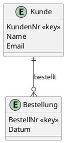

# Fachmodul: Entity Relationship Diagramm (ERD)

**Kurs-ID:** 2690
**Kategorie:** Kursbibliothek / Fachmodule / Informatik / DBS
**Quelle:** https://moodle.oszimt.de/course/view.php?id=2690

---

## Inhaltsverzeichnis

1. [Lernziele](#1-lernziele)
2. [Geschichte und Bedeutung](#2-geschichte-und-bedeutung)
3. [Grundbegriffe des ER-Modells](#3-grundbegriffe-des-er-modells)
4. [Notationen im Vergleich](#4-notationen-im-vergleich)
5. [Kardinalitäten](#5-kardinalitäten)
6. [Participation Constraints (Optionalität)](#6-participation-constraints-optionalität)
7. [Schlüssel im ER-Diagramm](#7-schlüssel-im-er-diagramm)
8. [Schwache Entitäten](#8-schwache-entitäten)
9. [Generalisierung und Spezialisierung (ISA-Beziehung)](#9-generalisierung-und-spezialisierung-isa-beziehung)
10. [ER-Diagramm-Erstellung mit Tools](#10-er-diagramm-erstellung-mit-tools)
11. [Schritt-für-Schritt-Beispiel: Bibliothek](#11-schritt-für-schritt-beispiel-bibliothek)
12. [Schritt-für-Schritt-Beispiel: Universität](#12-schritt-für-schritt-beispiel-universität)
13. [Schritt-für-Schritt-Beispiel: Online-Shop](#13-schritt-für-schritt-beispiel-online-shop)
14. [Mapping ERD → Relationales Schema](#14-mapping-erd--relationales-schema)
15. [Min-Max vs. Chen vs. Krähenfüße](#15-min-max-vs-chen-vs-krähenfüße)
16. [Best Practices](#16-best-practices)
17. [Lernaufgaben](#17-lernaufgaben)
18. [Bildverweise und Quellen](#18-bildverweise-und-quellen)
19. [Zusammenfassung](#19-zusammenfassung)

---

## 1. Lernziele

Nach Bearbeitung dieses Fachmoduls können Sie:

- die Geschichte des Entity-Relationship-Modells (Chen 1976) einordnen,
- Entitätstypen, Attribute und Beziehungstypen unterscheiden,
- die Chen-Notation, die Krähenfüße-Notation und das UML-Klassendiagramm vergleichen,
- Kardinalitäten (1:1, 1:N, N:M) korrekt anwenden,
- Participation Constraints (total/partial) modellieren,
- schwache Entitäten identifizieren und in das relationale Schema überführen,
- Generalisierung/Spezialisierung mit ISA-Beziehung umsetzen,
- mit Tools wie draw.io, Lucidchart, MySQL Workbench oder PlantUML ein ERD erstellen,
- ein ERD in ein relationales Schema transformieren.

---

## 2. Geschichte und Bedeutung

Das Entity-Relationship-Modell wurde 1976 vom deutsch-taiwanesischen Informatiker **Peter Pin-Shan Chen** in seinem wegweisenden Aufsatz *"The Entity-Relationship Model—Toward a Unified View of Data"* vorgestellt. Ziel war eine einheitliche Sicht auf Daten, unabhängig von der späteren Implementierung in einem konkreten Datenbanksystem.

Heute ist das ERM der **De-facto-Standard** für die semantische Datenmodellierung und bildet die Brücke zwischen Fachkonzept und relationalem Datenbankschema.

**Hauptanwendungsgebiete:**

- Datenbankentwurf in der konzeptionellen Phase
- Kommunikation zwischen Fachabteilung und IT
- Dokumentation bestehender Datenbanken (Reverse Engineering)
- Lehr- und Prüfungsstoff in Informatik und Wirtschaftsinformatik

---

## 3. Grundbegriffe des ER-Modells

### 3.1 Entitätstypen (Entity Types)

Ein Entitätstyp ist eine gleichartige Menge von Objekten der realen Welt mit gemeinsamen Eigenschaften. Beispiele: `KUNDE`, `BESTELLUNG`, `PRODUKT`, `STUDENT`, `BUCH`.

Eine **Entität** (im Singular) ist ein konkretes Exemplar dieses Typs.

**Starke vs. schwache Entitätstypen:**

- **Starke Entitätstypen** existieren unabhängig und haben einen eigenen Primärschlüssel. Darstellung: einfaches Rechteck.
- **Schwache Entitätstypen** sind existenzabhängig von einem übergeordneten starken Entitätstyp und haben keinen eigenen vollständigen Primärschlüssel. Darstellung: doppelt umrandetes Rechteck.

 – Beispiel: Schwacher Entitätstyp `Klasse` mit übergeordnetem `Schule`.

### 3.2 Attribute

Attribute beschreiben die Eigenschaften von Entitäts- oder Beziehungstypen.

| Typ | Bedeutung | Beispiel | Darstellung |
|---|---|---|---|
| **Einfach (atomar)** | nicht weiter zerlegbar | `Alter` | Oval |
| **Zusammengesetzt** | aus Teilattributen | `Adresse` (PLZ, Ort, Straße) | Oval mit Unterovale |
| **Mehrwertig** | mehrere Werte möglich | `Telefonnummer`, `Kenntnisse` | Doppeltes Oval |
| **Abgeleitet** | aus anderen Attributen berechenbar | `Alter` aus `Geburtsdatum` | Gestricheltes Oval |
| **Schlüsselattribut** | identifiziert Entität eindeutig | `KundenNr`, `ISBN` | Unterstrichenes Oval |
| **Partielle Schlüssel** | identifiziert schwache Entität innerhalb Beziehung | `RaumNr` | Unterstrichenes, gestricheltes Oval |

### 3.3 Beziehungstypen (Relationships)

Ein Beziehungstyp ist eine logische Verknüpfung zwischen Entitätstypen.

**Stelligkeit (Arity):**

- **Binär** (zwei Entitätstypen): `KUNDE` bestellt `PRODUKT`
- **Ternär** (drei Entitätstypen): `DOZENT` prüft `STUDENT` in `PRÜFUNG`
- **Rekursiv** (Entitätstyp mit sich selbst): `MITARBEITER` ist Chef von `MITARBEITER`

**Beziehungsattribute** sind Attribute, die nicht einer einzelnen Entität, sondern der Beziehung selbst zugeordnet sind. Beispiel: Das Attribut `Menge` gehört zur Beziehung `KUNDE bestellt PRODUKT`.

---

## 4. Notationen im Vergleich

### 4.1 Chen-Notation (Original, akademisch)

Peter Chens Originalnotation aus dem Jahr 1976:

- **Rechteck** für Entitätstypen
- **Raute** für Beziehungstypen
- **Oval** für Attribute
- **Linien** zur Verbindung

Sehr ausdrucksstark, aber platzintensiv.

### 4.2 Krähenfüße-Notation (Crow's Foot, Industrie-Standard)

Platzsparend, in der Praxis häufig eingesetzt (Barker-Notation, SSADM, Information Engineering).

**Krähenfuß-Symbole:**

| Symbol | Bedeutung |
|---|---|
| `──` | keine/null |
| `──│` | genau eins (one) |
| `──<` | viele (many) – Krähenfuß |
| `──O{` | null oder mehr (zero or many) |

### 4.3 Vergleich

| Aspekt | Chen-Notation | Krähenfüße |
|---|---|---|
| Entität | Rechteck | Rechteck |
| Beziehung | Raute | Linie |
| Attribute | Ovale außerhalb | Spalten innerhalb der Entität |
| Kardinalität | Beschriftung (1, N, M) | Grafisches Symbol |
| Platzbedarf | hoch | kompakt |
| Eignung | Lehre, Konzeptmodellierung | Implementierungsnähe |


### 4.4 UML-Klassendiagramm

Das UML-Klassendiagramm ist die objektorientierte Variante:

- UML kennt **Operationen** (Methoden)
- UML kennt **Assoziation, Aggregation, Komposition**
- UML kennt **Vererbung** (statt ISA-Beziehung)
- Primärschlüssel/Fremdschlüssel sind im OO-Paradigma nicht zwingend

---

## 5. Kardinalitäten

### 5.1 1:1-Beziehung (One-to-One)

Jede Entität des einen Typs ist mit **genau einer** Entität des anderen Typs verknüpft.

**Beispiele:** `Ehepartner`, `Person`/`Ausweis`, `Klassenlehrer`/`Klasse`.

```sql
CREATE TABLE Person (
   PersonID INT PRIMARY KEY,
   Name VARCHAR(100)
);
CREATE TABLE Ausweis (
   AusweisID INT PRIMARY KEY,
   PersonID INT UNIQUE NOT NULL,
   FOREIGN KEY (PersonID) REFERENCES Person(PersonID)
);
```

### 5.2 1:N-Beziehung (One-to-Many)

Eine Entität des einen Typs steht mit **mehreren** Entitäten des anderen Typs in Beziehung.

**Beispiele:** `KUNDE` bestellt `BESTELLUNG`, `ABTEILUNG` hat `MITARBEITER`.

```sql
CREATE TABLE Kunde (
   KundeID INT PRIMARY KEY,
   Name VARCHAR(100)
);
CREATE TABLE Bestellung (
   BestellID INT PRIMARY KEY,
   KundeID INT,
   Datum DATE,
   FOREIGN KEY (KundeID) REFERENCES Kunde(KundeID)
);
```

### 5.3 N:M-Beziehung (Many-to-Many)

Jede Entität des einen Typs kann mit **mehreren** Entitäten des anderen Typs verknüpft sein und umgekehrt.

**Beispiele:** `STUDENT` besucht `KURS`, `BUCH` ist veröffentlicht von `AUTOR`.

```sql
CREATE TABLE Student (
   StudentID INT PRIMARY KEY,
   Name VARCHAR(100)
);
CREATE TABLE Kurs (
   KursID INT PRIMARY KEY,
   Titel VARCHAR(100)
);
CREATE TABLE Teilnahme (
   StudentID INT,
   KursID INT,
   Note DECIMAL(2,1),
   PRIMARY KEY (StudentID, KursID),
   FOREIGN KEY (StudentID) REFERENCES Student(StudentID),
   FOREIGN KEY (KursID) REFERENCES Kurs(KursID)
);
```

### 5.4 Min-Max-Notation

- `(1,1)` – genau eins
- `(0,1)` – null oder eins
- `(1,n)` – eins oder mehr
- `(0,n)` – null oder mehr

---

## 6. Participation Constraints (Optionalität)

### 6.1 Totale Participation (obligatorisch)

Jede Entität muss an mindestens einer Beziehung teilnehmen. **Chen:** Doppelte Linie. **Crow's Foot:** Senkrechter Strich.

### 6.2 Partielle Participation (optional)

Eine Entität kann teilnehmen, muss aber nicht. **Chen:** Einfache Linie. **Crow's Foot:** Offener Kreis (May-Be-Optional).

| Aspekt | Total | Partial |
|---|---|---|
| Bedeutung | Alle Entitäten müssen teilnehmen | Nur manche Entitäten nehmen teil |
| Minimum | 1 | 0 |
| Chen-Symbol | Doppelte Linie | Einfache Linie |
| Crow's Foot | Bar | Open Circle (O) |

> **Wichtige Unterscheidung:** *Kardinalität* (maximale Anzahl) und *Participation* (minimale Anzahl) sind getrennt zu betrachten.

---

## 7. Schlüssel im ER-Diagramm

### 7.1 Primärschlüssel (Primary Key)

Ein Primärschlüssel ist ein Attribut oder eine Attributkombination, das jede Entität **eindeutig identifiziert**.

**Eigenschaften:**

- Eindeutigkeit (unique)
- Minimalität
- Nicht-NULL
- Stabil

**Typen:**

- **Einfacher Primärschlüssel**: ein einzelnes Attribut, z. B. `KundenNr`
- **Zusammengesetzter Primärschlüssel**: mehrere Attribute, z. B. `(BestellID, ArtikelID)`
- **Künstlicher Primärschlüssel (Surrogate Key)**: vom System vergebene ID

### 7.2 Fremdschlüssel (Foreign Key)

Ein Fremdschlüssel ist ein Attribut, das auf den Primärschlüssel einer anderen Entität verweist.

### 7.3 Partielle Schlüssel (Diskriminator)

Bei schwachen Entitätstypen dient der partielle Schlüssel zur Unterscheidung innerhalb des Vorkommens der identifizierenden Entität.

---

## 8. Schwache Entitäten (Weak Entities)

### 8.1 Definition

Eine **schwache Entität** ist existenzabhängig von einer oder mehreren starken Entitäten. Sie kann durch ihre eigenen Attribute allein nicht eindeutig identifiziert werden.

### 8.2 Beispiele

- **Raum** in einem **Hotel**: Raum 101 existiert nur, wenn es das Hotel gibt
- **Bankkonto** in einer **Bank**
- **Bestellposition** in einer **Bestellung**
- **Klasse** (Schulklasse) in einer **Schule**
- **Rechnung** zur **Bestellung**

### 8.3 Darstellung

- **Schwacher Entitätstyp:** doppelt umrandetes Rechteck
- **Identifizierender Beziehungstyp:** doppelt umrandete Raute
- **Partieller Schlüssel (Diskriminator):** unterstrichenes, gestricheltes Oval


### 8.4 Umsetzung in SQL

```sql
CREATE TABLE Bestellung (
   BestellID INT PRIMARY KEY,
   Datum DATE
);
CREATE TABLE Bestellposition (
   BestellID INT,
   PositionsNr INT,
   Menge INT,
   PRIMARY KEY (BestellID, PositionsNr),
   FOREIGN KEY (BestellID) REFERENCES Bestellung(BestellID) ON DELETE CASCADE
);
```

---

## 9. Generalisierung und Spezialisierung (ISA-Beziehung)

### 9.1 Konzept

Die **Generalisierung** fasst mehrere ähnliche Entitätstypen zu einem allgemeineren Entitätstyp (Superklasse) zusammen. Die **Spezialisierung** zerlegt einen Entitätstyp in mehrere spezialisierte Subklassen.

Es entsteht eine **ISA-Beziehung** (auch: "is-a"-Beziehung): Ein Subtyp ist ein Supertyp.

### 9.2 Beispiel

Superklasse: `PERSON` mit Attributen `Name`, `Geburtsdatum`, `Personalnummer`.

Subtypen:

- `ANGESTELLTER` + spezifisch: `Gehalt`, `Einstellungsdatum`
- `KUNDE` + spezifisch: `Kundennummer`, `Rabatt`
- `LIEFERANT` + spezifisch: `Lieferbedingungen`

Oder im Fahrzeug-Kontext:

- `FAHRZEUG` (Superklasse) mit ID, Kennzeichen, Baujahr
- `PKW` (spezialisiert) mit `AnzahlSitzplätze`, `Kofferraumvolumen`
- `LKW` (spezialisiert) mit `Ladefläche`, `MaxLadung`
- `MOTORRAD` (spezialisiert) mit `Hubraum`

### 9.3 Disjunktheit und Vollständigkeit

- **Disjunkt (d):** Ein Subtyp-Entität kann nur genau einem Subtyp angehören
- **Überlappend (o):** Eine Entität kann mehreren Subtypen angehören
- **Total (vollständig):** Jede Entität des Supertyps muss genau einem Subtyp angeordnet sein
- **Partiell (unvollständig):** Eine Entität des Supertyps kann auch ohne Subtyp-Zuordnung existieren

### 9.4 Umsetzung in SQL

**Drei mögliche Strategien:**

1. **Eine Tabelle pro Subtyp** (Table-per-subtype)
2. **Eine Tabelle pro Supertyp** (Table-per-supertype)
3. **Eine Tabelle pro konkreter Subtyp** (Table-per-concrete-subtype)

```sql
-- Variante 1: Table-per-subtype
CREATE TABLE Person (
   PersonID INT PRIMARY KEY,
   Name VARCHAR(100),
   Geburtsdatum DATE
);
CREATE TABLE Angestellter (
   PersonID INT PRIMARY KEY,
   Gehalt DECIMAL(10,2),
   Einstellungsdatum DATE,
   FOREIGN KEY (PersonID) REFERENCES Person(PersonID)
);
CREATE TABLE Kunde (
   PersonID INT PRIMARY KEY,
   Kundennummer VARCHAR(20),
   Rabatt DECIMAL(4,2),
   FOREIGN KEY (PersonID) REFERENCES Person(PersonID)
);
```

---

## 10. ER-Diagramm-Erstellung mit Tools

### 10.1 draw.io (diagrams.net)

- Open-Source, kostenlos, im Browser oder als Desktop-App
- Viele Notationen (Chen, Crow's Foot, UML)
- Export als PNG, SVG, PDF, XML

**Schritte:**

1. draw.io öffnen, neue Zeichnung erstellen
2. "Mehr Shapes" → "Entity Relation" aktivieren
3. Symbole per Drag-and-Drop platzieren
4. Verbindungen ziehen, Kardinalitäten setzen
5. Export

### 10.2 Lucidchart

- Browserbasiert, kollaborativ
- Viele Vorlagen
- JDBC-Import aus MySQL, PostgreSQL, SQL Server

### 10.3 MySQL Workbench

- Offizielles MySQL-Tool
- EER-Diagramm (Enhanced ER)
- Forward Engineering (SQL generieren)
- Reverse Engineering (DB zu EER)

### 10.4 PlantUML

Code-basiertes Diagramm:



Online-Editoren: plantuml.com, planttext.com, dev-toolbox.tech.

### 10.5 Weitere Tools

- **ERDPlus** – spezialisiertes Online-Tool
- **DBeaver** – Open-Source-Datenbank-Tool
- **dbdiagram.io** – Code-basiertes Tool
- **Visual Paradigm, Creately, SmartDraw** – kommerzielle Tools

---

## 11. Schritt-für-Schritt-Beispiel: Bibliothek

### 11.1 Anforderungen

> In einer Bibliothek gibt es Bücher (Titel, ISBN, Erscheinungsjahr, Verlag). Jedes Buch ist genau einem Verlag zugeordnet. Mitglieder (Studenten oder externe Leser) leihen Bücher aus. Pro Ausleihe werden Ausleihdatum und Rückgabedatum gespeichert. Ein Mitglied kann mehrere Bücher ausleihen, ein Buch kann von mehreren Mitgliedern ausgeliehen werden (historisch). Mitglieder sind in Kategorien eingeteilt.

### 11.2 Schritt 1: Entitäten identifizieren

Hauptentitäten: `BUCH`, `VERLAG`, `MITGLIED`, `AUSLEIHE`, `KATEGORIE`

### 11.3 Schritt 2: Attribute festlegen

- **BUCH**: `ISBN` (Schlüssel), `Titel`, `Erscheinungsjahr`, `Genre`
- **VERLAG**: `VerlagID` (Schlüssel), `Name`, `Adresse`
- **MITGLIED**: `MitgliedID` (Schlüssel), `Name`, `Email`, `Eintrittsdatum`
- **AUSLEIHE**: `MitgliedID`, `ISBN`, `Ausleihdatum`, `Rückgabedatum`
- **KATEGORIE**: `KategorieID`, `Bezeichnung`

### 11.4 Schritt 3: Beziehungen und Kardinalitäten

- `VERLAG` veröffentlicht `BUCH` → **1:N**
- `MITGLIED` leiht `BUCH` (über `AUSLEIHE`) → **N:M**
- `KATEGORIE` kategorisiert `MITGLIED` → **1:N**

### 11.5 SQL-Ableitung

```sql
CREATE TABLE Verlag (
   VerlagID INT PRIMARY KEY,
   Name VARCHAR(100),
   Adresse VARCHAR(200)
);
CREATE TABLE Buch (
   ISBN VARCHAR(20) PRIMARY KEY,
   Titel VARCHAR(200),
   Erscheinungsjahr INT,
   VerlagID INT NOT NULL,
   FOREIGN KEY (VerlagID) REFERENCES Verlag(VerlagID)
);
CREATE TABLE Mitglied (
   MitgliedID INT PRIMARY KEY,
   Name VARCHAR(100),
   Email VARCHAR(100),
   Eintrittsdatum DATE,
   KategorieID INT
);
CREATE TABLE Ausleihe (
   MitgliedID INT,
   ISBN VARCHAR(20),
   Ausleihdatum DATE,
   Rueckgabedatum DATE,
   PRIMARY KEY (MitgliedID, ISBN, Ausleihdatum),
   FOREIGN KEY (MitgliedID) REFERENCES Mitglied(MitgliedID),
   FOREIGN KEY (ISBN) REFERENCES Buch(ISBN)
);
```

---

## 12. Schritt-für-Schritt-Beispiel: Universität

### 12.1 Anforderungen

> An einer Universität gibt es Fakultäten, Studiengänge, Studenten, Professoren und Vorlesungen. Jeder Professor ist Mitglied genau einer Fakultät. Eine Fakultät hat mehrere Studiengänge. Ein Student ist in genau einem Studiengang eingeschrieben. Ein Professor hält eine oder mehrere Vorlesungen. Ein Student besucht mehrere Vorlesungen, eine Vorlesung wird von mehreren Studenten besucht.

### 12.2 Entitäten

`FAKULTÄT`, `STUDIENGANG`, `STUDENT`, `PROFESSOR`, `VORLESUNG`

### 12.3 Beziehungen

- `FAKULTÄT` → `STUDIENGANG` → 1:N
- `FAKULTÄT` → `PROFESSOR` → 1:N
- `STUDIENGANG` → `STUDENT` → 1:N
- `PROFESSOR` → `VORLESUNG` → 1:N
- `STUDENT` → `VORLESUNG` → N:M (über `STUDENT_VORLESUNG`)

### 12.4 SQL-Ableitung

```sql
CREATE TABLE Fakultaet (
   FakID INT PRIMARY KEY,
   Name VARCHAR(100)
);
CREATE TABLE Studiengang (
   SGID INT PRIMARY KEY,
   Name VARCHAR(100),
   FakID INT,
   FOREIGN KEY (FakID) REFERENCES Fakultaet(FakID)
);
CREATE TABLE Student (
   StudentID INT PRIMARY KEY,
   Name VARCHAR(100),
   Matrikelnummer VARCHAR(20) UNIQUE,
   SGID INT,
   FOREIGN KEY (SGID) REFERENCES Studiengang(SGID)
);
CREATE TABLE Professor (
   ProfID INT PRIMARY KEY,
   Name VARCHAR(100),
   FakID INT,
   FOREIGN KEY (FakID) REFERENCES Fakultaet(FakID)
);
CREATE TABLE Vorlesung (
   VorlesungID INT PRIMARY KEY,
   Titel VARCHAR(200),
   ECTS INT,
   ProfID INT,
   FOREIGN KEY (ProfID) REFERENCES Professor(ProfID)
);
CREATE TABLE Student_Vorlesung (
   StudentID INT,
   VorlesungID INT,
   Semester VARCHAR(20),
   Note DECIMAL(2,1),
   PRIMARY KEY (StudentID, VorlesungID, Semester),
   FOREIGN KEY (StudentID) REFERENCES Student(StudentID),
   FOREIGN KEY (VorlesungID) REFERENCES Vorlesung(VorlesungID)
);
```

---

## 13. Schritt-für-Schritt-Beispiel: Online-Shop

### 13.1 Anforderungen

> Ein Online-Shop verwaltet Kunden, Bestellungen, Produkte, Kategorien und Lieferungen. Ein Kunde gibt mehrere Bestellungen auf (1:N). Eine Bestellung enthält mehrere Produkte N:M (über Bestellposition). Jedes Produkt gehört genau einer Kategorie an (N:1). Eine Bestellung wird über eine Lieferung versendet (1:1).

### 13.2 Entitäten

`KUNDE`, `BESTELLUNG`, `BESTELLPOSITION`, `PRODUKT`, `KATEGORIE`, `LIEFERUNG`

### 13.3 SQL-Ableitung

```sql
CREATE TABLE Kunde (
   KundeID INT PRIMARY KEY,
   Name VARCHAR(100),
   Email VARCHAR(100) UNIQUE,
   Registrierungsdatum DATE
);
CREATE TABLE Kategorie (
   KatID INT PRIMARY KEY,
   Bezeichnung VARCHAR(100)
);
CREATE TABLE Produkt (
   ProduktID INT PRIMARY KEY,
   Name VARCHAR(200),
   Preis DECIMAL(10,2),
   Bestand INT,
   KatID INT,
   FOREIGN KEY (KatID) REFERENCES Kategorie(KatID)
);
CREATE TABLE Bestellung (
   BestellID INT PRIMARY KEY,
   Datum DATE,
   Status VARCHAR(20),
   KundeID INT NOT NULL,
   FOREIGN KEY (KundeID) REFERENCES Kunde(KundeID)
);
CREATE TABLE Bestellposition (
   BestellID INT,
   PositionsNr INT,
   ProduktID INT,
   Menge INT,
   Einzelpreis DECIMAL(10,2),
   PRIMARY KEY (BestellID, PositionsNr),
   FOREIGN KEY (BestellID) REFERENCES Bestellung(BestellID),
   FOREIGN KEY (ProduktID) REFERENCES Produkt(ProduktID)
);
CREATE TABLE Lieferung (
   LieferungID INT PRIMARY KEY,
   Sendungsnummer VARCHAR(50),
   Lieferdatum DATE,
   BestellID INT UNIQUE NOT NULL,
   FOREIGN KEY (BestellID) REFERENCES Bestellung(BestellID)
);
```

---

## 14. Mapping ERD → Relationales Schema

Aus dem ERD lässt sich nach bewährten Regeln ein relationales Schema ableiten:

1. **Starke Entitätstypen** → Eigene Tabelle mit Primärschlüssel.
2. **Schwache Entitätstypen** → Eigene Tabelle mit zusammengesetztem Primärschlüssel aus Owner-PK + partiellem Schlüssel.
3. **1:1-Beziehung** → Fremdschlüssel auf einer der beiden Seiten + UNIQUE-Constraint.
4. **1:N-Beziehung** → Fremdschlüssel auf der "N"-Seite.
5. **N:M-Beziehung** → Neue Zwischentabelle mit zusammengesetztem Primärschlüssel aus beiden FKs.
6. **Mehrwertige Attribute** → Eigene Tabelle mit FK auf den Entitätstyp.
7. **Generalisierung** → Drei Optionen (siehe Abschnitt 9.4).

Anschließend wird das resultierende Schema **normalisiert** (1NF, 2NF, 3NF, BCNF), um Redundanzen zu vermeiden.

---

## 15. Min-Max vs. Chen vs. Krähenfüße

| Notation | Stärke | Schwäche |
|---|---|---|
| Chen | Sehr ausdrucksstark, gut für Lehre | Platzintensiv, viele Symbole |
| Krähenfüße | Kompakt, implementierungsnah | Schwächere Notation für schwache Entitäten |
| Min-Max (ISO) | Exakte Kardinalität mit min/max | Komplexer zu lesen |
| UML-Klassendiagramm | OO-Integration, Vererbung | Weniger DB-spezifisch |

---

## 16. Best Practices

1. **Früh modellieren:** ER-Diagramm vor der Implementierung, nicht hinterher.
2. **Konsistente Namen:** Singular für Entitätstypen.
3. **Schlüssel immer definieren:** Jede Entität braucht einen Primärschlüssel.
4. **Mit Anwendern kommunizieren:** ER-Diagramm ist auch Dokumentation für Fachseite.
5. **Schwache Entitäten explizit markieren:** Nur als schwach definieren, wenn echte Existenzabhängigkeit besteht.
6. **Naming Conventions:** `student_id`, `order_date` – einheitlich und beschreibend.
7. **Reverse Engineering nutzen:** Bestehende Datenbanken dokumentieren.
8. **Normalisierung prüfen:** ERD ist noch nicht normalisiert.
9. **Diagramme versionieren:** Bei PlantUML oder dbdiagram.io als Code in Git.
10. **Mehrere Notationen kennen:** Verständigung mit Entwicklern (Krähenfüße) und Fachabteilung (Chen).

---

## 17. Lernaufgaben

### Übung 1 — Bibliothek erweitern

Erweitern Sie das Bibliotheks-Beispiel um:

- `AUTOR` mit N:M-Beziehung zu `BUCH` und Beziehungsattribut `Erscheinungsjahr`
- `EXEMPLAR` als schwache Entität mit Seriennummer, Standort, Zustand
- `MAHNUNG` als schwache Entität zur `AUSLEIHE`

### Übung 2 — Krankenhaus

Modellieren Sie ein Krankenhaus:

- `PATIENT`, `ARZT`, `STATION`, `BEHANDLUNG`, `MEDIKAMENT`
- Ein Patient kann mehrere Behandlungen erhalten
- Ein Arzt ist auf einer oder mehreren Stationen tätig
- Ein Medikament kann bei mehreren Behandlungen verordnet werden
- Erstellen Sie das ERD in beiden Notationen

### Übung 3 — Flugbuchung

Modellieren Sie eine Flugbuchung:

- `FLUG`, `PASSAGIER`, `BUCHUNG`, `FLUGHAFEN`, `FLUGLINIE`
- Passagiere können Flüge buchen
- Ein Flug hat Start- und Zielflughafen
- Zeichnen Sie das Diagramm in draw.io oder PlantUML

### Übung 4 — Generalisierung

Erweitern Sie das Universitäts-Beispiel um eine ISA-Hierarchie:

- `PERSON` als Supertyp
- `STUDENT`, `PROFESSOR`, `MITARBEITER` als Subtypen
- Überlegen Sie, welche Strategie (Table-per-subtype, etc.) Sie wählen würden

---

## 18. Bildverweise und Quellen

### Bildverweise

- Schwache Entität: <https://www.luo-darmstadt.de/wiki2/lib/exe/fetch.php?media=db:schwacher_entitaetstyp.png>
- Schwache Entität Beispiel: <https://www.wikiwand.com/de/Schwache_Entit%C3%A4t>
- Chen vs Crow's Foot: <https://www.gleek.io/blog/crows-foot-chen>
- PlantUML ER: <https://plantuml.com/er-diagram>
- Wikipedia ERM: <https://en.wikipedia.org/wiki/Entity%E2%80%93relationship_model>

### Deutsche und englische Quellen

- de.wikipedia.org/wiki/Entity-Relationship-Modell
- de.wikipedia.org/wiki/Kardinalität_(Datenbankmodellierung)
- de.wikipedia.org/wiki/Schwache_Entität
- studyflix.de/informatik/er-modell-7476
- simpleclub.com/lessons/informatik-entities-im-ermodell
- gfn.uinclis.de/02-resources/notes/kardinalitaet/
- oer-informatik.de/erm
- datenbanken-verstehen.de
- lucidchart.com / lucid.co
- dev.mysql.com (MySQL Workbench Manual)
- creately.com/guides/chen-notation-in-erd/
- red-gate.com/blog/chen-erd-notation/
- gleek.io/er-diagrams

---

## 19. Zusammenfassung

Das Entity-Relationship-Diagramm ist seit Chen 1976 der Standard für konzeptionelle Datenmodellierung. Es beschreibt Entitätstypen, Attribute und Beziehungstypen und unterscheidet zwischen der akademischen Chen-Notation, der praxisnahen Krähenfüße-Notation und der UML-Klassendiagramm-Notation.

Kardinalitäten (1:1, 1:N, N:M) und Participation Constraints (total/partial) bilden die zentralen Modellierungselemente. Schwache Entitäten und Generalisierung/Spezialisierung (ISA) erweitern die Ausdruckskraft. Das Mapping in ein relationales Schema folgt klaren Regeln, die anschließende Normalisierung vermeidet Redundanzen.

### Wichtigste Merksätze

1. Das ERM wurde 1976 von Peter Pin-Shan Chen vorgestellt.
2. Chen-Notation ist akademisch, Krähenfüße-Notation ist Industrie-Standard.
3. Kardinalitäten beschreiben die maximale Anzahl; Participation Constraints die minimale.
4. N:M-Beziehungen werden zu Zwischentabellen mit zusammengesetztem PK.
5. Schwache Entitäten sind existenzabhängig und brauchen zusammengesetzten PK.
6. ISA-Beziehungen modellieren Generalisierung/Spezialisierung.
7. ERD → Relationales Schema → Normalisierung ist die Standard-Reihenfolge.

### Selbsttest-Checkliste

- [ ] Ich erkläre den Unterschied zwischen Chen- und Krähenfüße-Notation.
- [ ] Ich wähle die richtige Kardinalität für reale Beispiele.
- [ ] Ich erkenne schwache Entitäten.
- [ ] Ich modelliere ISA-Beziehungen.
- [ ] Ich transformiere ein ERD in ein relationales Schema.
- [ ] Ich nutze ein ERD-Tool zur Visualisierung.

---

*Quelle: https://moodle.oszimt.de/course/view.php?id=2690 — Recherche 2026*
