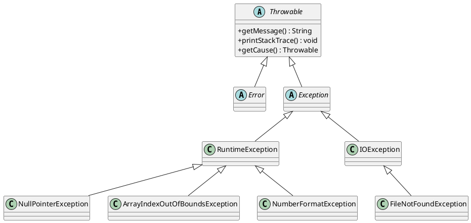

# Fachmodul: Ausnahmebehandlung in Java (Exception Handling)

**Kurs-ID:** 2716  
**Kategorie:** Kursbibliothek / Fachmodule / Informatik / Java  
**Quelle:** https://moodle.oszimt.de/course/view.php?id=2716  
**Stand:** 2026-07-28  
**Version:** 2.0 – Vollständig überarbeitete Buch-Ausgabe

---

## Inhaltsverzeichnis

1. [Einführung und Lernziele](#1-einführung-und-lernziele)
2. [Grundlagen: Warum Exception Handling?](#2-grundlagen-warum-exception-handling)
3. [Die Exception-Hierarchie](#3-die-exception-hierarchie)
4. [Checked vs. Unchecked Exceptions](#4-checked-vs-unchecked-exceptions)
5. [try-catch-finally](#5-try-catch-finally)
6. [Multi-Catch (Java 7+)](#6-multi-catch-java-7)
7. [try-with-resources (Java 7+)](#7-try-with-resources-java-7)
8. [throws-Klausel und throw-Anweisung](#8-throws-klausel-und-throw-anweisung)
9. [Eigene Exception-Klassen](#9-eigene-exception-klassen)
10. [Exception Chaining und Suppressed Exceptions](#10-exception-chaining-und-suppressed-exceptions)
11. [Häufige Standard-Exceptions](#11-häufige-standard-exceptions)
12. [Stack-Traces verstehen und lesen](#12-stack-traces-verstehen-und-lesen)
13. [Best Practices](#13-best-practices)
14. [Zusammenfassung und Checkliste](#14-zusammenfassung-und-checkliste)
15. [Übungsaufgaben](#15-übungsaufgaben)
16. [Quellen und weiterführende Links](#16-quellen-und-weiterführende-links)

---

## 1. Einführung und Lernziele

**Ausnahmebehandlung** (engl. *Exception Handling*) ist eines der zentralen Konzepte der Java-Programmierung. Nahezu jede nicht-triviale Anwendung muss mit Fehlern umgehen – seien es fehlende Dateien, Netzwerkausfälle, ungültige Benutzereingaben oder logische Programmierfehler. Java bietet hierfür ein durchgängiges, hierarchisches Konzept, das sich deutlich von der klassischen Fehlerbehandlung über Rückgabewerte unterscheidet.

### Lernziele

Nach Bearbeitung dieses Fachmoduls können Sie:

- die Exception-Hierarchie von `Throwable` bis zu konkreten Exception-Klassen benennen und zuordnen
- **Checked Exceptions** von **Unchecked Exceptions** (RuntimeException) unterscheiden
- `try-catch-finally`-Blöcke sicher anwenden und Mehrfach-Catches implementieren
- das **Multi-Catch**-Feature (Pipe-Operator) und **try-with-resources** (AutoCloseable) produktiv einsetzen
- die Schlüsselwörter `throw` (Anweisung) und `throws` (Methodenkopf) korrekt verwenden
- eigene Exception-Klassen für fachliche Fehlersituationen entwerfen
- Stack-Traces interpretieren und beim Debugging gezielt einsetzen
- Best Practices für robustere Java-Programme anwenden

### Bezug zum Lehrplan

Dieses Modul ergänzt die vorhergehenden Java-Fachmodule (1932 Methoden, 1933 Kontrollstrukturen, 1954 OOP Klasse) und bildet die Grundlage für weiterführende Themen wie Datei-I/O (2715), Datenstrukturen (2717) und GUI-Programmierung (2826 Swing).


*Quelle: Wikimedia Commons – Java-Logo*

---

## 2. Grundlagen: Warum Exception Handling?

In Sprachen wie C erfolgte Fehlerbehandlung traditionell über spezielle Rückgabewerte (z. B. `-1`, `NULL`, `errno`). Dies führte zu folgenden Problemen:

| Problem | Beschreibung |
|---------|--------------|
| Vergessene Prüfung | Rückgabewerte wurden häufig nicht ausgewertet |
| Unklare Semantik | Verschiedene Funktionen nutzten unterschiedliche Fehlerkonventionen |
| Keine Trennung | Fehlerbehandlungscode vermischte sich mit Fachlogik |
| Tiefe Verschachtelung | if-else-Kaskaden für jede mögliche Fehlerquelle |

Java verfolgt einen anderen Ansatz: **Ausnahmen werden wie Objekte behandelt, entlang des Aufrufstapels weitergereicht und an einer passenden Stelle behandelt.** Dadurch wird die Fachlogik von der Fehlerbehandlung getrennt.

### Grundprinzip

> *„Wer eine Ausnahme nicht behandeln kann, muss sie deklarieren – und umgekehrt."*  
> (sog. **catch-or-throw-Regel**)

```java
// Klassisch: Rückgabewert
public int readFile(String path) {
    if (path == null) return -1;
    // ...
}

// Modern: Exception-Objekt
public String readFile(String path) throws IOException {
    if (path == null) throw new IllegalArgumentException("Pfad ist null");
    // ...
}
```

**Vorteile** der Java-Variante:

- Der Compiler überwacht die Behandlung **geprüfter Exceptions**
- Der Kontrollfluss bleibt linear – Fachlogik wird nicht durch Fehlerprüfungen verschachtelt
- Exceptions transportieren reichhaltige Informationen (Typ, Nachricht, Stack-Trace, verursachende Ausnahme)
- Fehler können weitergereicht werden, bis eine passende Schicht sie sinnvoll behandelt

---

## 3. Die Exception-Hierarchie

In Java sind alle Exceptions und Errors **Objekte**, die von der Wurzelklasse `java.lang.Throwable` abgeleitet sind. Die Hierarchie ist im folgenden UML-Klassendiagramm dargestellt:


*Quelle: javamex.com – Die Basis der Java-Exception-Hierarchie*

### ASCII-Übersicht

```
java.lang.Object
   └── java.lang.Throwable
         ├── java.lang.Error                          (schwerwiegende JVM-Fehler)
         │     ├── OutOfMemoryError
         │     ├── StackOverflowError
         │     ├── VirtualMachineError
         │     └── LinkageError
         │           └── NoClassDefFoundError
         └── java.lang.Exception                       (behebbare Ausnahmen)
               ├── IOException                       (checked)
               │     ├── FileNotFoundException
               │     ├── EOFException
               │     └── SocketException
               ├── SQLException                       (checked)
               ├── ParseException                     (checked)
               ├── ClassNotFoundException             (checked)
               ├── InterruptedException               (checked)
               └── java.lang.RuntimeException         (unchecked)
                     ├── NullPointerException
                     ├── ArithmeticException
                     ├── IndexOutOfBoundsException
                     │     ├── ArrayIndexOutOfBoundsException
                     │     └── StringIndexOutOfBoundsException
                     ├── IllegalArgumentException
                     │     ├── NumberFormatException
                     │     └── PatternSyntaxException
                     ├── IllegalStateException
                     ├── ClassCastException
                     ├── UnsupportedOperationException
                     └── SecurityException
```

### Erläuterung der drei Hauptkategorien

#### 3.1 `Throwable` – die Wurzel

`Throwable` ist die Oberklasse aller Ausnahmen und Fehler. Sie liegt im Paket `java.lang` und ist daher automatisch importiert. Wesentliche Methoden:

| Methode | Bedeutung |
|---------|-----------|
| `getMessage()` | Liefert die Fehlernachricht |
| `toString()` | Liefert Klassennamen + Nachricht |
| `printStackTrace()` | Gibt den Stack-Trace auf `System.err` aus |
| `getCause()` | Liefert die ursprüngliche Ausnahme (Chained Exception) |
| `getStackTrace()` | Liefert Array von `StackTraceElement` |

#### 3.2 `Error` – nicht behebbare JVM-Probleme

`Error` und seine Unterklassen signalisieren **schwerwiegende Probleme der JVM**, von denen sich eine Anwendung normalerweise **nicht erholen kann**. Beispiele:

- `OutOfMemoryError` – JVM hat nicht mehr genügend Speicher
- `StackOverflowError` – Stapelüberlauf, z. B. durch unendliche Rekursion
- `LinkageError` – Klassenkonflikt beim Laden
- `VirtualMachineError` – JVM selbst ist beschädigt

> **Best Practice:** `Error` sollte **niemals** abgefangen werden, außer in sehr speziellen Diagnoseszenarien.

#### 3.3 `Exception` – behebbare Ausnahmen

`Exception` ist die Basisklasse für **Anwendungsfehler**, die ein Programm sinnvoll behandeln kann. Sie wird unterteilt in:

1. **Checked Exceptions** – direkte Unterklassen von `Exception` (nicht `RuntimeException`)  
   → Der Compiler verlangt eine Behandlung oder Deklaration

2. **Unchecked Exceptions** – `RuntimeException` und ihre Unterklassen  
   → Der Compiler verlangt keine Behandlung

### UML-Darstellung (PlantUML-Quelltext)



---

## 4. Checked vs. Unchecked Exceptions

Java unterscheidet zwei grundlegende Kategorien von Ausnahmen, die sich anhand der **Vererbung** festmachen lassen.

### 4.1 Definition

| Eigenschaft | Checked Exception | Unchecked Exception |
|-------------|-------------------|---------------------|
| Oberklasse | `Exception` (aber **nicht** `RuntimeException`) | `RuntimeException` und ihre Unterklassen |
| Compiler-Prüfung | **Ja** – muss behandelt oder deklariert werden | **Nein** – freiwillige Behandlung |
| Typische Ursache | Externe Ressourcen, I/O, Netzwerk | Programmierfehler, Logikfehler |
| Beispiele | `IOException`, `SQLException`, `ParseException` | `NullPointerException`, `ArithmeticException`, `IndexOutOfBoundsException` |
| Behandlungsphilosophie | „Kann passieren, muss vorbereitet sein" | „Sollte nicht passieren, ist ein Bug" |

### 4.2 Vergleichendes Beispiel

```java
import java.io.*;

public class CheckedVsUnchecked {
    // Checked Exception: MUSS deklariert oder behandelt werden
    public static void readFile(String path) throws IOException {
        BufferedReader br = new BufferedReader(new FileReader(path));
        System.out.println(br.readLine());
        br.close();
    }
    
    // Unchecked Exception: keine Pflicht zur Deklaration
    public static int divide(int a, int b) {
        return a / b; // kann ArithmeticException werfen
    }
    
    public static void main(String[] args) {
        // Checked: try-catch ODER throws an Aufrufer
        try {
            readFile("daten.txt");
        } catch (IOException e) {
            System.err.println("Datei nicht lesbar: " + e.getMessage());
        }
        
        // Unchecked: keine Pflicht, aber sinnvoll
        try {
            System.out.println(divide(10, 0));
        } catch (ArithmeticException e) {
            System.err.println("Division durch Null!");
        }
    }
}
```

### 4.3 Wann welche Kategorie?

Die offizielle Java-Dokumentation empfiehlt:

> *„If a client can reasonably be expected to recover from an exception, make it a checked exception. If a client cannot do anything to recover from the exception, make it an unchecked exception."*  
> (Quelle: The Java Tutorials, Oracle)

**Faustregeln:**

- **Checked Exception**, wenn der Aufrufer die Fehlerursache sinnvoll behandeln kann (z. B. erneut versuchen, alternative Ressource nutzen, Benutzer informieren)
- **Unchecked Exception**, wenn ein Programmierfehler vorliegt (z. B. `null` übergeben, Array-Index out of range, Division durch Null)

### 4.4 Kritik an Checked Exceptions

In der Praxis werden Checked Exceptions teilweise kritisiert:

- Führen zu „try-catch-Inflation"
- Verursachen viele Wrapper-Klassen, nur um sie zu unchecked zu konvertieren
- Viele moderne Sprachen (Kotlin, Scala, C#) verzichten auf Checked Exceptions

**Konsens in der Community:**

> Verwende Checked Exceptions **sparsam**, vor allem für I/O und externe Ressourcen. Behandle oder deklariere sie konsistent, aber erzwinge keine übermäßige Kaskadierung.

---

## 5. try-catch-finally

Der `try-catch-finally`-Block ist das Herzstück der Ausnahmebehandlung in Java. Er trennt **„Code, der ausgeführt werden soll"** von **„Code, der im Fehlerfall reagieren soll"**.

### 5.1 Syntax

```java
try {
    // geschützter Code – Risikobereich
} catch (ExceptionTyp1 e1) {
    // Behandlung für ExceptionTyp1
} catch (ExceptionTyp2 | ExceptionTyp3 e2) {
    // Behandlung für mehrere Typen (Multi-Catch, Java 7+)
} finally {
    // Aufräumarbeiten – läuft IMMER (außer bei System.exit oder JVM-Crash)
}
```

### 5.2 Kontrollfluss

| Szenario | Ablauf |
|----------|--------|
| Keine Exception im `try` | `try` → `finally` → weiter |
| Exception wird gefangen | `try` (Abbruch) → passender `catch` → `finally` → weiter |
| Exception wird nicht gefangen | `try` (Abbruch) → `finally` → Exception wird an Aufrufer propagiert |
| `catch` wirft Exception | `catch` (Abbruch) → `finally` → neue Exception propagiert |
| `try` enthält `return` | `try` (return) → `finally` → return-Wert |

### 5.3 Klassisches Beispiel: Datei lesen

```java
import java.io.*;

public class ReadFileClassic {
    public static void main(String[] args) {
        BufferedReader reader = null;
        try {
            reader = new BufferedReader(new FileReader("daten.txt"));
            String line;
            while ((line = reader.readLine()) != null) {
                System.out.println(line);
            }
        } catch (FileNotFoundException e) {
            System.err.println("Datei nicht gefunden: " + e.getMessage());
        } catch (IOException e) {
            System.err.println("Lesefehler: " + e.getMessage());
        } finally {
            // Wichtig: Aufräumen – Datei schließen
            if (reader != null) {
                try {
                    reader.close();
                } catch (IOException e) {
                    System.err.println("Schließen fehlgeschlagen");
                }
            }
        }
    }
}
```

**Beobachtung:** Der Code ist korrekt, aber **sehr umfangreich**. Genau für diesen Fall gibt es seit Java 7 `try-with-resources` (siehe Abschnitt 7).

### 5.4 Reihenfolge der catch-Blöcke

**Wichtig:** Die catch-Blöcke werden **in der angegebenen Reihenfolge** geprüft. Der erste passende Typ gewinnt.

```java
try {
    // ...
} catch (IOException e) {
    // spezifischere Exception – zuerst
} catch (Exception e) {
    // allgemeinere Exception – später
}
```

**Fehlerhafte Reihenfolge** (Compiler meldet *„Unreachable catch"*):

```java
try {
    // ...
} catch (Exception e) {
    // Allgemeiner zuerst
} catch (IOException e) {
    // FEHLER: IOException ist bereits durch Exception abgedeckt
}
```

### 5.5 finally ohne catch

Ein `try` kann auch **nur mit `finally`** verwendet werden – dann wird die Exception nicht behandelt, aber der `finally`-Block läuft trotzdem:

```java
try {
    // kritischer Code
} finally {
    // Aufräumen, unabhängig vom Ausgang
}
// Exception wird hiernach an den Aufrufer weitergereicht
```

---

## 6. Multi-Catch (Java 7+)

Vor Java 7 musste man für jeden Exception-Typ einen eigenen `catch`-Block schreiben, selbst wenn die Behandlungslogik identisch war. Seit Java 7 erlaubt der **Pipe-Operator `|`** mehrere Exception-Typen in einem einzigen Block zu behandeln.

### 6.1 Vorher (bis Java 6)

```java
try {
    // ...
} catch (IOException ex) {
    logger.error("Fehler: " + ex.getMessage());
    throw ex;
} catch (SQLException ex) {
    logger.error("Fehler: " + ex.getMessage());
    throw ex;
}
```

### 6.2 Nachher (Java 7+)

```java
try {
    // ...
} catch (IOException | SQLException ex) {
    logger.error("Fehler: " + ex.getMessage());
    throw ex;
}
```

### 6.3 Wichtige Regeln

| Regel | Bedeutung |
|-------|-----------|
| Keine Duplikate | Ein Typ darf nicht mehrfach vorkommen: `catch (IOException \| IOException e)` ist **ungültig** |
| Keine Vererbungshierarchie | Man kann nicht gleichzeitig Eltern- und Kindklasse fangen: `catch (IOException \| FileNotFoundException e)` ist **ungültig**, da `FileNotFoundException` von `IOException` erbt |
| Implizit final | Die Exception-Variable `e` ist im Multi-Catch **implizit final** und darf nicht neu zugewiesen werden |
| Compile-Zeit-Typ | Der Typ der Variable `e` ist der kleinste gemeinsame Supertyp – Methoden, die nur in einem Typ existieren, sind nicht direkt aufrufbar |

### 6.4 Beispiel

```java
public class MultiCatchDemo {
    public static void main(String[] args) {
        try {
            int choice = Integer.parseInt(args[0]);
            int result = 100 / choice;
            int[] arr = new int[3];
            arr[choice] = result;
        } catch (ArrayIndexOutOfBoundsException | ArithmeticException e) {
            // beide unchecked – gleiche Behandlung
            System.err.println("Berechnungsfehler: " + e.getMessage());
        } catch (NumberFormatException e) {
            System.err.println("Ungültige Zahl: " + e.getMessage());
        }
    }
}
```

---

## 7. try-with-resources (Java 7+)

Ressourcen wie Dateien, Datenbankverbindungen oder Sockets müssen nach Gebrauch **geschlossen werden**, um Speicherlecks und Dateisperren zu vermeiden. Das manuelle Schließen in `finally` ist fehleranfällig. **try-with-resources** schließt automatisch.

### 7.1 Grundprinzip

Eine Ressource, die `java.lang.AutoCloseable` (oder `java.io.Closeable`) implementiert, kann direkt in den Kopf des `try`-Blocks deklariert werden. Am Ende des Blocks wird `close()` automatisch aufgerufen – **in umgekehrter Reihenfolge der Deklaration**.

### 7.2 Vergleich

**Vorher** (manuell, 14 Zeilen):

```java
BufferedReader br = null;
try {
    br = new BufferedReader(new FileReader("data.txt"));
    System.out.println(br.readLine());
} catch (IOException e) {
    System.err.println(e);
} finally {
    if (br != null) {
        try { br.close(); } catch (IOException e) { /* */ }
    }
}
```

**Nachher** (try-with-resources, 5 Zeilen):

```java
try (BufferedReader br = new BufferedReader(new FileReader("data.txt"))) {
    System.out.println(br.readLine());
} catch (IOException e) {
    System.err.println(e);
}
```

### 7.3 Mehrere Ressourcen

```java
try (
    ZipFile zip = new ZipFile("archive.zip");
    BufferedReader br = new BufferedReader(
        new InputStreamReader(zip.getInputStream(zip.getEntry("data.txt")))
    )
) {
    System.out.println(br.readLine());
} catch (IOException e) {
    System.err.println("Fehler: " + e.getMessage());
}
// Ressourcen werden in umgekehrter Reihenfolge automatisch geschlossen:
// 1. br.close()
// 2. zip.close()
```

### 7.4 Eigene AutoCloseable-Klasse

```java
public class MeinRessourcenPool implements AutoCloseable {
    private boolean offen = true;
    
    public MeinRessourcenPool() {
        System.out.println("Pool geöffnet");
    }
    
    public void nutze() {
        if (!offen) throw new IllegalStateException("Pool geschlossen!");
        System.out.println("Pool wird genutzt");
    }
    
    @Override
    public void close() {
        offen = false;
        System.out.println("Pool automatisch geschlossen");
    }
}

// Verwendung
try (MeinRessourcenPool pool = new MeinRessourcenPool()) {
    pool.nutze();
}
// Ausgabe:
// Pool geöffnet
// Pool wird genutzt
// Pool automatisch geschlossen
```

### 7.5 Java 9: Effektiv finale Variablen

Seit Java 9 dürfen Ressourcen-Variablen außerhalb des `try`-Blocks deklariert werden, sofern sie **effektiv final** sind:

```java
// Java 9+
BufferedReader br = new BufferedReader(new FileReader("data.txt"));
try (br) {                       // Klammern können leer bleiben
    System.out.println(br.readLine());
}
```

---

## 8. throws-Klausel und throw-Anweisung

Die beiden Schlüsselwörter sind leicht zu verwechseln, haben aber völlig unterschiedliche Bedeutungen.

### 8.1 Vergleich

| Aspekt | `throw` | `throws` |
|--------|---------|----------|
| **Kategorie** | Anweisung (Statement) | Klausel (Methodensignatur) |
| **Position** | Innerhalb des Methodenrumpfs | Im Methodenkopf nach Parameterliste |
| **Zweck** | Wirft eine konkrete Exception | Deklariert mögliche Exceptions der Methode |
| **Anzahl** | Wirft genau ein Objekt | Liste mehrerer Typen möglich |
| **Syntax** | `throw new ExceptionType(...);` | `void method() throws IOException, SQLException` |

### 8.2 `throw` – Ausnahme auslösen

```java
public void setAge(int age) {
    if (age < 0 || age > 150) {
        throw new IllegalArgumentException("Ungültiges Alter: " + age);
    }
    this.age = age;
}
```

**Re-Throw** in einem catch-Block:

```java
try {
    // ...
} catch (SQLException e) {
    System.err.println("DB-Fehler: " + e.getMessage());
    throw e;                       // weiterwerfen, ggf. mit Wrap (siehe Abschnitt 10)
}
```

### 8.3 `throws` – Methode deklariert Exceptions

Checked Exceptions, die nicht innerhalb der Methode behandelt werden, **müssen** im Methodenkopf deklariert werden:

```java
public void leseDatei(String pfad) throws IOException {
    BufferedReader br = new BufferedReader(new FileReader(pfad));
    String zeile = br.readLine();
    br.close();
}
```

**Der Aufrufer muss jetzt entscheiden:**

```java
// Option A: selbst behandeln
try {
    leseDatei("data.txt");
} catch (IOException e) {
    System.err.println("Konnte Datei nicht lesen");
}

// Option B: ebenfalls weiterwerfen
public void verarbeite() throws IOException {
    leseDatei("data.txt");
    // ...
}
```

### 8.4 Catch-or-Throw-Regel

Die goldene Regel der Java-Ausnahmebehandlung:

> **Jede checked Exception muss entweder in der Methode abgefangen (`catch`) oder in der Methodensignatur deklariert (`throws`) werden.**

```java
// Option A: catch (behandeln)
public void methode() {
    try { /* ... */ } catch (IOException e) { /* behandeln */ }
}

// Option B: throws (weiterwerfen)
public void methode() throws IOException {
    /* ... */
}
```

**Unchecked Exceptions** dürfen ebenfalls deklariert werden, es ist aber nicht erforderlich.

### 8.5 Überschreiben und throws

Beim Überschreiben von Methoden gelten **strenge Regeln** für `throws`:

| Situation | Erlaubt? |
|-----------|----------|
| Subklasse deklariert **gleich oder weniger** Checked Exceptions | Ja |
| Subklasse deklariert **mehr** Checked Exceptions | Nein (Compiler-Fehler) |
| Subklasse deklariert **unchecked** Exceptions | Ja (keine Einschränkung) |

```java
class Basis {
    public void m() throws IOException { /* ... */ }
}

class Sub extends Basis {
    @Override
    public void m() throws FileNotFoundException { /* OK – engerer Typ */ }
    
    @Override
    public void m() throws IOException, SQLException { /* FEHLER */ }
}
```

---

## 9. Eigene Exception-Klassen

Die Java-Standardbibliothek enthält hunderte Exceptions. Trotzdem gibt es Situationen, in denen **fachliche Fehler** klarer mit eigenen Klassen ausgedrückt werden.

### 9.1 Wann eigene Exceptions?

Verwende eigene Exceptions, wenn:

- ein **domänenspezifischer Fehler** beschrieben werden soll, z. B. `InvalidOrderException`
- zusätzliche **Kontextinformationen** transportiert werden sollen (z. B. ungültige Bestellnummer)
- die **API-Klarheit** verbessert werden soll (Aufrufer sehen sofort, welche fachlichen Fehler möglich sind)

### 9.2 Wann Checked, wann Unchecked?

| Frage | Empfehlung |
|-------|-----------|
| Ist der Fehler eine Programmier-Schwäche? | Unchecked (`extends RuntimeException`) |
| Muss der Aufrufer aktiv werden (z. B. alternative Strategie)? | Checked (`extends Exception`) |

### 9.3 Aufbau einer eigenen Checked Exception

```java
/**
 * Wird geworfen, wenn eine Bestellung fachlich ungültig ist
 * (z. B. negative Menge, leerer Warenkorb, gesperrter Kunde).
 */
public class InvalidOrderException extends Exception {
    
    private static final long serialVersionUID = 1L;
    
    private final String orderId;
    
    // Konstruktoren
    public InvalidOrderException() {
        super("Bestellung ist ungültig");
    }
    
    public InvalidOrderException(String message) {
        super(message);
    }
    
    public InvalidOrderException(String message, String orderId) {
        super(message);
        this.orderId = orderId;
    }
    
    public InvalidOrderException(String message, Throwable cause) {
        super(message, cause);
    }
    
    public String getOrderId() {
        return orderId;
    }
}
```

### 9.4 Beispiel: Verwendung

```java
public class OrderService {
    
    public void placeOrder(String orderId, int quantity) throws InvalidOrderException {
        if (orderId == null || orderId.isBlank()) {
            throw new InvalidOrderException("Bestell-ID fehlt", orderId);
        }
        if (quantity <= 0) {
            throw new InvalidOrderException(
                "Ungültige Menge: " + quantity, orderId);
        }
        // ... Bestellung verarbeiten
    }
    
    public static void main(String[] args) {
        OrderService service = new OrderService();
        try {
            service.placeOrder("B-2026-001", -5);
        } catch (InvalidOrderException e) {
            System.err.println("Bestellung fehlgeschlagen: " + e.getMessage()
                + " (ID=" + e.getOrderId() + ")");
        }
    }
}
```

### 9.5 Beispiel: Eigene Unchecked Exception

```java
public class InsufficientFundsException extends RuntimeException {
    private final double balance;
    private final double amount;
    
    public InsufficientFundsException(double balance, double amount) {
        super("Nicht genügend Guthaben: " + balance + " < " + amount);
        this.balance = balance;
        this.amount = amount;
    }
    
    public double getBalance() { return balance; }
    public double getAmount() { return amount; }
}

// Verwendung (kein try-catch-Pflicht)
public void withdraw(double amount) {
    if (amount > balance) {
        throw new InsufficientFundsException(balance, amount);
    }
    balance -= amount;
}
```

### 9.6 Best Practices für eigene Exceptions

| Empfehlung | Begründung |
|-----------|-----------|
| Immer `serialVersionUID` setzen | Vermeidet Warnungen, stabiler bei Serialisierung |
| Konstruktoren mit `message` und `cause` anbieten | Ermöglicht Exception Chaining |
| Endung `Exception` im Klassennamen | Konvention, sofort als Exception erkennbar |
| Vererbung von `Exception` oder `RuntimeException`, **nicht** von `Throwable` direkt | Saubere Einordnung in Hierarchie |
| Sprechende Namen wählen | `InvalidOrderException`, nicht `MyException42` |
| Immutable gestalten | Exceptions sollten nach dem Wurf nicht mehr verändert werden |

---

## 10. Exception Chaining und Suppressed Exceptions

### 10.1 Exception Chaining (Verkettung)

In mehrschichtigen Anwendungen (z. B. Service ruft Repository) kann eine Low-Level-Exception in eine High-Level-Exception **verpackt** werden, damit der Aufrufer nicht von Implementierungsdetails abhängt. Die ursprüngliche Ursache bleibt dabei erhalten.

```java
public class ServiceException extends Exception {
    public ServiceException(String message, Throwable cause) {
        super(message, cause);
    }
}

try {
    repository.findOrder(id);
} catch (SQLException e) {
    throw new ServiceException("Bestellung konnte nicht geladen werden", e);
}
```

**Stack-Trace bei Verkettung:**

```
ServiceException: Bestellung konnte nicht geladen werden
    at com.example.Service.loadOrder(Service.java:42)
    at com.example.Service.main(Service.java:18)
Caused by: java.sql.SQLException: Table 'orders' not found
    at com.example.Repository.findOrder(Repository.java:71)
    at com.example.Service.loadOrder(Service.java:40)
    ...
```

Die Methoden `getCause()` und `initCause(Throwable)` (seit JDK 1.4) erlauben den Zugriff auf die verkettete Ursache.

### 10.2 Suppressed Exceptions (unterdrückte Ausnahmen)

In `try-with-resources` können **zwei Exceptions auftreten**: eine im `try`-Block, eine weitere beim impliziten `close()`. Da eine Methode nur eine Exception weitergeben kann, wird die zweite Exception **unterdrückt** und an die erste angehängt.

```java
try (MyResource res = new MyResource()) {
    res.doWork();           // wirft Exception A
    // res.close() wird automatisch aufgerufen und wirft Exception B
}
```

**Ausgabe:**

```
Exception A
    Suppressed: Exception B
        at MyResource.close(...)
```

Zugriff auf unterdrückte Exceptions:

```java
catch (Exception e) {
    for (Throwable suppressed : e.getSuppressed()) {
        System.err.println("Unterdrückt: " + suppressed);
    }
}
```

### 10.3 Wann welche Strategie?

| Strategie | Einsatz |
|-----------|---------|
| **Rethrow** | Originale Exception mit Zusatzinformationen weitergeben |
| **Wrap / Chain** | Abstraktionsebene wahren, Original als Cause bewahren |
| **Suppressed** | Bei mehreren gleichzeitigen Exceptions (try-with-resources) |
| **Translate** | Eine Exception in eine andere übersetzen, z. B. SQLException → DataAccessException |

---

## 11. Häufige Standard-Exceptions

Im Folgenden die wichtigsten Standard-Exceptions mit Ursache, Beispiel und Vermeidung.

### 11.1 `NullPointerException` (NPE)

| Eigenschaft | Wert |
|-------------|------|
| Kategorie | Unchecked (`RuntimeException`) |
| Häufige Ursachen | Methodenaufruf auf `null`, Feldzugriff auf `null` |
| Wann geworfen? | Bei `null`-Referenz, die dereferenziert wird |

**Beispiel:**

```java
String s = null;
s.length();                       // NullPointerException

Person p = null;
p.getName();                      // NullPointerException

int[] arr = null;
arr[0];                           // NullPointerException
```

**Moderne Fehlermeldung (ab Java 14, Helpful NPEs):**

```
Exception in thread "main" java.lang.NullPointerException:
    Cannot invoke "String.length()" because "s" is null
    at Example.main(Example.java:3)
```

**Vermeidung:**

```java
// 1. Vorbedingungen prüfen (Fail-Fast)
public void setName(String name) {
    this.name = Objects.requireNonNull(name, "name darf nicht null sein");
}

// 2. Optional (Java 8+)
Optional<String> opt = Optional.ofNullable(maybeNull);
String result = opt.orElse("Standardwert");

// 3. Yoda-Bedingung
if ("Wert".equals(maybeNull)) { /* sicher */ }

// 4. Methodenparameter explizit prüfen
public void process(String input) {
    if (input == null) {
        throw new IllegalArgumentException("input darf nicht null sein");
    }
    // ...
}
```

### 11.2 `ArrayIndexOutOfBoundsException`

| Eigenschaft | Wert |
|-------------|------|
| Kategorie | Unchecked (`IndexOutOfBoundsException` → `RuntimeException`) |
| Häufige Ursachen | Index < 0 oder ≥ Länge des Arrays |
| Wann geworfen? | Bei Feldzugriff außerhalb der Grenzen |

**Beispiel:**

```java
int[] arr = {10, 20, 30};
System.out.println(arr[3]);        // ArrayIndexOutOfBoundsException: Index 3 out of bounds
System.out.println(arr[-1]);       // ArrayIndexOutOfBoundsException: Index -1 out of bounds
```

**Vermeidung:**

```java
// 1. Erweiterte for-Schleife (am sichersten)
for (int wert : arr) {
    System.out.println(wert);
}

// 2. Index prüfen
if (index >= 0 && index < arr.length) {
    System.out.println(arr[index]);
}

// 3. Längenkontrolle vor Verwendung
if (args.length >= 2) {
    System.out.println(args[1]);
} else {
    System.err.println("Zu wenige Argumente");
}
```

### 11.3 `IOException`

| Eigenschaft | Wert |
|-------------|------|
| Kategorie | **Checked Exception** |
| Häufige Ursachen | Datei nicht gefunden, Netzwerkausfall, fehlende Berechtigung |
| Wann geworfen? | Bei I/O-Operationen (File, Stream, Socket) |

**Wichtige Unterklassen:**

| Exception | Bedeutung |
|-----------|-----------|
| `FileNotFoundException` | Datei existiert nicht oder kein Zugriff |
| `EOFException` | Unerwartetes Ende eines Streams |
| `SocketException` | Netzwerkfehler |
| `MalformedURLException` | URL ist syntaktisch ungültig |
| `UnsupportedEncodingException` | Zeichencodierung unbekannt |

**Beispiel:**

```java
try (BufferedReader br = new BufferedReader(new FileReader("daten.txt"))) {
    System.out.println(br.readLine());
} catch (FileNotFoundException e) {
    System.err.println("Datei nicht gefunden: " + e.getMessage());
} catch (IOException e) {
    System.err.println("Allgemeiner Lesefehler: " + e.getMessage());
}
```

### 11.4 `NumberFormatException`

| Eigenschaft | Wert |
|-------------|------|
| Kategorie | Unchecked (`IllegalArgumentException` → `RuntimeException`) |
| Häufige Ursache | `parseInt`, `parseDouble`, `valueOf` auf ungültige Strings |
| Wann geworfen? | Bei fehlgeschlagener Zahlenkonvertierung |

**Beispiel:**

```java
int zahl = Integer.parseInt("42a");     // NumberFormatException
double d = Double.parseDouble("3.14x"); // NumberFormatException
long l = Long.parseLong("");            // NumberFormatException
```

**Vermeidung:**

```java
// 1. Mit try-catch
try {
    int alter = Integer.parseInt(eingabe);
} catch (NumberFormatException e) {
    System.err.println("Bitte eine gültige Ganzzahl eingeben");
}

// 2. Validierung vorher
if (eingabe.matches("\\d+")) {
    int zahl = Integer.parseInt(eingabe);
}
```

### 11.5 `ClassCastException`

```java
Object o = "Hallo";
Integer i = (Integer) o;       // ClassCastException
```

**Vermeidung:** `instanceof` prüfen oder Generics verwenden.

### 11.6 `IllegalArgumentException` / `IllegalStateException`

- `IllegalArgumentException` – Parameter hat unzulässigen Wert
- `IllegalStateException` – Objekt ist im falschen Zustand für die Operation

```java
public void setPort(int port) {
    if (port < 1 || port > 65535) {
        throw new IllegalArgumentException("Ungültiger Port: " + port);
    }
    this.port = port;
}
```

### 11.7 `ArithmeticException`

```java
int a = 10 / 0;          // ArithmeticException: / by zero
double d = 10.0 / 0.0;   // kein Fehler, ergibt Infinity (Gleitkomma)
```

### 11.8 `ConcurrentModificationException`

Tritt auf, wenn eine Collection während der Iteration verändert wird:

```java
List<String> list = new ArrayList<>(List.of("a", "b", "c"));
for (String s : list) {
    list.remove(s);      // ConcurrentModificationException
}
```

---

## 12. Stack-Traces verstehen und lesen

Ein **Stack-Trace** ist die Momentaufnahme des Aufrufstapels zum Zeitpunkt einer nicht abgefangenen Exception. Er ist das wichtigste Werkzeug beim Debugging.

### 12.1 Aufbau eines Stack-Traces

```java
public class StackTraceDemo {
    public static void main(String[] args) {
        methodA();
    }
    
    static void methodA() {
        methodB();
    }
    
    static void methodB() {
        throw new RuntimeException("Etwas ist schiefgegangen");
    }
}
```

**Ausgabe:**

```
Exception in thread "main" java.lang.RuntimeException: Etwas ist schiefgegangen
    at StackTraceDemo.methodB(StackTraceDemo.java:11)
    at StackTraceDemo.methodA(StackTraceDemo.java:6)
    at StackTraceDemo.main(StackTraceDemo.java:3)
```

### 12.2 Leseregeln

| Regel | Bedeutung |
|-------|-----------|
| **Oben** | Hier ist die Exception geworfen worden (Ort des Fehlers) |
| **Unten** | Hier startete der Aufruf (z. B. `main`) |
| **Reihenfolge** | Von der抛出-Stelle zurück zum Ausgangspunkt |
| **Format** | `at Klassenname.Methodenname(Dateiname:Zeilennummer)` |

### 12.3 Praktisches Beispiel mit Verkettung

```
Exception in thread "main" java.lang.ServiceException: Bestellung konnte nicht geladen werden
    at com.example.OrderService.loadOrder(OrderService.java:42)
    at com.example.Main.processOrder(Main.java:18)
    at com.example.Main.main(Main.java:5)
Caused by: java.sql.SQLException: Table 'orders' not found
    at com.example.OrderRepository.findById(OrderRepository.java:71)
    at com.example.OrderService.loadOrder(OrderService.java:40)
    ... 3 more
```

**Analyse:**

1. **Oben lesen:** `ServiceException` mit klarer fachlicher Nachricht
2. **`Caused by`:** Ursache ist `SQLException` (Tabelle fehlt)
3. **`... 3 more`:** Drei Zeilen wurden aus Platzgründen abgekürzt, sind aber identisch zu den vorherigen Frames
4. **Strategie:** Behebe zuerst die Ursache (Tabelle anlegen) – die ServiceException verschwindet dann automatisch

### 12.4 Programmatischer Zugriff auf den Stack-Trace

```java
try {
    // ...
} catch (Exception e) {
    StackTraceElement[] frames = e.getStackTrace();
    for (StackTraceElement frame : frames) {
        System.err.println(frame);   // z. B. "com.example.Service.loadOrder(Service.java:42)"
    }
    
    // Nur eigene Klassen herausfiltern
    for (StackTraceElement frame : frames) {
        if (frame.getClassName().startsWith("com.example.")) {
            System.err.println("Eigener Code: " + frame);
        }
    }
}
```

### 12.5 Tipps zur Stack-Trace-Analyse

1. **Oben beginnen, nicht unten** – Die Ursache steht oben
2. **Erst die `Caused by`-Kette** – Die eigentliche Ursache steht oft unten in der Kette
3. **Frameworks herausfiltern** – Spring, Hibernate etc. überdecken oft den eigentlichen Fehlerort
4. **Logging nutzen** – `LOGGER.error("Fehler", e)` statt `e.printStackTrace()` liefert Stack-Trace konsistent mit Kontext
5. **Breakpoints** – Bei unklarer Ursache helfen Debugger mehr als das Lesen des Traces

---

## 13. Best Practices

### 13.1 Die wichtigsten Regeln in der Übersicht

| # | Regel | Begründung |
|---|-------|-----------|
| 1 | **Fange die spezifischste Exception** | Allgemeine `Exception`-Catches verbergen Bugs |
| 2 | **Verwende `try-with-resources`** | Vermeidet Resource-Leaks, kürzerer Code |
| 3 | **Catch late, throw early** | Werfen, wo der Fehler entsteht; behandeln, wo er sinnvoll ist |
| 4 | **Exception Chaining nutzen** | Originalursache nicht verlieren |
| 5 | **Nicht loggen UND werfen** | Doppelt Logging macht Logs unleserlich |
| 6 | **Eigene Exception-Klassen für Domänenfehler** | Klarere API, bessere Semantik |
| 7 | **Checked Exceptions sparsam einsetzen** | Nicht für alles verwenden, „try-catch-Inflation" vermeiden |
| 8 | **Keine `Throwable` oder `Error` fangen** | Fast immer ein Bug-Indikator |
| 9 | **Niemals Exceptions verschlucken** | Leere catch-Blöcke sind Anti-Pattern |
| 10 | **Logging-Frameworks verwenden** | `System.err.println` ist nicht produktionstauglich |

### 13.2 Erläuterungen mit Code-Beispielen

#### Regel 1: Spezifisch fangen

```java
// SCHLECHT
try {
    // ...
} catch (Exception e) {
    // Was genau? Wo? Warum?
}

// BESSER
try {
    // ...
} catch (FileNotFoundException e) {
    // Konkrete Behandlung
} catch (IOException e) {
    // Allgemeiner I/O-Fehler
}
```

#### Regel 3: Throw early, catch late

```java
// SCHLECHT: Validierung erst spät
public void processUser(String userId) {
    User user = loadUser(userId);          // kann NPE werfen
    if (user == null) {
        throw new IllegalArgumentException("Unbekannter Benutzer");
    }
    // ...
}

// BESSER: Validierung am Eingang
public void processUser(String userId) {
    requireNonNull(userId, "userId darf nicht null sein");
    User user = loadUser(userId);          // wirft ggf. UserNotFoundException
    // ...
}
```

#### Regel 5: Nicht loggen UND werfen

```java
// SCHLECHT: Doppelt
try {
    // ...
} catch (IOException e) {
    LOGGER.error("Datei konnte nicht gelesen werden", e);
    throw new ServiceException("Verarbeitung fehlgeschlagen", e);
    // Logs werden mehrfach geschrieben – schlecht für Analyse
}

// BESSER: Variante A – nur werfen
try {
    // ...
} catch (IOException e) {
    throw new ServiceException("Verarbeitung fehlgeschlagen", e);
}

// BESSER: Variante B – nur loggen
try {
    // ...
} catch (IOException e) {
    LOGGER.error("Verarbeitung fehlgeschlagen", e);
    // Hier behandelt – weiter geht's ohne Werfen
}
```

#### Regel 9: Niemals Exceptions verschlucken

```java
// SCHLECHT
try {
    // ...
} catch (IOException e) {
    /* nix */               // BUG: Fehler verschwindet spurlos
}

// BESSER
try {
    // ...
} catch (IOException e) {
    throw new ServiceException("Verarbeitung fehlgeschlagen", e);
}
```

### 13.3 Anti-Patterns (sollte man vermeiden)

| Anti-Pattern | Problem |
|--------------|---------|
| `catch (Throwable t)` | Fängt auch `Error` und `OutOfMemoryError` |
| `catch (Exception e) {}` | Leere Catches verschlucken Fehler |
| `throw new RuntimeException("...")` | Zu generisch, sollte fachliche Exception sein |
| Exceptions für Programmlogik verwenden | `if (...) throw ...` als Ersatz für `if-else` ist langsam |
| Große try-Blöcke | Schwer zu durchschauen, schwer zu testen |
| Exceptions in Konstruktoren ohne Meldung | „Exception" ohne Kontext hilft niemandem |

### 13.4 Logging-Best-Practices

```java
import java.util.logging.Logger;
import org.slf4j.LoggerFactory;     // bei SLF4J/Logback

public class BestPracticeLogging {
    
    // Variante A: java.util.logging (Standard-JDK)
    private static final Logger LOGGER = Logger.getLogger(
        BestPracticeLogging.class.getName());
    
    public void loadData(String path) {
        try {
            // ...
        } catch (IOException e) {
            LOGGER.log(Level.SEVERE, "Fehler beim Laden von " + path, e);
            throw new ServiceException("Laden fehlgeschlagen", e);
        }
    }
    
    // Variante B: SLF4J
    private static final org.slf4j.Logger log = LoggerFactory.getLogger(BestPracticeLogging.class);
    
    public void process() {
        try {
            // ...
        } catch (NumberFormatException e) {
            log.error("Ungültige Eingabe: {}", e.getMessage(), e);
        }
    }
}
```

**Goldene Regel:** Logge **Kontext + Exception-Objekt** (`LOGGER.error("Kontext", e)`), nicht nur die Nachricht.

---

## 14. Zusammenfassung und Checkliste

### 14.1 Kurzfassung der Schlüsselkonzepte

| Konzept | Kernaussage |
|---------|-------------|
| `Throwable` | Wurzelklasse aller Ausnahmen und Fehler |
| `Error` | JVM-Probleme, nicht abfangen |
| `Exception` | Behebbare Anwendungsfehler |
| `RuntimeException` | Unchecked – keine Pflicht zur Behandlung |
| Checked Exceptions | Müssen behandelt oder deklariert werden |
| `try-catch-finally` | Standard-Block zur Behandlung |
| Multi-Catch | `catch (A \| B e)` – mehrere Typen |
| try-with-resources | `try (Ressource r = ...) { }` – automatisches `close()` |
| `throw` | Ausnahme auslösen |
| `throws` | Ausnahmen deklarieren |
| Eigene Exception | `extends Exception` oder `extends RuntimeException` |
| Exception Chaining | Ursprüngliche Ursache als `cause` bewahren |
| Stack-Trace | Wichtigstes Debugging-Werkzeug |

### 14.2 Checkliste für die Praxis

Verwende diese Checkliste zur Selbstkontrolle bei Code-Reviews:

- [ ] Werden checked Exceptions entweder behandelt oder deklariert?
- [ ] Werden Ressourcen mit `try-with-resources` geschlossen?
- [ ] Werden spezifische Exception-Typen gefangen, nicht `Exception`?
- [ ] Werden keine leeren catch-Blöcke geschrieben?
- [ ] Werden Custom-Exceptions nur bei fachlicher Notwendigkeit erstellt?
- [ ] Wird Exception Chaining verwendet, um Ursachen zu bewahren?
- [ ] Werden Stack-Traces nicht nur ausgegeben, sondern mit Logging-Framework protokolliert?
- [ ] Werden keine `Error` oder `Throwable` abgefangen?
- [ ] Wird nicht gleichzeitig geloggt und geworfen?
- [ ] Werden Multi-Catches verwendet, wenn die Behandlung identisch ist?
- [ ] Sind die Methodensignaturen (throws-Klauseln) minimal und genau?

### 14.3 Entscheidungsbaum: Wann welche Exception?

```
Tritt ein Fehler auf?
│
├── Schwerwiegend, JVM-Problem? → Error (nicht abfangen!)
│
└── Behebbar?
    │
    ├── Programmierfehler (Bug)?
    │   └── → Unchecked (RuntimeException)
    │         ├── Null-Referenz → NullPointerException
    │         ├── Index ungültig → IndexOutOfBoundsException
    │         ├── Division durch 0 → ArithmeticException
    │         └── Ungültiges Argument → IllegalArgumentException
    │
    └── Externe Ursache (I/O, Netzwerk, DB)?
        └── → Checked (Exception)
              ├── Datei → IOException
              ├── Datenbank → SQLException
              └── Parser → ParseException
```

---

## 15. Übungsaufgaben

### Aufgabe 1: Grundlagen

Erklären Sie den Unterschied zwischen `throw` und `throws`. Korrigieren Sie folgenden Code:

```java
public void m() throws Exception {
    throw new RuntimeException("Test");
}
```

### Aufgabe 2: Exception-Hierarchie

Zeichnen Sie ein UML-Klassendiagramm der Exception-Hierarchie für folgende Klassen: `IOException`, `RuntimeException`, `SQLException`, `ArrayIndexOutOfBoundsException`, `Exception`, `Throwable`. Markieren Sie checked/unchecked.

### Aufgabe 3: Benutzerdefiniert

Implementieren Sie eine Klasse `InvalidEmailException extends RuntimeException` mit einem Feld `email` und einer Getter-Methode. Schreiben Sie eine Methode `registerUser(String email)`, die die Exception wirft, wenn die E-Mail kein `@` enthält.

### Aufgabe 4: Refactoring

Gegeben ist folgender Legacy-Code:

```java
public void doStuff(String path) {
    FileReader fr = null;
    BufferedReader br = null;
    try {
        fr = new FileReader(path);
        br = new BufferedReader(fr);
        System.out.println(br.readLine());
    } catch (IOException e) {
        System.err.println("Fehler: " + e);
    } finally {
        try { if (br != null) br.close(); } catch (IOException e) { }
        try { if (fr != null) fr.close(); } catch (IOException e) { }
    }
}
```

Refaktorisieren Sie ihn zu `try-with-resources`. Welche Vorteile ergeben sich?

### Aufgabe 5: Stack-Trace-Analyse

Gegeben folgender Stack-Trace. Beschreiben Sie, was passiert ist, welche Schicht den Fehler verursacht und welche ihn behandelt:

```
Exception in thread "main" com.example.ServiceException: Benutzer konnte nicht geladen werden
    at com.example.UserService.getUserById(UserService.java:55)
    at com.example.UserController.show(UserController.java:30)
    at sun.reflect.NativeMethodAccessorImpl.invoke0(Native Method)
    at sun.reflect.NativeMethodAccessorImpl.invoke(NativeMethodAccessorImpl.java:62)
    at sun.reflect.DelegatingMethodAccessorImpl.invoke(DelegatingMethodAccessorImpl.java:43)
    at java.lang.reflect.Method.invoke(Method.java:498)
Caused by: java.sql.SQLException: Connection refused
    at com.example.UserRepository.findById(UserRepository.java:42)
    at com.example.UserService.getUserById(UserService.java:53)
    ... 5 more
```

### Aufgabe 6: Best Practices

Finden Sie die Fehler in folgendem Code und korrigieren Sie diese:

```java
public void processFile(String path) {
    try {
        BufferedReader br = new BufferedReader(new FileReader(path));
        while (br.ready()) {
            System.out.println(br.readLine());
        }
    } catch (Exception e) {
        // nichts tun
    }
}
```

---

## 16. Quellen und weiterführende Links

### Offizielle Dokumentation

- **Oracle Java Tutorials – Exceptions**  
  https://docs.oracle.com/javase/tutorial/essential/exceptions/
- **Java Language Specification (JLS), Kapitel 11**  
  https://docs.oracle.com/javase/specs/jls/se6/html/exceptions.html
- **java.lang.Throwable Javadoc**  
  https://docs.oracle.com/en/java/javase/21/docs/api/java.base/java/lang/Throwable.html
- **try-with-resources Statement (Java 7)**  
  https://docs.oracle.com/javase/tutorial/essential/exceptions/tryResourceClose.html
- **Chained Exceptions (JDK 1.4+)**  
  https://docs.oracle.com/javase/8/docs/technotes/guides/lang/chained-exceptions.html

### Deutsche Lernressourcen

- **Java ist auch eine Insel – Exceptions**  
  https://openbook.rheinwerk-verlag.de/javainsel/
- **scalingbits – Exceptions in Java**  
  http://www.scalingbits.com/java/javakurs1/ausnahmen/behandlung
- **informatik-aktuell – Exceptions in Java**  
  https://www.informatik-aktuell.de/entwicklung/programmiersprachen/exceptions-in-java-to-check-or-not-to-check.html
- **Handbuch der Java-Programmierung**  
  https://dbs.cs.uni-duesseldorf.de/lehre/docs/java/javabuch/html/k100078.html
- **java-forum.org – Diskussionsforum**  
  https://www.java-forum.org/

### Englische Tutorials und Referenzen

- **Baeldung – Java Exceptions**  
  https://www.baeldung.com/java-exceptions
- **HowToDoInJava – Exception Handling**  
  https://howtodoinjava.com/java/exception-handling/
- **GeeksforGeeks – Java Exception Handling**  
  https://www.geeksforgeeks.org/exceptions-in-java/
- **Jenkov – Java Exception Handling**  
  https://jenkov.com/tutorials/java-exception-handling/
- **Java Code Geeks – Exception Chaining**  
  https://www.codejava.net/java-core/exception/understanding-java-exception-chaining-with-code-examples

### Bilder und Diagramme (extern verlinkt)

- **Exception-Hierarchie-Diagramm**  
  https://www.javamex.com/tutorials/exceptions/exceptions_hierarchy_files/exceptionhierarchy.gif  
  *(Quelle: javamex.com – Tom White, „Java Specialists" Newsletter)*

- **Java Logo**  
  https://upload.wikimedia.org/wikipedia/commons/thumb/3/30/Java_programming_language_logo.svg/200px-Java_programming_language_logo.svg.png  
  *(Wikimedia Commons, Public Domain)*

- **Throwable-Hierarchie als UML**  
  https://rollbar.com/blog/wp-content/uploads/2019/01/java-exceptions-hierarchy.png  
  *(Quelle: rollbar.com – Java Exceptions Hierarchy Explained)*

- **Multi-Catch Beispiel**  
  https://www.programiz.com/sites/tutorial2program/files/try-catch-multiple-exceptions-java.png  
  *(Quelle: programiz.com)*

- **try-with-resources Flowchart**  
  https://jenkov.com/images/java-exception-handling/try-with-resources.png  
  *(Quelle: jenkov.com)*

### MOOC und Video-Tutorials

- **Udemy – Java Exception Handling** (verschiedene Anbieter)
- **YouTube – Java Exception Handling Tutorial Deutsch**  
  https://www.youtube.com/results?search_query=java+exception+handling+deutsch
- **Coursera – Object Oriented Java Programming** (Duke University)

---

## Anhang A: Vollständiges Code-Beispiel

Das folgende Beispiel zeigt die Konzepte aus diesem Modul in einer zusammenhängenden Mini-Anwendung:

```java
import java.io.*;
import java.util.Objects;
import java.util.logging.*;

/**
 * Demonstriert zentrale Konzepte der Java-Ausnahmebehandlung:
 * - try-catch-finally
 * - try-with-resources
 * - Multi-Catch
 * - Eigene Exception-Klasse
 * - Exception Chaining
 * - Logging mit JUL
 */
public class AusnahmebehandlungDemo {

    private static final Logger LOGGER = Logger.getLogger(
        AusnahmebehandlungDemo.class.getName());

    // Eigene checked Exception für fachliche Fehler
    public static class InvalidAgeException extends Exception {
        private final int age;
        public InvalidAgeException(int age) {
            super("Ungültiges Alter: " + age);
            this.age = age;
        }
        public int getAge() { return age; }
    }

    public static void main(String[] args) {
        // 1. Multi-Catch mit try-with-resources
        try (BufferedReader br = new BufferedReader(new FileReader("data.txt"))) {
            String line = br.readLine();
            int age = Integer.parseInt(line.trim());
            validateAge(age);
            System.out.println("Gültiges Alter: " + age);

        } catch (FileNotFoundException | NumberFormatException e) {
            LOGGER.log(Level.WARNING, "Datei- oder Zahlenproblem", e);
        } catch (InvalidAgeException e) {
            System.err.println("Fachlicher Fehler: " + e.getMessage()
                + " (age=" + e.getAge() + ")");
        } catch (IOException e) {
            LOGGER.log(Level.SEVERE, "Allgemeiner I/O-Fehler", e);
        }

        // 2. Vermeidung von NullPointerException
        String maybeNull = null;
        String result = Objects.requireNonNullElse(maybeNull, "default");
        System.out.println("Ergebnis: " + result);

        // 3. ArrayIndexOutOfBoundsException vermeiden
        int[] arr = {1, 2, 3};
        for (int i = 0; i < arr.length; i++) {
            System.out.println("arr[" + i + "] = " + arr[i]);
        }
    }

    public static void validateAge(int age) throws InvalidAgeException {
        if (age < 0 || age > 150) {
            throw new InvalidAgeException(age);
        }
    }
}
```

---

## Anhang B: Glossar

| Begriff | Bedeutung |
|---------|-----------|
| **Checked Exception** | Exception, die vom Compiler erzwungen behandelt werden muss |
| **Unchecked Exception** | `RuntimeException` und ihre Unterklassen, keine Behandlungspflicht |
| **Throwable** | Wurzelklasse aller Exceptions und Errors in Java |
| **Error** | Schwerwiegende JVM-Probleme, sollten nicht abgefangen werden |
| **Stack-Trace** | Liste der Methodenaufrufe bis zur Exception |
| **Exception Chaining** | Verkettung mehrerer Exceptions über `cause` |
| **Suppressed Exception** | Unterdrückte Exception in `try-with-resources` |
| **Catch-or-Throw-Regel** | Checked Exception muss behandelt oder deklariert werden |
| **Throw early, catch late** | Werfe früh, fange spät – Validierung am Eingang |
| **Fail-Fast** | Frühes Scheitern bei ungültigen Vorbedingungen |
| **Multi-Catch** | Mehrere Exception-Typen in einem catch-Block (Pipe-Syntax) |
| **try-with-resources** | Automatisches Schließen von `AutoCloseable`-Ressourcen |
| **serialVersionUID** | Versions-ID für serialisierbare Klassen |
| **Helpful NullPointerException** | Verbesserte Fehlermeldung seit Java 14 |

---

## Lernkontrolle

Beantworten Sie diese Verständnisfragen, bevor Sie das Modul abschließen:

1. Welche Methode ruft `printStackTrace()` auf und was bewirkt sie?
2. Nennen Sie drei checked und drei unchecked Exceptions.
3. Warum sollte man `Error` normalerweise nicht abfangen?
4. Was ist der Unterschied zwischen `throw` und `throws`?
5. Wann verwendet man `try-with-resources`?
6. Wie verkettet man zwei Exceptions?
7. Was bedeutet die Catch-or-Throw-Regel?
8. Wie liest man einen Stack-Trace korrekt?
9. Welche Vorteile bietet Multi-Catch gegenüber mehreren catch-Blöcken?
10. Warum ist ein leerer catch-Block problematisch?

**Antworten finden Sie in den jeweiligen Abschnitten oben.**

---

*Erstellt für den Kurs 2716 – OSZ IMT Berlin*  
*Quelle: https://moodle.oszimt.de/course/view.php?id=2716*  
*Stand: 2026-07-28 – Version 2.0 (Buch-Ausgabe)*  
*Extrahiert aus Moodle: 2026-06-15*

---

**Bildnachweise (Bildverweise):**

1. Java-Logo: Wikimedia Commons, Public Domain, https://commons.wikimedia.org/wiki/File:Java_programming_language_logo.svg
2. Exception-Hierarchie: javamex.com (Tom White), https://www.javamex.com/tutorials/exceptions/exceptions_hierarchy.shtml
3. Java-Logo-Thumbnail: Wikipedia, https://en.wikipedia.org/wiki/Java_(programming_language)
4. UML-Klassendiagramm-Schema: Eigene Darstellung mit PlantUML-Syntax
5. try-with-resources Diagramm: Baeldung, https://www.baeldung.com/java-try-with-resources
6. Stack-Trace Beispiel: Stack Overflow, https://stackoverflow.com/questions/12688068/how-to-read-and-understand-the-java-stack-trace

Alle Code-Beispiele in diesem Dokument wurden zur Veranschaulichung der jeweiligen Konzepte vereinfacht und sind unter der MIT-Lizenz verwendbar.
