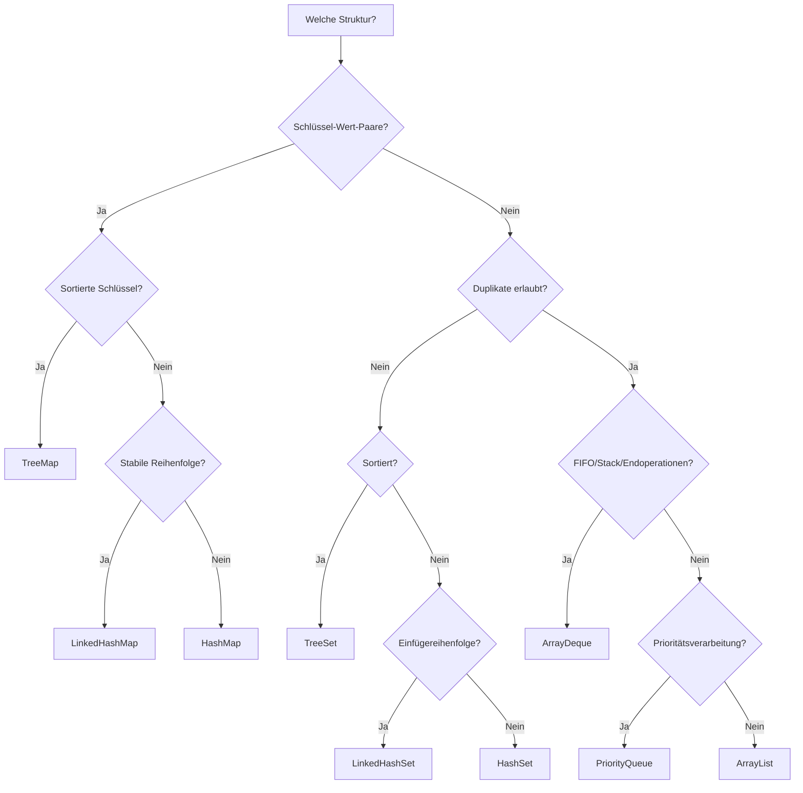

# Fachmodul: Java Datenstrukturen

**Kurs-ID:** 2717
**Kategorie:** Kursbibliothek / Fachmodule / Informatik / Java
**Quelle:** https://moodle.oszimt.de/course/view.php?id=2717
**Bezugsstand:** Java 21 LTS

---

## Inhaltsverzeichnis

1. [Lernziele](#1-lernziele)
2. [Das Java Collections Framework](#2-das-java-collections-framework)
3. [Kerninterfaces: List, Set, Queue, Map](#3-kerninterfaces-list-set-queue-map)
4. [ArrayList und LinkedList](#4-arraylist-und-linkedlist)
5. [Set-Implementierungen](#5-set-implementierungen)
6. [Map-Implementierungen](#6-map-implementierungen)
7. [Iterator, ListIterator und erweiterte for-Schleife](#7-iterator-listiterator-und-erweiterte-for-schleife)
8. [Comparable und Comparator](#8-comparable-und-comparator)
9. [Generics und Typparameter](#9-generics-und-typparameter)
10. [Wrapperklassen und Autoboxing](#10-wrapperklassen-und-autoboxing)
11. [Big-O-Komplexitäten](#11-big-o-komplexitäten)
12. [Streams API](#12-streams-api)
13. [Optional](#13-optional)
14. [Durchgängiges Praxisbeispiel](#14-durchgängiges-praxisbeispiel)
15. [Auswahlleitfaden](#15-auswahlleitfaden)
16. [Häufige Fehler](#16-häufige-fehler)
17. [Kontrollfragen und Übungen](#17-kontrollfragen-und-übungen)
18. [Bild- und Diagrammverweise](#18-bild-und-diagrammverweise)
19. [Quellen](#19-quellen)
20. [Zusammenfassung](#20-zusammenfassung)

---

## 1. Lernziele

Nach Bearbeitung dieses Fachmoduls können Sie:

- die Hierarchie des Java Collections Framework erklären,
- `List`, `Set`, `Queue`, `Deque` und `Map` fachlich unterscheiden,
- geeignete Implementierungen anhand von Ordnung, Duplikaten und Laufzeit auswählen,
- `ArrayList` und `LinkedList` hinsichtlich Aufbau, Speicherbedarf und Laufzeit vergleichen,
- `HashSet`, `LinkedHashSet` und `TreeSet` korrekt einsetzen,
- `HashMap`, `LinkedHashMap` und `TreeMap` unterscheiden,
- sicher mit `Iterator`, `ListIterator` und der erweiterten `for`-Schleife arbeiten,
- natürliche und externe Ordnungen mit `Comparable` und `Comparator` definieren,
- Generics, Bounds und Wildcards verwenden,
- Autoboxing und Unboxing einschließlich ihrer Risiken erklären,
- typische Operationen mit Big-O-Notation bewerten,
- Daten mit Streams filtern, transformieren und aggregieren,
- optionale Rückgabewerte mit `Optional` modellieren.

---

## 2. Das Java Collections Framework

Das **Java Collections Framework (JCF)** besteht aus:

1. **Interfaces** wie `List`, `Set`, `Queue` und `Map`
2. **Implementierungen** wie `ArrayList`, `HashSet` oder `TreeMap`
3. **Algorithmen und Hilfsmethoden** in `Collections`
4. **Iteratoren** zum Durchlaufen unabhängig von der konkreten Implementierung
5. **Generics** für Typsicherheit zur Übersetzungszeit

`Map` gehört zum Framework, erweitert aber **nicht** `Collection`, da es keine einzelnen Elemente, sondern Zuordnungen speichert.

### 2.1 UML-Klassendiagramm (vereinfacht)

```
Iterable ← Collection ← List ← ArrayList
                              ← LinkedList ← Deque
                  ← Set ← HashSet
                          ← LinkedHashSet
                          ← NavigableSet ← TreeSet
                  ← Queue ← PriorityQueue
                            ← Deque ← ArrayDeque
Map ← HashMap
    ← LinkedHashMap
    ← NavigableMap ← TreeMap
```

---

## 3. Kerninterfaces: List, Set, Queue, Map

### 3.1 List<E> – geordnete Folge

- besitzt eine positionsbezogene Reihenfolge
- erlaubt Duplikate
- ermöglicht Indexzugriff

```java
List<String> namen = new ArrayList<>();
namen.add("Anna");
namen.add("Ben");
namen.add("Anna");
System.out.println(namen);         // [Anna, Ben, Anna]
System.out.println(namen.get(1));  // Ben
```

Anwendungsfälle: Arbeitsschritte, Schülerlisten, Messergebnisse, Warenkorbpositionen.

### 3.2 Set<E> – Menge eindeutiger Elemente

- verhindert Duplikate
- besitzt keinen Index
- unterscheidet Implementierungen nach Ordnung

```java
Set<String> faecher = new HashSet<>();
faecher.add("Java");
faecher.add("SQL");
faecher.add("Java");
System.out.println(faecher.size());  // 2
```

### 3.3 Queue<E> – Warteschlange

Modelliert das Verarbeiten von Elementen, häufig FIFO. Eine `PriorityQueue` verarbeitet nach Priorität.

```java
Queue<String> druckauftraege = new ArrayDeque<>();
druckauftraege.offer("Auftrag A");
druckauftraege.offer("Auftrag B");
System.out.println(druckauftraege.peek()); // A, bleibt enthalten
System.out.println(druckauftraege.poll()); // A, wird entfernt
```

### 3.4 Deque<E> – doppelseitige Warteschlange

```java
Deque<String> verlauf = new ArrayDeque<>();
verlauf.addLast("Seite 1");
verlauf.addLast("Seite 2");
verlauf.addFirst("Start");
System.out.println(verlauf.removeLast()); // Seite 2
```

`ArrayDeque` ist für Stack- und Queue-Aufgaben meist besser als die veraltete Klasse `Stack`.

### 3.5 Map<K,V> – Schlüssel-Wert-Zuordnung

```java
Map<String, Integer> punkte = new HashMap<>();
punkte.put("Anna", 92);
punkte.put("Ben", 78);
punkte.put("Anna", 95); // ersetzt
System.out.println(punkte.get("Anna")); // 95
```

Wichtige Map-Sichten: `keySet()`, `values()`, `entrySet()`. Für gleichzeitigen Bedarf an Schlüssel und Wert ist `entrySet()` meist die effizienteste Wahl.

---

## 4. ArrayList und LinkedList

### 4.1 ArrayList

Verwendet ein dynamisch vergrößerbares Array.

```
Index:     0      1      2      3
         +------+------+------+------+
Element: | "A"  | "B"  | "C"  | "D"  |
         +------+------+------+------+
```

Eigenschaften:

- direkter Indexzugriff
- gute Cache-Lokalität
- Anhängen amortisiert O(1)
- Einfügen/Entfernen in Mitte erfordert Verschieben

### 4.2 LinkedList

Doppelt verkettete Liste:

```
null ← [prev|A|next] ↔ [prev|B|next] ↔ [prev|C|next] → null
```

Eigenschaften:

- kein direkter Indexzugriff
- höherer Speicherbedarf
- Einfügen an Enden O(1)
- Suchen nach Index O(n)
- implementiert zusätzlich `Deque`

### 4.3 Vergleich

| Merkmal | ArrayList | LinkedList |
|---|---|---|
| Interne Struktur | dynamisches Array | doppelt verkettete Knoten |
| `get(i)` | O(1) | O(n) |
| `set(i, x)` | O(1) | O(n) |
| Anhängen | amortisiert O(1) | O(1) |
| Einfügen am Anfang | O(n) | O(1) |
| Cache-Lokalität | gut | schlecht |
| Queue/Deque | nein | ja |

> **Praxisregel:** Für normale Listen zunächst `ArrayList` wählen.

---

## 5. Set-Implementierungen

### 5.1 HashSet

Verwendet intern eine `HashMap`.

```java
Set<String> set = new HashSet<>();
set.add("C"); set.add("A"); set.add("B");
```

Eigenschaften: keine Iterationsreihenfolge, Grundoperationen Ø O(1), ein `null`-Element zulässig, korrekte Funktion erfordert konsistente `equals`/`hashCode`.

### 5.2 LinkedHashSet

Ergänzt Hashtabelle um verkettete Reihenfolge:

```java
Set<String> set = new LinkedHashSet<>();
set.add("C"); set.add("A"); set.add("B");
System.out.println(set); // [C, A, B]
```

Anwendungsfall: Duplikatentfernung mit Reihenfolge:

```java
List<String> roh = List.of("A", "B", "A", "C");
List<String> eindeutig = new ArrayList<>(new LinkedHashSet<>(roh));
// [A, B, C]
```

### 5.3 TreeSet

Sortiert nach natürlicher Ordnung oder `Comparator`:

```java
NavigableSet<Integer> werte = new TreeSet<>(List.of(10, 20, 30));
System.out.println(werte.lower(20));   // 10, strikt kleiner
System.out.println(werte.floor(20));   // 20, kleiner/gleich
System.out.println(werte.ceiling(21)); // 30, größer/gleich
System.out.println(werte.higher(20));  // 30, strikt größer
```

### 5.4 Vergleich

| Eigenschaft | HashSet | LinkedHashSet | TreeSet |
|---|---|---|---|
| Reihenfolge | keine | Einfügereihenfolge | sortiert |
| Grundoperationen | Ø O(1) | Ø O(1) | O(log n) |
| `null` | einmal | einmal | normalerweise nicht |
| Datenstruktur | Hashtabelle | Hashtabelle + Liste | balancierter Baum |

---

## 6. Map-Implementierungen

### 6.1 HashMap

```java
Map<String, String> hauptstadt = new HashMap<>();
hauptstadt.put("DE", "Berlin");
```

Eigenschaften: keine Reihenfolge, Grundoperationen Ø O(1), ein `null`-Schlüssel zulässig, nicht threadsicher, Schlüssel sollten unveränderlich sein.

### 6.2 LinkedHashMap

Kombiniert Hashing mit Reihenfolge. Mit `accessOrder=true` lässt sich ein LRU-Cache realisieren:

```java
Map<Integer, String> cache = new LinkedHashMap<>(16, 0.75f, true) {
    @Override
    protected boolean removeEldestEntry(
            Map.Entry<Integer, String> eldest) {
        return size() > 100;
    }
};
```

### 6.3 TreeMap

Sortiert in einem balancierten Suchbaum:

```java
NavigableMap<Integer, String> map = new TreeMap<>();
SortedMap<Integer, String> ausschnitt = map.subMap(10, true, 30, false);
```

### 6.4 Vergleich

| Eigenschaft | HashMap | LinkedHashMap | TreeMap |
|---|---|---|---|
| Ordnung | keine | Einfügung oder Zugriff | sortiert |
| `get`/`put` | Ø O(1) | Ø O(1) | O(log n) |
| Struktur | Hashtabelle | Hashtabelle + Liste | Rot-Schwarz-Baum |
| Bereichsabfragen | nein | nein | ja |

---

## 7. Iterator, ListIterator und erweiterte for-Schleife

### 7.1 Iterator

```java
Iterator<String> it = namen.iterator();
while (it.hasNext()) {
    String name = it.next();
    System.out.println(name);
}
```

Sicheres Entfernen:

```java
Iterator<String> it = namen.iterator();
while (it.hasNext()) {
    if (it.next().isBlank()) {
        it.remove();
    }
}
```

> Viele Iteratoren sind **fail-fast**: strukturelle Änderungen ohne Iterator-Methoden führen zu `ConcurrentModificationException`.

### 7.2 ListIterator

```java
ListIterator<String> it = namen.listIterator();
while (it.hasNext()) {
    String name = it.next();
    if (name.equals("Ben")) {
        it.set("Benjamin");
        it.add("Nach Benjamin");
    }
}
while (it.hasPrevious()) {
    System.out.println(it.previous());
}
```

### 7.3 Enhanced for

```java
for (String name : namen) {
    System.out.println(name);
}
```

Nicht geeignet bei: Index-Bedarf, strukturellen Änderungen während Iteration, Rückwärtsdurchlauf, parallelem Durchlauf mehrerer Listen.

---

## 8. Comparable und Comparator

### 8.1 Comparable<T> – natürliche Ordnung

```java
public record Schueler(String name, int punkte)
        implements Comparable<Schueler> {

    @Override
    public int compareTo(Schueler other) {
        int nachPunkten = Integer.compare(this.punkte, other.punkte);
        if (nachPunkten != 0) return nachPunkten;
        return this.name.compareTo(other.name);
    }
}
```

### 8.2 Comparator<T> – externe oder alternative Ordnung

```java
Comparator<Schueler> nachName = Comparator.comparing(Schueler::name);

Comparator<Schueler> kombiniert =
        Comparator.comparingInt(Schueler::punkte)
                  .reversed()
                  .thenComparing(Schueler::name);

klasse.sort(kombiniert);
```

### 8.3 Vergleich

| Kriterium | Comparable | Comparator |
|---|---|---|
| Methode | `compareTo(T)` | `compare(T,T)` |
| Ort der Logik | in der Klasse | außerhalb |
| Anzahl Ordnungen | eine | beliebig viele |
| Lambda-fähig | nein | ja |

### 8.4 Konsistenz mit equals

In sortierten Strukturen (TreeSet, TreeMap) werden Elemente als gleich behandelt, wenn `compareTo`/`compare` `0` liefert. Die Ordnung sollte möglichst mit `equals` konsistent sein.

---

## 9. Generics und Typparameter

### 9.1 Vorteile

- Typfehler werden beim Kompilieren erkannt
- Casts entfallen
- APIs werden wiederverwendbar

```java
List<String> texte = new ArrayList<>();
texte.add("Hallo");
// texte.add(42); // Compilerfehler
```

### 9.2 Generische Klasse

```java
public class Box<T> {
    private T wert;

    public Box(T wert) { this.wert = wert; }
    public T getWert() { return wert; }
    public void setWert(T wert) { this.wert = wert; }
}

Box<Integer> zahl = new Box<>(42);
Box<String>  text = new Box<>("Java");
```

### 9.3 Generische Methode

```java
public static <T> T erstesElement(List<T> liste) {
    if (liste.isEmpty()) throw new IllegalArgumentException("Liste ist leer");
    return liste.get(0);
}
```

### 9.4 Begrenzte Typparameter

```java
public static <T extends Number> double summe(List<T> zahlen) {
    double summe = 0.0;
    for (T zahl : zahlen) {
        summe += zahl.doubleValue();
    }
    return summe;
}
```

### 9.5 Wildcards und PECS

**Producer extends** (Quelle):

```java
public static double summe(List<? extends Number> quelle) {
    double result = 0;
    for (Number n : quelle) {
        result += n.doubleValue();
    }
    return result;
}
```

**Consumer super** (Senke):

```java
public static void fuegeGanzzahlenEin(List<? super Integer> ziel) {
    ziel.add(10); ziel.add(20);
}
```

**PECS**: Producer Extends, Consumer Super.

### 9.6 Type Erasure

Generics nutzen **Type Erasure**. `List<String>` und `List<Integer>` sind zur Laufzeit beide `List`. Daher:

```java
// new T();          // nicht möglich
// new T[10];        // nicht möglich
// obj instanceof List<String> // nicht möglich
```

Generics akzeptieren nur Referenztypen:

```java
List<Integer> zahlen = new ArrayList<>();
// List<int> ungueltig;
```

---

## 10. Wrapperklassen und Autoboxing

| Primitiv | Wrapper |
|---|---|
| `byte` | `Byte` |
| `short` | `Short` |
| `int` | `Integer` |
| `long` | `Long` |
| `float` | `Float` |
| `double` | `Double` |
| `char` | `Character` |
| `boolean` | `Boolean` |

### 10.1 Autoboxing und Unboxing

```java
Integer objekt = 42;       // int -> Integer
int primitiv = objekt;     // Integer -> int
```

### 10.2 Null-Risiko

```java
Integer vielleicht = null;
int zahl = vielleicht;  // NullPointerException
```

Sicherer mit Map:

```java
int wert = anzahl.getOrDefault("unbekannt", 0);
```

### 10.3 Integer-Cache und == vs equals

```java
Integer a = 127, b = 127;
System.out.println(a == b);     // häufig true (Cache -128..127)

Integer x = 128, y = 128;
System.out.println(x == y);     // typischerweise false
System.out.println(x.equals(y)); // true
```

### 10.4 Performance

Häufiges Boxing erzeugt Objekte und kann Garbage Collection auslösen. Für numerische Berechnungen:

```java
IntStream intStream = zahlen.stream().mapToInt(Integer::intValue);
```

---

## 11. Big-O-Komplexitäten

| Notation | Bedeutung |
|---|---|
| O(1) | konstant |
| O(log n) | logarithmisch |
| O(n) | linear |
| O(n log n) | typisches effizientes Sortieren |
| O(n²) | quadratisch |

### 11.1 Komplexitätstabelle

| Struktur / Operation | Zugriff | Suche | Einfügen | Entfernen |
|---|---:|---:|---:|---:|
| `ArrayList` Index | O(1) | O(n) | Ende amort. O(1) | O(n) |
| `LinkedList` Index | O(n) | O(n) | Enden O(1) | O(n) |
| `HashSet` | – | Ø O(1) | Ø O(1) | Ø O(1) |
| `TreeSet` | – | O(log n) | O(log n) | O(log n) |
| `HashMap` | Ø O(1) | O(n) (`containsValue`) | Ø O(1) | Ø O(1) |
| `TreeMap` | O(log n) | O(log n) | O(log n) | O(log n) |
| `ArrayDeque` Enden | O(1) | O(n) | O(1) | O(1) |
| `PriorityQueue` Spitze | O(1) | O(n) | O(log n) | O(log n) |

### 11.2 Amortisierte Laufzeit

`ArrayList.add` am Ende ist amortisiert O(1), obwohl gelegentliche Resizes O(n) kosten.

### 11.3 Big O ist nicht alles

Wichtige Faktoren: Cache-Lokalität, Objektallokationen, Speicherverbrauch, Qualität von `hashCode`, Resize-Vorgänge, JVM-Optimierung.

---

## 12. Streams API

### 12.1 Pipeline

```java
List<String> ergebnis = namen.stream()
        .filter(name -> name.length() >= 4)
        .map(String::toUpperCase)
        .sorted()
        .toList();
```

Eine Pipeline besteht aus:
1. Quelle
2. null oder mehr Zwischenoperationen
3. einer Terminaloperation

### 12.2 filter, map, collect

```java
List<Integer> gerade = List.of(1, 2, 3, 4, 5, 6).stream()
        .filter(n -> n % 2 == 0)
        .toList();  // [2, 4, 6]

List<Integer> laengen = namen.stream()
        .map(String::length)
        .toList();

List<String> result = namen.stream()
        .filter(n -> n.startsWith("A"))
        .collect(Collectors.toList());

Map<Integer, List<String>> nachLaenge = namen.stream()
        .collect(Collectors.groupingBy(String::length));

Map<String, Long> haeufigkeit = namen.stream()
        .collect(Collectors.groupingBy(
                Function.identity(),
                Collectors.counting()));
```

### 12.3 Lazy Evaluation

Zwischenoperationen sind lazy. Erst eine Terminaloperation startet die Verarbeitung.

```java
Stream<String> pipeline = namen.stream()
        .filter(n -> { System.out.println("Prüfe " + n); return true; });
// Bis hier wurde noch nicht verarbeitet.

long anzahl = pipeline.count();
```

Ein Stream kann nach einer Terminaloperation nicht erneut verwendet werden.

### 12.4 Weitere Operationen

```java
long anzahl = namen.stream().count();

boolean vorhanden = namen.stream().anyMatch(n -> n.equals("Anna"));

Optional<String> erstes = namen.stream()
        .filter(n -> n.startsWith("B"))
        .findFirst();

int summe = List.of(1, 2, 3, 4).stream()
        .reduce(0, Integer::sum);
```

### 12.5 Primitive Streams

```java
int gesamt = zahlen.stream()
        .mapToInt(Integer::intValue)
        .sum();

double durchschnitt = zahlen.stream()
        .mapToInt(Integer::intValue)
        .average()
        .orElse(0.0);
```

### 12.6 Parallele Streams

```java
long anzahl = daten.parallelStream()
        .filter(this::aufwendigePruefung)
        .count();
```

Parallele Streams sind nur sinnvoll bei: genügend Daten, teuren Operationen, unabhängigen/ seiteneffektfreien Funktionen, gemessenem Vorteil.

---

## 13. Optional

### 13.1 Erzeugen

```java
Optional<String> vorhanden = Optional.of("Java");
Optional<String> vielleicht = Optional.ofNullable(text);
Optional<String> leer = Optional.empty();
```

### 13.2 Auslesen

```java
vielleicht.ifPresent(System.out::println);

String wert = vielleicht.orElse("Standard");

String lazy = vielleicht.orElseGet(() -> berechneAufwendigenStandardwert());

String pflicht = vielleicht.orElseThrow(
        () -> new IllegalStateException("Wert fehlt"));
```

> `orElseGet` ruft den Supplier nur bei leerem Optional auf, `orElse` immer.

### 13.3 map, filter, flatMap

```java
Optional<Integer> laenge = vielleicht.map(String::length);
Optional<String> langesWort = vielleicht.filter(s -> s.length() > 5);

Optional<Adresse> adresse =
        optionalBenutzer.flatMap(this::findeAdresse);
```

### 13.4 Anti-Patterns

```java
// Schlecht: ungeprüftes get
String wert = optional.get();

// Besser:
optional.ifPresent(this::verarbeite);
```

`Optional<T>` sollte nie `null` zurückgeben.

---

## 14. Durchgängiges Praxisbeispiel

```java
import java.util.*;
import java.util.function.Function;
import java.util.stream.Collectors;

public class Kursverwaltung {

    public record Teilnehmer(
            int id,
            String name,
            int punkte,
            Set<String> kompetenzen) {
    }

    private final Map<Integer, Teilnehmer> nachId = new HashMap<>();

    public void hinzufuegen(Teilnehmer teilnehmer) {
        Objects.requireNonNull(teilnehmer);
        nachId.put(teilnehmer.id(), teilnehmer);
    }

    public Optional<Teilnehmer> finde(int id) {
        return Optional.ofNullable(nachId.get(id));
    }

    public List<Teilnehmer> rangliste() {
        return nachId.values().stream()
                .sorted(Comparator
                        .comparingInt(Teilnehmer::punkte)
                        .reversed()
                        .thenComparing(Teilnehmer::name))
                .toList();
    }

    public Set<String> alleKompetenzen() {
        return nachId.values().stream()
                .flatMap(t -> t.kompetenzen().stream())
                .collect(Collectors.toCollection(TreeSet::new));
    }

    public Map<String, Long> kompetenzHaeufigkeiten() {
        return nachId.values().stream()
                .flatMap(t -> t.kompetenzen().stream())
                .collect(Collectors.groupingBy(
                        Function.identity(),
                        TreeMap::new,
                        Collectors.counting()));
    }

    public double durchschnitt() {
        return nachId.values().stream()
                .mapToInt(Teilnehmer::punkte)
                .average()
                .orElse(0.0);
    }
}
```

---

## 15. Auswahlleitfaden



Kurzregeln:

- allgemeine Liste: `ArrayList`
- Queue oder Stack: `ArrayDeque`
- eindeutige Werte: `HashSet`
- sortierte eindeutige Werte: `TreeSet`
- allgemeines Lookup: `HashMap`
- sortierte Schlüssel: `TreeMap`

---

## 16. Häufige Fehler

1. `HashSet`/`HashMap` mit beobachteter Reihenfolge
2. `LinkedList.get(i)` in indexbasierter Schleife
3. Strukturelle Änderung in enhanced for
4. `equals` ohne passendes `hashCode`
5. Schlüssel nachträglich verändert
6. Wrapper mit `==` statt `.equals`
7. `null`-Wrapper entpackt
8. Rohe Typen ohne Generics
9. `Optional.get()` ohne Strategie
10. Streams mehrfach verwendet
11. Seiteneffekte in Stream-Pipelines
12. Parallel-Stream ohne Messung
13. TreeSet mit `compareTo`-0 für `equals`-ungleiche Objekte
14. O(1) als „immer gleich schnell"

---

## 17. Kontrollfragen und Übungen

### Kontrollfragen

1. Weshalb erweitert `Map` nicht `Collection`?
2. Warum ist `ArrayList` bei allgemeiner Listennutzung meist die Standardwahl?
3. Weshalb ist `LinkedList.add(index, element)` nicht grundsätzlich O(1)?
4. Welche Implementierung erhält Eindeutigkeit und Einfügereihenfolge?
5. Welche Struktur unterstützt sortierte Bereichsabfragen?
6. Warum müssen `equals` und `hashCode` konsistent sein?
7. Worin unterscheiden sich `Comparable` und `Comparator`?
8. Was bedeutet PECS?
9. Wie entsteht durch Unboxing eine `NullPointerException`?
10. Weshalb sind Stream-Zwischenoperationen lazy?
11. Wann ist `orElseGet` besser als `orElse`?
12. Warum kann ein indexbasierter LinkedList-Durchlauf O(n²) werden?

### Praktische Übungen

1. **Worthäufigkeiten**: Lese einen Text ein und erzeuge die Häufigkeit jedes Wortes.
2. **Duplikatentfernung**: Entferne Duplikate unter Erhalt der Reihenfolge des ersten Auftretens.
3. **Rangliste**: Sortiere Lernende nach Punkten absteigend, bei Gleichstand nach Name aufsteigend.
4. **Queue**: Druckerwarteschlange mit `ArrayDeque`.
5. **Stream-Auswertung**: Filtere Teilnehmer mit ≥ 50 Punkten, mappe Namen zu Uppercase, sammle sortiert.
6. **Optional**: Suche mit `Optional<Teilnehmer>`, behandele vorhandene und fehlende Treffer ohne `get()`.

---

## 18. Bild- und Diagrammverweise

- Java Collections Framework: <https://commons.wikimedia.org/wiki/File:Java_collections_framework_class_hierarchy.svg>
- Oracle Collections Overview: <https://docs.oracle.com/javase/8/docs/technotes/guides/collections/overview.html>
- Oracle Collections Interfaces Tutorial: <https://docs.oracle.com/javase/tutorial/collections/interfaces/index.html>
- Oracle Collections Implementations: <https://docs.oracle.com/javase/tutorial/collections/implementations/index.html>
- Baeldung: Collections Complexities: <https://www.baeldung.com/java-collections-complexity>
- GeeksforGeeks: HashSet/LinkedHashSet/TreeSet: <https://www.geeksforgeeks.org/java/difference-and-similarities-between-hashset-linkedhashset-and-treeset-in-java/>
- Oracle Stream Package: <https://docs.oracle.com/en/java/javase/17/docs/api/java.base/java/util/stream/package-summary.html>
- Oracle Generics Tutorial: <https://docs.oracle.com/javase/tutorial/java/generics/index.html>

---

## 19. Quellen

- Oracle – Collection Framework: <https://docs.oracle.com/javase/8/docs/technotes/guides/collections/overview.html>
- Oracle – List: <https://docs.oracle.com/en/java/javase/17/docs/api/java.base/java/util/List.html>
- Oracle – Set: <https://docs.oracle.com/en/java/javase/17/docs/api/java.base/java/util/Set.html>
- Oracle – Map: <https://docs.oracle.com/en/java/javase/17/docs/api/java.base/java/util/Map.html>
- Oracle – ArrayList: <https://docs.oracle.com/en/java/javase/17/docs/api/java.base/java/util/ArrayList.html>
- Oracle – Iterator: <https://docs.oracle.com/en/java/javase/17/docs/api/java.base/java/util/Iterator.html>
- Oracle – Comparable: <https://docs.oracle.com/en/java/javase/17/docs/api/java.base/java/lang/Comparable.html>
- Oracle – Comparator: <https://docs.oracle.com/en/java/javase/17/docs/api/java.base/java/util/Comparator.html>
- Oracle – Optional: <https://docs.oracle.com/en/java/javase/17/docs/api/java.base/java/util/Optional.html>
- JLS Generics: <https://docs.oracle.com/javase/specs/jls/se18/html/jls-4.html>

---

## 20. Zusammenfassung

Das Java Collections Framework stellt einheitliche Schnittstellen und Implementierungen für Listen, Mengen, Warteschlangen und Schlüssel-Wert-Zuordnungen bereit. Die Auswahl einer Datenstruktur muss sich an fachlichen Invarianten orientieren: Sind Duplikate zulässig? Ist Reihenfolge relevant? Werden Schlüssel benötigt? Muss sortiert, per Index zugegriffen oder an den Enden eingefügt werden?

Für die meisten Listen ist `ArrayList`, für ungeordnete Mengen `HashSet` und für Schlüssel-Wert-Daten `HashMap` die sinnvolle Standardwahl. Sortierung erfordert meist `TreeSet`/`TreeMap`; stabile Einfügereihenfolge liefern `LinkedHashSet` und `LinkedHashMap`.

### Wichtigste Merksätze

1. `Map` erweitert nicht `Collection`.
2. `ArrayList` ist für die meisten Listen die Standardwahl.
3. `LinkedList` ist nur bei Deque-/End-Operationen sinnvoll.
4. `HashSet` ist unsortiert, `TreeSet` sortiert, `LinkedHashSet` behält Reihenfolge.
5. Iteratoren sind oft fail-fast; strukturelle Änderungen ohne Iterator-Methoden vermeiden.
6. `Comparable` definiert die natürliche, `Comparator` eine externe Ordnung.
7. `equals` und `hashCode` müssen konsistent sein.
8. PECS: Producer extends, Consumer super.
9. Auto-Boxing kann zu `NullPointerException` und versteckten Performance-Problemen führen.
10. Streams sind lazy und können nach Terminaloperation nicht erneut verwendet werden.
11. `Optional` eignet sich besonders für Rückgabewerte, nicht für Felder.

### Selbsttest-Checkliste

- [ ] Ich wähle die passende Collection-Implementierung pro Anwendungsfall.
- [ ] Ich unterscheide `ArrayList` und `LinkedList`.
- [ ] Ich erkläre Big-O-Komplexitäten.
- [ ] Ich nutze `Iterator` sicher.
- [ ] Ich verwende `Comparable` und `Comparator` korrekt.
- [ ] Ich setze PECS bei Wildcards um.
- [ ] Ich nutze Streams deklarativ und vermeide Seiteneffekte.
- [ ] Ich modelliere optionale Werte mit `Optional`.

---

*Stand: Java 21 LTS — Quelle: https://moodle.oszimt.de/course/view.php?id=2717 — Recherche 2026*
