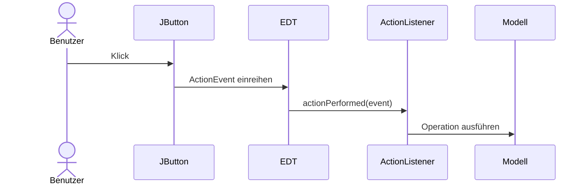
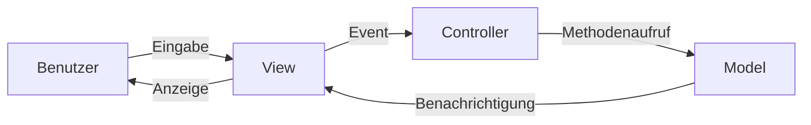

# Fachmodul: GUI (Java Swing)

**Kurs-ID:** 2826
**Kategorie:** Kursbibliothek / Fachmodule / Informatik / Java
**Quelle:** https://moodle.oszimt.de/course/view.php?id=2826
**Bezugsstand:** Java 21 LTS

---

## Inhaltsverzeichnis

1. [Lernziele](#1-lernziele)
2. [Historische Entwicklung der Java-GUI-Technologien](#2-historische-entwicklung-der-java-gui-technologien)
3. [Vergleich: Swing, JavaFX und SWT](#3-vergleich-swing-javafx-und-swt)
4. [Swing-Komponenten und Containerhierarchie](#4-swing-komponenten-und-containerhierarchie)
5. [Der Event Dispatch Thread](#5-der-event-dispatch-thread)
6. [Layout-Manager](#6-layout-manager)
7. [Ereignisbehandlung](#7-ereignisbehandlung)
8. [MVC in Swing](#8-mvc-in-swing)
9. [Nebenläufigkeit mit SwingWorker](#9-nebenläufigkeit-mit-swingworker)
10. [Look-and-Feel](#10-look-and-feel)
11. [Vollständige Beispielanwendung: MVC-Taschenrechner](#11-vollständige-beispielanwendung-mvc-taschenrechner)
12. [Entwurf einer Adressbuchanwendung](#12-entwurf-einer-adressbuchanwendung)
13. [Typische Fehler und Best Practices](#13-typische-fehler-und-best-practices)
14. [Bild- und Diagrammverweise](#14-bild-und-diagrammverweise)
15. [Quellen](#15-quellen)
16. [Zusammenfassung](#16-zusammenfassung)

---

## 1. Lernziele

Nach Bearbeitung dieses Fachmoduls können Sie:

- die Geschichte von AWT, Swing und JavaFX einordnen,
- Swing-Komponenten und Container hierarchisch anordnen,
- den Event Dispatch Thread (EDT) verstehen und nutzen,
- Layout-Manager für flexible Oberflächen einsetzen,
- Ereignisbehandlung mit ActionListener, MouseListener, KeyListener und Key Bindings implementieren,
- MVC-Pattern in Swing-Anwendungen anwenden,
- `SwingWorker` für nebenläufige Aufgaben nutzen,
- Look-and-Feel wechseln,
- typische Fehler vermeiden und Best Practices anwenden.

---

## 2. Historische Entwicklung der Java-GUI-Technologien

### 2.1 AWT – Abstract Window Toolkit

Das **Abstract Window Toolkit** gehört seit den frühen Java-Versionen zur Plattform:

```java
import java.awt.*;
import java.awt.event.*;
```

Klassische AWT-Komponenten: `Frame`, `Panel`, `Button`, `Label`, `TextField`, `Checkbox`, `List`.

AWT-Komponenten werden häufig als **Heavyweight Components** bezeichnet. Sie verwenden korrespondierende native Widgets des Betriebssystems (sog. **Peer**).

### 2.2 Swing – plattformunabhängige Komponenten

Swing wurde ab Ende der 1990er als Teil der **Java Foundation Classes (JFC)** eingeführt:

```java
import javax.swing.*;
```

Typische Swing-Komponenten beginnen mit `J`:

| AWT | Swing |
|---|---|
| `Frame` | `JFrame` |
| `Panel` | `JPanel` |
| `Button` | `JButton` |
| `Label` | `JLabel` |
| `TextField` | `JTextField` |
| `Checkbox` | `JCheckBox` |

Zusätzlich bietet Swing Komponenten ohne AWT-Gegenstück: `JTable`, `JTree`, `JTabbedPane`, `JToolBar`, `JProgressBar`, `JSpinner`, `JFileChooser`, `JColorChooser`, `JDesktopPane`, `JInternalFrame`.

Die meisten Swing-Steuerelemente sind **Lightweight Components**. Sie werden überwiegend durch Java selbst gezeichnet.

### 2.3 JavaFX – moderner Nachfolger

Seit Java 11 wird JavaFX als separates **OpenJFX**-Projekt gepflegt.

JavaFX bietet:

- FXML (deklarative UI)
- CSS-basiertes Styling
- Properties und Data Binding
- Animationen
- Audio und Video
- Scene Graph
- Hardwarebeschleunigung

---

## 3. Vergleich: Swing, JavaFX und SWT

| Kriterium | Swing | JavaFX | SWT |
|---|---|---|---|
| Bereitstellung | Java SE | separate OpenJFX | Eclipse |
| Darstellung | Java-gezeichnet | Scene Graph, CSS | native Widgets |
| Styling | Look-and-Feel | CSS | OS-abhängig |
| Layout | Layout-Manager | Layout Panes | Layout-Klassen |
| UI-Thread | EDT | JavaFX Application Thread | SWT Display Thread |
| Multimedia | begrenzt | umfangreich | nicht im Fokus |
| Data Binding | manuell | Properties/Bindings | Zusatzbibliotheken |
| Native Optik | System-LAF angenähert | eigene Darstellung | sehr nativ |
| Lernaufwand | moderat | moderat-hoch | moderat-hoch |

**Entscheidungshilfe:**

- **Swing** für klassische formular-/tabellenorientierte Anwendungen, Erweiterung bestehender Swing-Systeme, geringe externe Abhängigkeiten, Ausbildung.
- **JavaFX** für CSS, Animation, Multimedia, Scene Graph, Data Binding.
- **SWT** für Eclipse-RCP-Anwendungen mit möglichst nativer Optik.

---

## 4. Swing-Komponenten und Containerhierarchie

Eine Swing-Oberfläche besteht aus einer Hierarchie verschachtelter Container und Komponenten:

```
Component ← Container ← Window ← Frame ← JFrame
Container ← JComponent ← JPanel
JComponent ← JLabel
JComponent ← AbstractButton ← JButton
JComponent ← JTextComponent ← JTextField
```

### 4.1 JFrame

`JFrame` ist das Hauptfenster:

```java
JFrame frame = new JFrame("Meine Anwendung");
frame.setDefaultCloseOperation(JFrame.EXIT_ON_CLOSE);
frame.setSize(600, 400);
frame.setLocationRelativeTo(null);
frame.setVisible(true);
```

Wichtige Methoden:

| Methode | Bedeutung |
|---|---|
| `setTitle(...)` | Fenstertitel |
| `setDefaultCloseOperation(...)` | Schließverhalten |
| `setJMenuBar(...)` | Menüleiste |
| `add(...)` | Komponente zum Content Pane |
| `pack()` | Größe aus bevorzugten Komponentengrößen |
| `setLocationRelativeTo(null)` | Fenster zentrieren |
| `setResizable(...)` | Größenänderung erlauben/sperren |
| `dispose()` | native Ressourcen freigeben |

Für produktive Oberflächen ist `pack()` besser als starre Größen mit `setSize(...)`.

### 4.2 JPanel

`JPanel` ist ein universeller Container:

```java
JPanel panel = new JPanel(new FlowLayout());
panel.add(new JLabel("Name:"));
panel.add(new JTextField(20));
```

### 4.3 JLabel

`JLabel` zeigt Text oder Icon:

```java
JLabel label = new JLabel("Benutzername:");
label.setToolTipText("Geben Sie Ihren Anmeldenamen ein.");
```

Für Barrierefreiheit Zuordnung zu Eingabefeld:

```java
nameLabel.setLabelFor(nameField);
```

### 4.4 JTextField

`JTextField` ist einzeiliges Texteingabefeld:

```java
JTextField textField = new JTextField(20);
String input = textField.getText().trim();
```

Erweiterungen: `DocumentListener`, `InputVerifier`, `JFormattedTextField`, `DocumentFilter`.

### 4.5 JButton

`JButton` löst eine Aktion aus:

```java
JButton saveButton = new JButton("Speichern");
saveButton.addActionListener(event ->
    System.out.println("Speichern wurde ausgelöst."));
```

Ein Button kann Text, Icon, Mnemonic, Tooltip und eine `Action` besitzen.

---

## 5. Der Event Dispatch Thread

Swing arbeitet mit dem **Event Dispatch Thread** (EDT). Auf diesem Thread laufen:

- Mausereignisse
- Tastaturereignisse
- `ActionEvent`s
- Fokuswechsel
- Repaint-Anforderungen
- Änderungen an Swing-Komponenten

Die Oberfläche sollte auf dem EDT erzeugt werden:

```java
public static void main(String[] args) {
    SwingUtilities.invokeLater(() -> {
        JFrame frame = new JFrame("EDT-Beispiel");
        frame.setDefaultCloseOperation(JFrame.EXIT_ON_CLOSE);
        frame.add(new JLabel("Sicher auf dem EDT erzeugt"));
        frame.pack();
        frame.setLocationRelativeTo(null);
        frame.setVisible(true);
    });
}
```

**Zentrale Regel:** Swing-Komponenten sollen nach ihrer Anzeige grundsätzlich nur auf dem EDT gelesen oder verändert werden.

Problematisch:

```java
button.addActionListener(event -> {
    ladeMillionenDatensaetze();   // blockiert den EDT
});
```

---

## 6. Layout-Manager

### 6.1 Warum keine absoluten Koordinaten?

`setBounds(...)` reagiert schlecht auf:

- andere Schriftgrößen
- verschiedene Betriebssysteme
- Look-and-Feels
- Übersetzungen
- hohe DPI-Werte
- Fenstergrößenänderungen
- Barrierefreiheit

### 6.2 BorderLayout

```text
+--------------------------------+
|             NORTH              |
+------+------------------+------+
| WEST |      CENTER      | EAST |
+------+------------------+------+
|             SOUTH              |
+--------------------------------+
```

```java
JPanel root = new JPanel(new BorderLayout(8, 8));
root.add(new JLabel("Kopfbereich"), BorderLayout.NORTH);
root.add(new JTextArea(),           BorderLayout.CENTER);
root.add(new JButton("OK"),         BorderLayout.SOUTH);
```

### 6.3 FlowLayout

```java
JPanel buttons = new JPanel(new FlowLayout(FlowLayout.RIGHT, 8, 5));
buttons.add(new JButton("Abbrechen"));
buttons.add(new JButton("Speichern"));
```

### 6.4 GridLayout

```java
JPanel keypad = new JPanel(new GridLayout(4, 4, 5, 5));

for (String text : new String[]{
        "7", "8", "9", "/",
        "4", "5", "6", "*",
        "1", "2", "3", "-",
        "0", "C", "=", "+"
}) {
    keypad.add(new JButton(text));
}
```

### 6.5 GridBagLayout

```java
JPanel form = new JPanel(new GridBagLayout());
GridBagConstraints gbc = new GridBagConstraints();
gbc.insets = new Insets(4, 4, 4, 4);
gbc.anchor = GridBagConstraints.LINE_START;

gbc.gridx = 0; gbc.gridy = 0;
form.add(new JLabel("Name:"), gbc);

gbc.gridx = 1; gbc.weightx = 1.0; gbc.fill = GridBagConstraints.HORIZONTAL;
form.add(new JTextField(20), gbc);
```

### 6.6 BoxLayout

```java
JPanel panel = new JPanel();
panel.setLayout(new BoxLayout(panel, BoxLayout.Y_AXIS));
panel.add(new JLabel("Benutzername"));
panel.add(Box.createVerticalStrut(4));
panel.add(new JTextField(20));
panel.add(Box.createVerticalStrut(12));
panel.add(new JButton("Anmelden"));
```

### 6.7 Auswahlhilfe

| Layout | Typischer Einsatz |
|---|---|
| `BorderLayout` | Hauptstruktur |
| `FlowLayout` | Button-/Kontrollleisten |
| `GridLayout` | gleich große Raster |
| `GridBagLayout` | flexible Formulare |
| `BoxLayout` | vertikale/horizontale Stapel |
| `CardLayout` | Assistenten und wechselnde Ansichten |

---

## 7. Ereignisbehandlung

### 7.1 Delegation Event Model



### 7.2 ActionListener

```java
JButton button = new JButton("Begrüßen");
JTextField field = new JTextField(20);
JLabel output = new JLabel(" ");

button.addActionListener(event ->
    output.setText("Hallo " + field.getText().trim()));
```

### 7.3 MouseListener mit MouseAdapter

```java
panel.addMouseListener(new MouseAdapter() {
    @Override
    public void mousePressed(MouseEvent event) {
        System.out.printf("Taste %d bei (%d, %d)%n",
            event.getButton(), event.getX(), event.getY());
    }
});
```

### 7.4 KeyListener

```java
field.addKeyListener(new KeyAdapter() {
    @Override
    public void keyTyped(KeyEvent event) {
        char c = event.getKeyChar();
        if (!Character.isDigit(c)) {
            event.consume();
        }
    }
});
```

**Besser für Anwendungsbefehle**: Key Bindings statt KeyListener:

```java
KeyStroke escape = KeyStroke.getKeyStroke(KeyEvent.VK_ESCAPE, 0);
rootPanel.getInputMap(JComponent.WHEN_IN_FOCUSED_WINDOW).put(escape, "close");
rootPanel.getActionMap().put("close", new AbstractAction() {
    @Override
    public void actionPerformed(ActionEvent event) {
        frame.dispose();
    }
});
```

---

## 8. MVC in Swing

### 8.1 Grundidee

MVC trennt eine Anwendung in:

- **Model:** Daten, Zustand, Fachlogik
- **View:** visuelle Darstellung
- **Controller:** Übersetzung von Benutzeraktionen in Modelloperationen



Swing-Komponenten haben bereits interne Modelle:

| Komponente | Modell |
|---|---|
| `JButton` | `ButtonModel` |
| `JList` | `ListModel` |
| `JTable` | `TableModel` |
| `JTree` | `TreeModel` |
| `JTextField` | `Document` |
| `JSpinner` | `SpinnerModel` |

### 8.2 Beispielstruktur

```text
src/
├── model/
│   ├── Contact.java
│   └── ContactRepository.java
├── view/
│   └── AddressBookView.java
├── controller/
│   └── AddressBookController.java
└── Application.java
```

### 8.3 Model

```java
public record Contact(String name, String email, String phone) {
    public Contact {
        if (name == null || name.isBlank()) {
            throw new IllegalArgumentException("Name darf nicht leer sein.");
        }
    }
}
```

### 8.4 View

```java
public final class AddressBookView extends JFrame {
    final JTextField nameField = new JTextField(20);
    final JTextField emailField = new JTextField(20);
    final JButton addButton = new JButton("Hinzufügen");
    final DefaultListModel<Contact> listModel = new DefaultListModel<>();
    final JList<Contact> contactList = new JList<>(listModel);

    public AddressBookView() {
        super("Adressbuch");
        setDefaultCloseOperation(EXIT_ON_CLOSE);
    }
}
```

### 8.5 Controller

```java
public final class AddressBookController {
    private final List<Contact> contacts;
    private final AddressBookView view;

    public AddressBookController(List<Contact> contacts, AddressBookView view) {
        this.contacts = contacts;
        this.view = view;
        view.addButton.addActionListener(e -> addContact());
    }

    private void addContact() {
        try {
            Contact contact = new Contact(
                view.nameField.getText().trim(),
                view.emailField.getText().trim(),
                ""
            );
            contacts.add(contact);
            view.listModel.addElement(contact);
        } catch (IllegalArgumentException ex) {
            JOptionPane.showMessageDialog(view, ex.getMessage(),
                "Eingabefehler", JOptionPane.ERROR_MESSAGE);
        }
    }
}
```

### 8.6 Vorteile

- Fachlogik ist ohne GUI testbar
- Views können ausgetauscht werden
- Controller bleiben überschaubar
- Datenzugriff kann später ersetzt werden
- Ereignisbehandlung verteilt sich nicht unkontrolliert

---

## 9. Nebenläufigkeit mit SwingWorker

### 9.1 Problem

Dateizugriffe, Datenbankabfragen, Webanfragen und rechenintensive Aufgaben dürfen nicht auf dem EDT laufen. Hintergrundthreads dürfen Swing-Komponenten nicht beliebig verändern.

### 9.2 SwingWorker

`SwingWorker<T, V>`:

- `T`: endgültiger Ergebnistyp
- `V`: Typ der Zwischenergebnisse

| Methode | Thread | Aufgabe |
|---|---|---|
| `execute()` | aufrufender Thread | Worker starten |
| `doInBackground()` | Worker-Thread | lange Arbeit ausführen |
| `publish(...)` | Worker-Thread | Zwischenergebnisse melden |
| `process(...)` | EDT | Zwischenergebnisse anzeigen |
| `done()` | EDT | Endergebnis verarbeiten |
| `get()` | aufrufender Thread | Ergebnis abrufen |

```java
loadButton.addActionListener(event -> {
    loadButton.setEnabled(false);
    progressBar.setValue(0);

    SwingWorker<String, String> worker = new SwingWorker<>() {
        @Override
        protected String doInBackground() throws Exception {
            for (int i = 1; i <= 10; i++) {
                if (isCancelled()) return "Abgebrochen";
                Thread.sleep(300);
                setProgress(i * 10);
                publish("Schritt " + i);
            }
            return "Alle Daten geladen";
        }

        @Override
        protected void process(List<String> chunks) {
            for (String message : chunks) {
                output.append(message + System.lineSeparator());
            }
        }

        @Override
        protected void done() {
            loadButton.setEnabled(true);
            try {
                output.append(get() + System.lineSeparator());
            } catch (CancellationException ex) {
                output.append("Vorgang abgebrochen.\n");
            } catch (InterruptedException ex) {
                Thread.currentThread().interrupt();
            } catch (ExecutionException ex) {
                output.append("Fehler: " + ex.getCause().getMessage() + "\n");
            }
        }
    };

    worker.addPropertyChangeListener(event2 -> {
        if ("progress".equals(event2.getPropertyName())) {
            progressBar.setValue((Integer) event2.getNewValue());
        }
    });

    worker.execute();
});
```

---

## 10. Look-and-Feel

### 10.1 System-LAF

```java
try {
    UIManager.setLookAndFeel(
        UIManager.getSystemLookAndFeelClassName());
} catch (ReflectiveOperationException |
         UnsupportedLookAndFeelException ex) {
    System.err.println("System-LAF nicht verfügbar: " + ex.getMessage());
}
```

Das Look-and-Feel sollte vor dem Erzeugen der Swing-Komponenten eingestellt werden.

### 10.2 Nimbus aktivieren

```java
for (UIManager.LookAndFeelInfo info
        : UIManager.getInstalledLookAndFeels()) {
    if ("Nimbus".equals(info.getName())) {
        UIManager.setLookAndFeel(info.getClassName());
        break;
    }
}
```

### 10.3 Vorhandene LAFs anzeigen

```java
for (UIManager.LookAndFeelInfo info : UIManager.getInstalledLookAndFeels()) {
    System.out.println(info.getName() + " -> " + info.getClassName());
}
```

Wird das LAF nach Aufbau der Oberfläche gewechselt:

```java
UIManager.setLookAndFeel(className);
SwingUtilities.updateComponentTreeUI(frame);
frame.pack();
```

Externe LAFs wie **FlatLaf** sind verbreitet:

```java
FlatLightLaf.setup();
```

---

## 11. Vollständige Beispielanwendung: MVC-Taschenrechner

### 11.1 Modell

```java
import java.math.BigDecimal;
import java.math.MathContext;

public final class CalculatorModel {
    private BigDecimal accumulator = BigDecimal.ZERO;
    private String pendingOperator;
    private boolean startNewNumber = true;

    public BigDecimal getAccumulator() { return accumulator; }
    public boolean shouldStartNewNumber() { return startNewNumber; }
    public void setStartNewNumber(boolean value) { startNewNumber = value; }

    public void clear() {
        accumulator = BigDecimal.ZERO;
        pendingOperator = null;
        startNewNumber = true;
    }

    public BigDecimal applyOperator(String operator, BigDecimal displayedValue) {
        if (pendingOperator == null) {
            accumulator = displayedValue;
        } else if (!startNewNumber) {
            accumulator = calculate(accumulator, displayedValue, pendingOperator);
        }
        pendingOperator = "=".equals(operator) ? null : operator;
        startNewNumber = true;
        return accumulator;
    }

    private BigDecimal calculate(BigDecimal left, BigDecimal right, String operator) {
        return switch (operator) {
            case "+" -> left.add(right);
            case "-" -> left.subtract(right);
            case "*" -> left.multiply(right);
            case "/" -> {
                if (right.compareTo(BigDecimal.ZERO) == 0) {
                    throw new ArithmeticException("Division durch null ist nicht erlaubt.");
                }
                yield left.divide(right, MathContext.DECIMAL64);
            }
            default -> right;
        };
    }
}
```

### 11.2 View

```java
import javax.swing.*;
import javax.swing.border.EmptyBorder;
import java.awt.*;
import java.util.LinkedHashMap;
import java.util.Map;

public final class CalculatorView extends JFrame {
    private final JTextField display = new JTextField("0", 16);
    private final Map<String, JButton> buttons = new LinkedHashMap<>();

    public CalculatorView() {
        super("Swing-Taschenrechner");
        setDefaultCloseOperation(JFrame.EXIT_ON_CLOSE);

        display.setEditable(false);
        display.setHorizontalAlignment(JTextField.RIGHT);
        display.setFont(display.getFont().deriveFont(Font.BOLD, 24f));

        JPanel keypad = new JPanel(new GridLayout(4, 4, 6, 6));

        String[] labels = {
            "7", "8", "9", "/",
            "4", "5", "6", "*",
            "1", "2", "3", "-",
            "0", "C", "=", "+"
        };

        for (String label : labels) {
            JButton button = new JButton(label);
            button.setFont(button.getFont().deriveFont(Font.BOLD, 18f));
            buttons.put(label, button);
            keypad.add(button);
        }

        JPanel root = new JPanel(new BorderLayout(8, 8));
        root.setBorder(new EmptyBorder(10, 10, 10, 10));
        root.add(display, BorderLayout.NORTH);
        root.add(keypad, BorderLayout.CENTER);

        setContentPane(root);
        pack();
        setResizable(false);
        setLocationRelativeTo(null);
    }

    public JButton button(String label) { return buttons.get(label); }
    public String getDisplayText() { return display.getText(); }
    public void setDisplayText(String text) { display.setText(text); }

    public void showError(String message) {
        JOptionPane.showMessageDialog(this, message, "Rechenfehler",
            JOptionPane.ERROR_MESSAGE);
    }
}
```

### 11.3 Controller

```java
import java.math.BigDecimal;

public final class CalculatorController {
    private final CalculatorModel model;
    private final CalculatorView view;

    public CalculatorController(CalculatorModel model, CalculatorView view) {
        this.model = model;
        this.view = view;
        registerListeners();
    }

    private void registerListeners() {
        for (String digit : new String[]{"0", "1", "2", "3", "4", "5", "6", "7", "8", "9"}) {
            view.button(digit).addActionListener(event -> enterDigit(digit));
        }
        for (String operator : new String[]{"+", "-", "*", "/", "="}) {
            view.button(operator).addActionListener(event -> applyOperator(operator));
        }
        view.button("C").addActionListener(event -> clear());
    }

    private void enterDigit(String digit) {
        String current = view.getDisplayText();
        if (model.shouldStartNewNumber() || "0".equals(current)) {
            view.setDisplayText(digit);
            model.setStartNewNumber(false);
        } else {
            view.setDisplayText(current + digit);
        }
    }

    private void applyOperator(String operator) {
        try {
            BigDecimal current = new BigDecimal(view.getDisplayText());
            BigDecimal result = model.applyOperator(operator, current);
            view.setDisplayText(result.stripTrailingZeros().toPlainString());
        } catch (ArithmeticException ex) {
            view.showError(ex.getMessage());
            clear();
        }
    }

    private void clear() {
        model.clear();
        view.setDisplayText("0");
    }
}
```

### 11.4 Programmstart

```java
import javax.swing.*;

public final class CalculatorApplication {
    public static void main(String[] args) {
        try {
            UIManager.setLookAndFeel(UIManager.getSystemLookAndFeelClassName());
        } catch (Exception ex) {
            System.err.println("Look-and-Feel konnte nicht gesetzt werden.");
        }

        SwingUtilities.invokeLater(() -> {
            CalculatorModel model = new CalculatorModel();
            CalculatorView view = new CalculatorView();
            new CalculatorController(model, view);
            view.setVisible(true);
        });
    }
}
```

---

## 12. Entwurf einer Adressbuchanwendung

```text
AddressBookApplication
├── model
│   ├── Contact
│   ├── ContactTableModel
│   └── ContactRepository
├── view
│   ├── AddressBookFrame
│   └── ContactDialog
├── controller
│   └── AddressBookController
└── persistence
    ├── JsonContactRepository
    └── JdbcContactRepository
```

### 12.1 Tabellenmodell

```java
public final class ContactTableModel extends AbstractTableModel {
    private final List<Contact> contacts = new ArrayList<>();
    private final String[] columns = {"Name", "E-Mail", "Telefon"};

    @Override public int getRowCount() { return contacts.size(); }
    @Override public int getColumnCount() { return columns.length; }
    @Override public String getColumnName(int column) { return columns[column]; }

    @Override
    public Object getValueAt(int row, int column) {
        Contact contact = contacts.get(row);
        return switch (column) {
            case 0 -> contact.name();
            case 1 -> contact.email();
            case 2 -> contact.phone();
            default -> throw new IndexOutOfBoundsException();
        };
    }

    public void add(Contact contact) {
        int row = contacts.size();
        contacts.add(contact);
        fireTableRowsInserted(row, row);
    }

    public void remove(int row) {
        contacts.remove(row);
        fireTableRowsDeleted(row, row);
    }
}
```

---

## 13. Typische Fehler und Best Practices

| Fehler | Problem | Bessere Lösung |
|---|---|---|
| GUI nicht auf EDT | Race Conditions | `SwingUtilities.invokeLater(...)` |
| Lange Aufgabe im Listener | Oberfläche friert ein | `SwingWorker` |
| Absolute Koordinaten | schlechte Skalierung | Layout-Manager |
| Gesamte Logik im `JFrame` | schwer testbar | MVC und Services |
| `KeyListener` für globale Kürzel | fokusabhängig | Key Bindings |
| Komponenten aus Worker-Thread | Threading-Fehler | `process()` oder `done()` |
| `setSize(...)` überall | ignoriert Preferred Sizes | `pack()` |
| `null`-Layout | unflexibel | verschachtelte Layouts |
| Exceptions nur ausgeben | schlechte UX | Dialog + Logging |
| Modell direkt an UI koppeln | geringe Wiederverwendbarkeit | Observer, Controller |

Weitere Empfehlungen:

1. Eingaben an der Modellgrenze validieren
2. Fachlogik unabhängig von Swing testen
3. Listener klein halten und an Controller delegieren
4. Komponenten sprechend benennen
5. Mnemonics, Tooltips, zugängliche Namen berücksichtigen
6. `JPasswordField` statt `JTextField` für Passwörter
7. Logging statt `System.out.println`

---

## 14. Bild- und Diagrammverweise

- Swing-Komponentenhierarchie: <https://www.geeksforgeeks.org/java/introduction-to-java-swing/>
- Swing-Klassenhierarchie: <https://docs.oracle.com/javase/8/docs/api/javax/swing/package-tree.html>
- Wikipedia Swing: <https://en.wikipedia.org/wiki/Swing_(Java)>
- Nimbus LAF: <https://docs.oracle.com/javase/tutorial/uiswing/lookandfeel/nimbus.html>
- Layout-Manager: <https://docs.oracle.com/javase/tutorial/uiswing/layout/index.html>
- Concurrency in Swing: <https://docs.oracle.com/javase/tutorial/uiswing/concurrency/>

---

## 15. Quellen

- Oracle – `javax.swing`: <https://docs.oracle.com/en/java/javase/21/docs/api/java.desktop/javax/swing/package-summary.html>
- Oracle – `JFrame`: <https://docs.oracle.com/en/java/javase/21/docs/api/java.desktop/javax/swing/JFrame.html>
- Oracle – `JComponent`: <https://docs.oracle.com/en/java/javase/21/docs/api/java.desktop/javax/swing/JComponent.html>
- Oracle – `SwingWorker`: <https://docs.oracle.com/en/java/javase/21/docs/api/java.desktop/javax/swing/SwingWorker.html>
- Oracle Swing Tutorial: <https://docs.oracle.com/javase/tutorial/uiswing/>
- OpenJFX: <https://openjfx.io/>

---

## 16. Zusammenfassung

Swing ist ein ausgereiftes, weiterhin in Java SE enthaltenes GUI-Toolkit für klassische Desktop-Anwendungen. Es eignet sich besonders für Lernprojekte, interne Werkzeuge, Verwaltungssoftware und die Pflege bestehender Java-Anwendungen.

### Wichtigste Merksätze

1. AWT ist die Basis, Swing ergänzt durch Lightweight-Komponenten mit `J`-Präfix.
2. Top-Level-Container (`JFrame`, `JDialog`, `JWindow`) sind Heavyweight.
3. Alle Swing-Komponenten sollen auf dem EDT erzeugt und verändert werden.
4. Lange Aufgaben gehören in `SwingWorker`.
5. Layout-Manager passen sich Schriftgrößen, Übersetzungen und DPI an.
6. MVC entkoppelt Fachlogik von der Darstellung.
7. Look-and-Feel ist über `UIManager` austauschbar.

### Selbsttest-Checkliste

- [ ] Ich kenne den Unterschied zwischen AWT und Swing.
- [ ] Ich erzeuge ein Swing-Fenster sicher auf dem EDT.
- [ ] Ich wähle den passenden Layout-Manager.
- [ ] Ich nutze `SwingWorker` für nebenläufige Aufgaben.
- [ ] Ich trenne Model, View und Controller.
- [ ] Ich wechsle das Look-and-Feel korrekt.

---

*Stand: Java 21 LTS — Quelle: https://moodle.oszimt.de/course/view.php?id=2826 — Recherche 2026*
