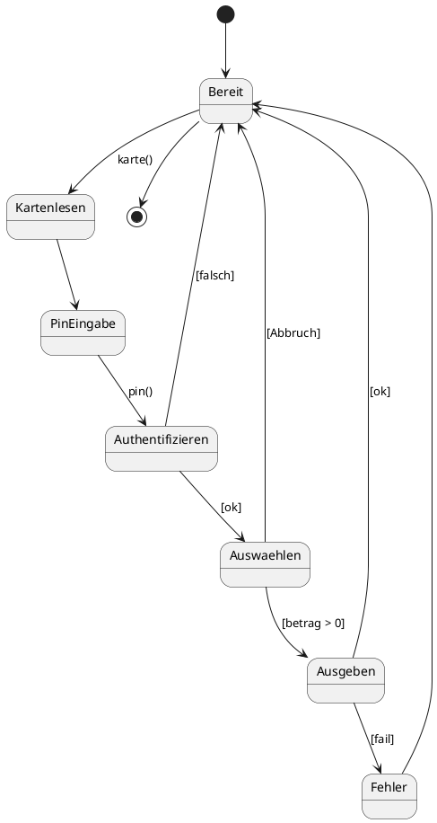

# Fachmodul: UML-Zustandsdiagramm

**Kurs-ID:** 3605
**Kategorie:** Kursbibliothek / Fachmodule / Informatik / UML
**Quelle:** https://moodle.oszimt.de/course/view.php?id=3605

---

## Inhaltsverzeichnis

1. [Lernziele](#1-lernziele)
2. [Was ist ein Zustandsdiagramm?](#2-was-ist-ein-zustandsdiagramm)
3. [Notationselemente](#3-notationselemente)
4. [Zustände und Transitionen](#4-zustände-und-transitionen)
5. [Events und Guards](#5-events-und-guards)
6. [Aktionen: Entry, Exit, Do](#6-aktionen-entry-exit-do)
7. [Hierarchische Zustandsmaschinen](#7-hierarchische-zustandsmaschinen)
8. [Praxisbeispiele](#8-praxisbeispiele)
9. [Tools](#9-tools)
10. [Übungen](#10-übungen)
11. [Quellen](#11-quellen)
12. [Zusammenfassung](#12-zusammenfassung)

---

## 1. Lernziele

Nach Bearbeitung dieses Fachmoduls können Sie:

- UML-Zustandsdiagramme (State Machine Diagrams) lesen und erstellen,
- Zustände, Transitionen, Events und Guards modellieren,
- Entry, Exit und Do-Aktionen nutzen,
- hierarchische Zustandsmaschinen verstehen,
- typische Beispiele (Geldautomat, Webauftritt) modellieren.

---

## 2. Was ist ein Zustandsdiagramm?

Ein **Zustandsdiagramm** (State Machine Diagram) ist ein Verhaltensdiagramm in UML. Es beschreibt das Verhalten eines Objekts über die Zeit.

**Anwendung:**

- Zustandsbehaftete Objekte
- Endliche Automaten (Finite State Machines, FSM)
- Reaktive Systeme (Ampeln, Türsteuerungen, Protokolle)

**Vorteil:**

- Klare Visualisierung möglicher Zustände und Übergänge
- Vermeidung von Zustandsfehlern

---

## 3. Notationselemente

| Element | Symbol | Bedeutung |
|---|---|---|
| Anfangszustand | gefüllter Kreis | Start des Diagramms |
| Endzustand | Bullauge | Ende (kann mehrere haben) |
| Zustand | Rechteck (abgerundet) | konkreter Zustand |
| Transition | Pfeil | Übergang |
| Choice | Raute (Diamant) | dynamische Auswahl |
| Junction | Raute | statische Verzweigung |
| History-Zustand | Kreis mit H | letzte Subzustand |
| Entry-Aktion | `entry/` | beim Betreten |
| Exit-Aktion | `exit/` | beim Verlassen |
| Do-Aktion | `do/` | im Zustand aktiv |

---

## 4. Zustände und Transitionen

### 4.1 Einfaches Beispiel

```
● ──→ [Inaktiv] ──start()──→ [Aktiv] ──stop()──→ [Inaktiv] ──→ ◯
```

### 4.2 Zustandsname mit Aktionen

```
┌──────────────────┐
│     Aktiv        │
├──────────────────┤
│ entry / starte() │
│ exit / stoppe()  │
│ do / verarbeite()│
└──────────────────┘
```

### 4.3 Komposition (Subzustände)

```
┌──────────────────────┐
│   Maschine läuft     │
│  ┌─────────────────┐ │
│  │ [Hochfahren]     │ │
│  │       ↓          │ │
│  │ [Betrieb]        │ │
│  │       ↓          │ │
│  │ [Herunterfahren] │ │
│  └─────────────────┘ │
└──────────────────────┘
```

---

## 5. Events und Guards

### 5.1 Transition mit Event

```
[Aktiv] ──pause()──→ [Pausiert]
```

`pause()` ist das auslösende **Event**.

### 5.2 Transition mit Guard (Bedingung)

```
[Aktiv] ──[Wert > 100]──→ [Überlauf]
```

Die Transition erfolgt nur, wenn die Bedingung wahr ist.

### 5.3 Transition mit Event und Guard

```
[Aktiv] ──mess() [Wert > 100]──→ [Überlauf]
```

Event triggert, Guard entscheidet.

### 5.4 Transition mit Aktion

```
[Aktiv] ──stop() / stoppen()──→ [Inaktiv]
```

`stoppen()` wird beim Übergang ausgeführt.

---

## 6. Aktionen: Entry, Exit, Do

| Aktion | Syntax | Bedeutung |
|---|---|---|
| **Entry** | `entry / aktion` | Beim Betreten des Zustands |
| **Exit** | `exit / aktion` | Beim Verlassen |
| **Do** | `do / aktion` | Während des Zustands |

### 6.1 Beispiel

```
┌──────────────────────┐
│     Spiel läuft      │
├──────────────────────┤
│ entry / Spiel starten│
│ do / Spielzug         │
│ exit / Spiel beenden│
└──────────────────────┘
```

---

## 7. Hierarchische Zustandsmaschinen

### 7.1 Subzustände

```
┌──────────────────────┐
│       Drucken        │
│   ┌──────────────┐   │
│   │  [Initialisiere]│   │
│   │       ↓       │   │
│   │   [Drucke]    │   │
│   │       ↓       │   │
│   │  [Storniere]  │   │
│   └──────────────┘   │
└──────────────────────┘
```

### 7.2 History-Zustand

Erinnert sich an den letzten Subzustand:

```
[Bestellung]
       ↓
[H*]  ← History-Zustand
       ↓
[Verarbeitet] / [Versendet] / [Storniert]
```

### 7.3 Parallele Zustände

Mehrere unabhängige Subzustände parallel:

```
┌──────────────────────┐
│     Bestellung       │
│  ┌─────────┐         │
│  │ Bezahl- │         │
│  │ phase   │         │
│  └─────────┘         │
│  ┌─────────┐         │
│  │ Versand-│         │
│  │ phase   │         │
│  └─────────┘         │
└──────────────────────┘
```

---

## 8. Praxisbeispiele

### 8.1 Geldautomat

```
● ──→ [Bereit] ──karte()──→ [Karte gelesen]
                                    │
                                    ▼
                             [PIN eingeben]
                                    │
                                ◇  [PIN ok]
                                │ ja
                                    ▼
                             [Betrag wählen]
                                    │
                                ◇  [ausreichend]
                                │ ja
                                    ▼
                             [Geld ausgeben] ──→ ◯
                                    │
                                    nein
                                    ▼
                             [Fehler anzeigen]
                                    │
                                    ▼
                             zurück zu [Karte gelesen]
```

### 8.2 Webauftritt

```
● ──→ [Startseite] ──login()──→ [Login-Formular] ──submit()──→ [Authentifizierung]
                                                                            │
                                                              ◇ ok
                                                              │ ja
                                                              ▼
                                                         [Dashboard]
                                                              │
                                                              ├─profil()──→ [Profilseite]
                                                              ├─logout()──→ [Login-Formular]
                                                              │
                                                              ▼
                                                              ◯
```

### 8.3 Ampel

```
● ──→ [Rot] ──tick(60s)──→ [Rot-Gelb] ──tick(2s)──→ [Grün] ──tick(30s)──→ [Gelb] ──tick(3s)──→ [Rot]
```

---

## 9. Tools

- **draw.io**: Browser, kostenlos
- **PlantUML**: Code-basiert
- **yEd**: Grapheneditor
- **Enterprise Architect**: professionelles UML-Tool

### 9.1 PlantUML-Code



---

## 10. Übungen

### Übung 1 — Geldautomat

Erstellen Sie ein vollständiges Zustandsdiagramm für einen Geldautomaten:
- Karte einlesen
- PIN prüfen
- Betrag auswählen
- Geld ausgeben
- Karte ausgeben
- Fehlerzustände

### Übung 2 — Webauftritt

Erstellen Sie ein Zustandsdiagramm für eine Webanwendung: Login → Dashboard → Logout.

### Übung 3 — Aufzugssteuerung

Modellieren Sie die Zustände eines Aufzugs: Warten, Türen öffnen/schließen, Fahren, Stockwerk erreichen, Notfall.

### Übung 4 — Bestellprozess

Erstellen Sie ein Zustandsdiagramm für eine Online-Bestellung: Neu, Bezahlt, Versendet, Zugestellt, Storniert, Retourniert.

---

## 11. Quellen

- OMG UML 2.5.1 Specification: <https://www.omg.org/spec/UML/2.5.1/>
- UML State Machine: <https://www.uml-diagrams.org/state-machine-diagrams.html>
- PlantUML State Diagram: <https://plantuml.com/state-diagram>
- Gamma et al.: *Design Patterns*

---

## 12. Zusammenfassung

**UML-Zustandsdiagramme** modellieren das zustandsbehaftete Verhalten von Objekten.

**Schlüsselkonzepte:**

- **Zustände**: konkrete Lebensphase eines Objekts
- **Transitionen**: Übergänge durch Events und Guards
- **Aktionen**: entry, exit, do
- **History-Zustand**: H* speichert letzten Subzustand
- **Hierarchie**: Subzustände modellieren
- **Parallele Zustände**: unabhängige Regionen

**Wann einsetzen:**

- Zustandsbehaftete Objekte mit klaren Übergängen
- Endliche Automaten
- Reaktive Systeme

### Selbsttest-Checkliste

- [ ] Ich erkenne Zustände aus Anforderungen.
- [ ] Ich modelliere Events und Guards.
- [ ] Ich nutze Entry/Exit/Do-Aktionen.
- [ ] Ich modelliere Hierarchien und parallele Zustände.

---

*Quelle: https://moodle.oszimt.de/course/view.php?id=3605 — Recherche 2026*
