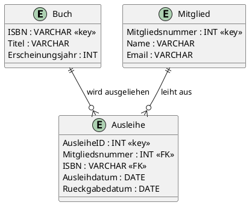

# Fachmodul: Entity Relationship Diagramm (LF08)

**Kurs-ID:** 6723
**Kategorie:** Kursbibliothek / Fachmodule / Informatik / DBS / LF08
**Quelle:** https://moodle.oszimt.de/course/view.php?id=6723

---

## Inhaltsverzeichnis

1. [Lernziele](#1-lernziele)
2. [Wiederholung: ERM-Grundbegriffe](#2-wiederholung-erm-grundbegriffe)
3. [Schrittweise ER-Modellierung im LF08-Kontext](#3-schrittweise-er-modellierung-im-lf08-kontext)
4. [Praxisbeispiele](#4-praxisbeispiele)
5. [Tools für ERD-Erstellung](#5-tools-für-erd-erstellung)
6. [Übungen](#6-übungen)
7. [Quellen](#7-quellen)
8. [Zusammenfassung](#8-zusammenfassung)

---

## 1. Lernziele

Nach Bearbeitung dieses Fachmoduls können Sie:

- Aus Anforderungstexten ER-Diagramme ableiten,
- Kardinalitäten (1:1, 1:N, N:M) korrekt bestimmen,
- schwache Entitäten und ISA-Beziehungen identifizieren,
- ER-Diagramme in Chen- und Krähenfüße-Notation zeichnen,
- typische LF08-Praxisbeispiele modellieren.

---

## 2. Wiederholung: ERM-Grundbegriffe

(Siehe auch Fachmodul 2690 ER-Diagramm.)

- **Entitätstyp**: gleichartige Menge von Objekten
- **Attribut**: Eigenschaft
- **Beziehungstyp**: Verknüpfung zwischen Entitäten
- **Kardinalität**: 1:1, 1:N, N:M
- **Schwache Entität**: existenzabhängig
- **ISA-Beziehung**: Generalisierung/Spezialisierung

---

## 3. Schrittweise ER-Modellierung im LF08-Kontext

### 3.1 Schritt 1 — Substantive finden

> "In einer Bibliothek gibt es Bücher, Mitglieder und Ausleihen."

→ Entitäten: `Buch`, `Mitglied`, `Ausleihe`

### 3.2 Schritt 2 — Verben identifizieren

> "Mitglieder leihen Bücher aus."

→ Beziehung: `leiht aus` zwischen `Mitglied` und `Buch`

### 3.3 Schritt 3 — Attribute definieren

> "Bücher haben Titel und ISBN. Mitglieder haben Namen und Mitgliedsnummer."

→ Attribute: `Buch.ISBN, Buch.Titel`, `Mitglied.Name, Mitglied.Mitgliedsnummer`

### 3.4 Schritt 4 — Kardinalitäten festlegen

> "Ein Mitglied kann mehrere Bücher ausleihen. Ein Buch kann von mehreren Mitgliedern ausgeliehen werden."

→ N:M-Beziehung → wird zur `Ausleihe`-Entität mit eigener Tabelle

### 3.5 Schritt 5 — Schlüsselattribute markieren

→ PK: `Buch.ISBN`, `Mitglied.Mitgliedsnummer`

### 3.6 Schritt 6 — Notation wählen

**Chen-Notation:** akademisch, ausdrucksstark
**Krähenfüße-Notation:** kompakt, implementierungsnah

---

## 4. Praxisbeispiele

### 4.1 Beispiel 1: Forenverwaltung

**Entitäten:**

- `Benutzer` (BenutzerID, Username, Email)
- `Forum` (ForumID, Name)
- `Thread` (ThreadID, Titel, Erstellungsdatum)
- `Beitrag` (BeitragID, Inhalt)

**Beziehungen:**

- Forum — enthält → Thread (1:N)
- Benutzer — erstellt → Thread (1:N)
- Benutzer — schreibt → Beitrag (1:N)
- Thread — enthält → Beitrag (1:N)
- Benutzer — moderiert → Forum (N:M)

**Krähenfüße-Notation:**

```
┌────────────┐                 ┌────────────┐
│   Forum    │                │   Thread   │
│ ForumID PK │────────○───────│ ThreadID PK│
│ Name       │ 1 enthält N    │ Titel      │
└────────────┘                │ ErstelltAm  │
                              │ ForumID FK │
                              └────────────┘

┌────────────┐                 ┌────────────┐
│  Benutzer  │                │  Beitrag   │
│ BenutzerPK │─────┬──────┐   │ BeitragIDPK│
│ Username   │     │      │   │ Inhalt    │
│ Email      │     │      │   │ ThreadIDFK│
└────────────┘     │      │   │ BenutzerFK│
       │1          │1     │1  └────────────┘
       │erstellt   │schreibt
       │           │
       └─→ Thread ─┴─→ Beitrag
```

### 4.2 Beispiel 2: Segeltörn

**Entitäten:**

- `Segler` (SeglerID, Name, Erfahrung)
- `Boot` (BootID, Name, Typ)
- `Törn` (TörnID, Startdatum, Enddatum)
- `Crew` (ToernID, SeglerID, Rolle)

**Beziehungen:**

- Segler ↔ Törn (N:M) → Zwischentabelle Crew
- Boot → Törn (1:N)

### 4.3 Beispiel 3: Zwerge

Fantasydatenbank: Zwerge mit Waffen, Aufgaben und Beute. Mehrere N:M-Beziehungen.

---

## 5. Tools für ERD-Erstellung

| Tool | Vorteil | Nachteil |
|---|---|---|
| **draw.io** | kostenlos, Browser | wenige vorgefertigte ER-Symbole |
| **Lucidchart** | kollaborativ, Vorlagen | kostenpflichtig |
| **MySQL Workbench** | offiziell für MySQL, EER | nur MySQL |
| **PlantUML** | Code-basiert, versionierbar | Lernkurve |
| **DBeaver** | Multi-DB, open source | Diagramm-Editor einfach |
| **ERDPlus** | spezialisiert für ER | eingeschränkte Tooling-Funktionen |

### 5.1 PlantUML-Code für ERD



---

## 6. Übungen

### Übung 1 — Bücherei

Modellieren Sie eine Bibliothek mit Büchern, Mitgliedern, Ausleihen und Autoren. Erstellen Sie das ERD in Krähenfüße-Notation.

### Übung 2 — Flugbuchung

Modellieren Sie Passagiere, Flüge, Buchungen, Sitze. Bestimmen Sie Kardinalitäten und PK.

### Übung 3 — Online-Shop

Modellieren Sie Kunden, Bestellungen, Produkte, Kategorien. Identifizieren Sie N:M-Beziehungen.

### Übung 4 — Krankenhaus

Modellieren Sie Patienten, Ärzte, Behandlungen, Stationen. Erstellen Sie das ERD in Chen-Notation.

---

## 7. Quellen

- de.wikipedia.org/wiki/Entity-Relationship-Modell
- oer-informatik.de/erm
- creately.com/guides/chen-notation-in-erd/
- red-gate.com/blog/chen-erd-notation/
- LF08-Infoblätter des OSZ-IMT

---

## 8. Zusammenfassung

Die **ER-Modellierung im LF08-Kontext** umfasst:

1. Anforderungsanalyse → Substantive und Verben extrahieren
2. Entitäten, Attribute, Beziehungen identifizieren
3. Kardinalitäten festlegen
4. Schlüsselattribute markieren
5. Notation wählen (Chen oder Krähenfüße)
6. Werkzeug einsetzen (draw.io, PlantUML, MySQL Workbench)

**Wichtig:**

- Schwache Entitäten explizit markieren
- ISA-Beziehungen für Generalisierung nutzen
- N:M immer in Zwischentabellen umsetzen

### Selbsttest-Checkliste

- [ ] Ich erkenne Entitäten aus Anforderungstexten.
- [ ] Ich bestimme Kardinalitäten korrekt.
- [ ] Ich nutze Chen- und Krähenfüße-Notation.
- [ ] Ich setze Tools für ERD-Erstellung ein.

---

*Quelle: https://moodle.oszimt.de/course/view.php?id=6723 — Recherche 2026*
