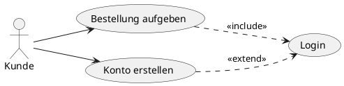

# Fachmodul: UML Anwendungsfalldiagramme

**Kurs-ID:** 7785
**Kategorie:** Kursbibliothek / Fachmodule / Informatik / UML
**Quelle:** https://moodle.oszimt.de/course/view.php?id=7785

---

## Inhaltsverzeichnis

1. [Lernziele](#1-lernziele)
2. [Anwendungsfalldiagramm – Überblick](#2-anwendungsfalldiagramm--überblick)
3. [Elemente](#3-elemente)
4. [Beziehungen](#4-beziehungen)
5. [Beispiel](#5-beispiel)
6. [Erstellung](#6-erstellung)
7. [Übungen](#7-übungen)
8. [Zusammenfassung](#8-zusammenfassung)

---

## 1. Lernziele

Nach Bearbeitung dieses Fachmoduls können Sie:

- Anwendungsfalldiagramme lesen und erstellen,
- Akteure, Anwendungsfälle und Systeme identifizieren,
- Beziehungen zwischen Anwendungsfällen modellieren.

---

## 2. Anwendungsfalldiagramm – Überblick

Das **Anwendungsfalldiagramm** (Use Case Diagram) ist ein UML-Diagrammtyp, der die **funktionalen Anforderungen** eines Systems aus Sicht der **Akteure** darstellt.

**Zweck:**

- Anforderungsanalyse
- Kommunikation mit Stakeholdern
- Identifikation von Systemgrenzen

**Standard-UML 2.5.1**.

---

## 3. Elemente

### 3.1 Akteur

- **Person** außerhalb des Systems
- Rolle, nicht konkrete Person
- Symbol: **Strichmännchen** oder Rechteck mit «actor»

```
:Benutzer:
:Kunde:
:Mitarbeiter:
```

### 3.2 Anwendungsfall (Use Case)

- **Funktionale Anforderung** des Systems
- Ein Verb (etwas tun)
- Symbol: **Ellipse**

```
(Kundenkonto eröffnen)
(Warenkorb anzeigen)
(Bestellung abschicken)
```

### 3.3 Systemgrenze

- Rechteck, das das System umfasst
- Anwendungsfälle innerhalb
- Akteure außerhalb

```
┌────────────────────────┐
│       Online-Shop        │
│                         │
│ (Produkt suchen)          │
│ (Bestellung abschicken)   │
│                         │
└────────────────────────┘
       │              │
       ↓              ↓
    :Kunde:       :Admin:
```

### 3.4 Notizen (Notes)

- Erläuterungen zu Anwendungsfällen
- Nicht-standardisiert, aber hilfreich

---

## 4. Beziehungen

### 4.1 Assoziation

Verbindung zwischen Akteur und Anwendungsfall:

```
:Kunde: ─── (Bestellung aufgeben)
```

### 4.2 Generalisierung

Vererbung zwischen Akteuren:

```
:VIP-Kunde: ╲
              ╲ inherits
               ╲
            :Kunde:
```

### 4.3 Beziehungen zwischen Anwendungsfällen

| Beziehung | Symbol | Bedeutung |
|---|---|---|
| **«include»** | gestrichelter Pfeil | A ist Bestandteil von B |
| **«extend»** | gestrichelter Pfeil | A erweitert B (optional) |
| **Generalisierung** | Pfeil mit Spitze | A erbt von B |

### 4.4 «include»

- **Pflicht**: A wird immer ausgeführt, wenn B ausgeführt wird
- Beispiel: "Bestellung bezahlen" ist Bestandteil von "Bestellung abschicken"

### 4.5 «extend»

- **Optional**: A erweitert B unter bestimmten Bedingungen
- Beispiel: "Rabatt anwenden" erweitert "Bestellung abschicken"

### 4.6 Beispiel

```
        :Kunde: ─── (Bestellung aufgeben)
                    │
                    «include»
                    ↓
              (Bestellung bezahlen)

        (Bestellung abschicken) ← «extend» ← (Rabatt anwenden)
```

---

## 5. Beispiel

### 5.1 Online-Bibliothek

**Akteure:**

- :Leser:
- :Bibliothekar:
- :Verwaltungsmitarbeiter:

**Anwendungsfälle:**

- Buch ausleihen
- Buch zurückgeben
- Buch suchen
- Buch reservieren
- Benutzer verwalten
- Bestand verwalten

```
                    ┌────────────────────────────┐
                    │     Online-Bibliothek        │
                    │                              │
:Kunde: ──── (Buch suchen)                            │
                    │                              │
                    │                              │
                    │ (Buch ausleihen) ← (Buch reservieren)
                    │                              │
:Bibliothekar: ── (Bestand verwalten)                │
                    │                              │
                    │ (Benutzer verwalten)          │
                    │                              │
                    └────────────────────────────┘
```

### 5.2 Erweiterter Anwendungsfall mit Beschreibung

| Feld | Inhalt |
|---|---|
| **Name** | Buch ausleihen |
| **Akteur** | Leser |
| **Vorbedingung** | Leser ist angemeldet, Buch verfügbar |
| **Beschreibung** | Leser wählt Buch, System prüft Verfügbarkeit, Ausleihe wird gespeichert |
| **Nachbedingung** | Buch als ausgeliehen markiert, Leihfrist gesetzt |
| **Ausnahmen** | Buch nicht verfügbar: Meldung |
| **Spezialanforderungen** | Bestätigung per E-Mail |

---

## 6. Erstellung

### 6.1 Vorgehen

1. **Systemgrenze** definieren
2. **Akteure** identifizieren (alle externen Beteiligten)
3. **Anwendungsfälle** identifizieren (Was muss das System tun?)
4. **Beziehungen** modellieren (include, extend)
5. **Beschreibungen** erstellen (mindestens für jeden Use Case)

### 6.2 Tipps

- Use Cases beschreiben **Was**, nicht **Wie**
- Akteure immer mit Rolle benennen
- Sätze mit Hauptwort (Substantiv) und Verb
- Maximal 3 Wörter pro Use Case Name

### 6.3 Werkzeuge

- **draw.io**: kostenlos, Browser
- **PlantUML**: Code-basiert
- **Lucidchart, Miro, Mural**: kollaborativ
- **Visual Paradigm, Enterprise Architect**: professionell
- **StarUML**: Open Source

### 6.4 PlantUML-Code



---

## 7. Übungen

### Übung 1 — Use Cases identifizieren

Identifizieren Sie 10 Anwendungsfälle für einen Webshop.

### Übung 2 — Diagramm zeichnen

Erstellen Sie ein Anwendungsfalldiagramm für eine Bibliotheks-App.

### Übung 3 — Beziehungen

Wann nutzen Sie «include» und wann «extend»?

### Übung 4 — Beschreibungen

Erstellen Sie detaillierte Beschreibungen für drei Anwendungsfälle.

### Übung 5 — Akteure

Welche Akteure sind in einem Krankenhaus-Informationssystem relevant?

### Übung 6 — PlantUML

Erstellen Sie ein Anwendungsfalldiagramm in PlantUML.

---

## 8. Zusammenfassung

Das **UML-Anwendungsfalldiagramm** modelliert **funktionale Anforderungen**:

**Elemente:**

- **Akteur**: externer Beteiligter
- **Anwendungsfall**: Funktion des Systems
- **Systemgrenze**: Systemumfang

**Beziehungen:**

- Assoziation (Akteur ↔ Use Case)
- «include» (Pflicht)
- «extend» (Optional)
- Generalisierung (Vererbung)

**Werkzeuge:** draw.io, PlantUML, Lucidchart

### Selbsttest-Checkliste

- [ ] Ich identifiziere Akteure und Use Cases.
- [ ] Ich modelliere Beziehungen korrekt.
- [ ] Ich beschreibe Use Cases detailliert.
- [ ] Ich nutze Tools für die Erstellung.

---

*Quelle: https://moodle.oszimt.de/course/view.php?id=7785 — Recherche 2026*
